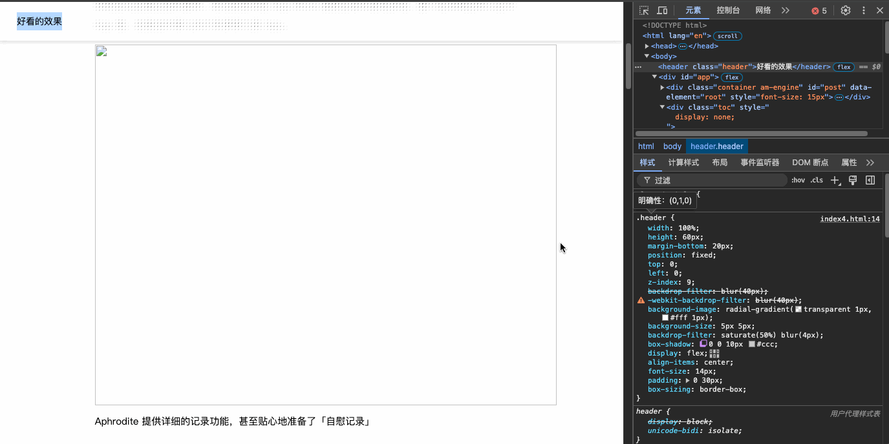

# 仿饿了么导航栏好看的效果

## 效果演示


## 代码示例
```html
<!DOCTYPE html>
<html lang="en">
  <head>
    <meta charset="UTF-8" />
    <meta http-equiv="X-UA-Compatible" content="IE=edge" />
    <meta name="viewport" content="width=device-width, initial-scale=1.0" />
    <title>仿饿了么导航栏好看的效果</title>
    <style>
      .header {
        width: 100%;
        height: 60px;
        margin-bottom: 20px;
        position: fixed;
        top: 0;
        left: 0;
        z-index: 9;
        backdrop-filter: blur(40px);
        -webkit-backdrop-filter: blur(40px);
        background-image: radial-gradient(transparent 1px, #fff 1px);
        background-size: 5px 5px;
        backdrop-filter: saturate(50%) blur(4px);
        box-shadow: 0 0 10px #ccc;
        display: flex;
        align-items: center;
        font-size: 14px;
        padding: 0 30px;
        box-sizing: border-box;
      }

      #app {
        display: flex;
        justify-content: center;
        box-sizing: border-box;
        padding-top: 70px;
      }

      .container {
        width: 60%;
        height: 100vh;
      }
    </style>
  </head>

  <body>
    <header class="header">仿饿了么导航栏好看的效果</header>
    <div id="app">
      <div class="container am-engine">
        <p data-id="p838747a-N8VpPoCk">
          今年国庆期间，我上线了一款用来记录性生活的 App ——
          Aphrodite，除了因为切中目标用户的需求痛点而获得夸赞之外，我被问到最多的问题就是「为什么要开发这样一款应用」，以及「记录性生活有什么意义？为什么要记录？」。
        </p>
        <p data-id="p838747a-BfaGrkTR">
          在我已知的大部分人的观念里，「性生活」都是足够隐秘甚至禁忌的话题，相应地，「记录性生活」也被认为是荒唐之举，因此在
          Aphrodite
          上线后，我在社媒上照例去「吹嘘」的时候，收获更多的是来自于朋友们的质疑与不理解……
          这也是我写这篇文章的初衷之一，我想聊聊开发 Aphrodite
          背后的故事，以及我所理解的「记录性生活的意义」。
        </p>

        
      </div>

    </div>
  </body>
</html>

```