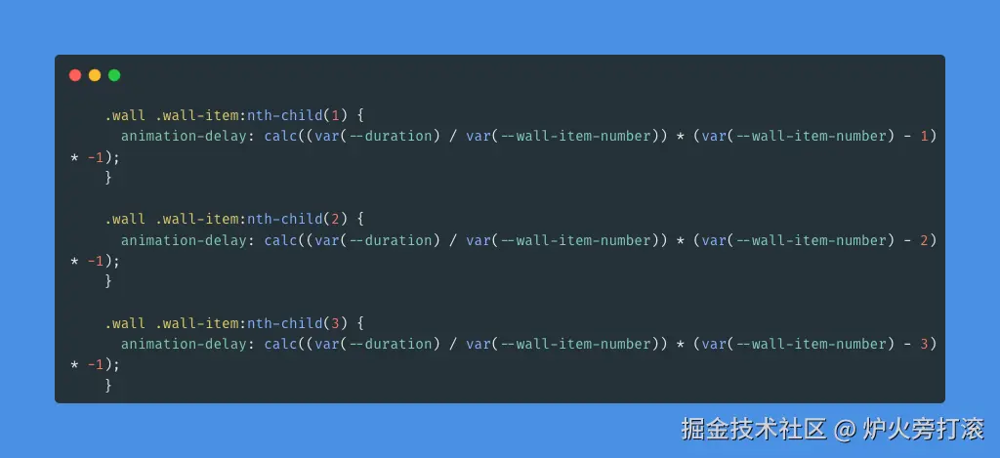

# 纯css实现无限循环滚动logo墙

<Index />

## 一、需求

在许多网站的合作伙伴一栏，常常会看到一排排无限地循环滚动的logo墙。
不久前，接到一个类似的需求。需求如下：
1、无限循环滚动；
2、鼠标hover后，暂停滚动，鼠标离开后，继续滚动；
3、支持从左往右和从右往左滚动；
4、滚动速度需要可配置。
简单动画，我们先尝试只使用css实现。


## 二、实现

### 1、marquee标签

说到无限循环滚动，很久以前marquee标签可以实现类似的功能，它可以无限循环滚动，并且可以控制方向和速度。但是该标签在HTML5中已经被弃用，虽然还可以正常使用，但w3c不再推荐使用该特性。作为一个标签，只需要负责布局，而不应该有行为特性。

了解marquee标签：[marquee标签](https://developer.mozilla.org/zh-CN/docs/Web/HTML/Element/marquee)

### 2、css3动画

说到无限循环滚动我们会想到使用css3动画。

把animation-iteration-count设置为infinite，代表无限循环播放动画。

为了使动画运动平滑，我们把animation-timing-function设置为linear，代表动画匀速运动。

```html
<!DOCTYPE html>
<html lang="en">
<head>
  <meta charset="UTF-8">
  <meta name="viewport" content="width=device-width, initial-scale=1.0">
  <title>Document</title>
  <style>
    * {
      margin: 0;
      padding: 0;
      box-sizing: border-box;
    }

    body {
      padding-top: 200px;
    }

    @keyframes scrolling {
      to {
        transform: translateX(100vw);
      }
    }
    
    .wall-item {
      height: 90px;
      width: 160px;
      background-image: linear-gradient(120deg, #d4fc79 0%, #96e6a1 100%);
      animation: scrolling 4s linear infinite;
    }
  </style>
</head>
<body>
  <div class="wall-item"></div>
</body>
</html>
```

我们上面实现了一个元素的滚动，在多个元素的时候，我们只需为每个元素设置不同的动画延迟时间（animation-delay），让每一项错落开来，就可以实现我们想要的效果了。
至于鼠标hover后暂停动画，我们只需在滚动元素hover时把animation-play-state设置为暂停即可。

有了以上思路，我很快就可以写出一个纯css实现logo墙无限循环滚动的效果。

### 3、完整示例代码：
```html
<!DOCTYPE html>
<html lang="en">

<head>
  <meta charset="UTF-8">
  <meta name="viewport" content="width=device-width, initial-scale=1.0">
  <title>Document</title>
  <style>
    * {
      margin: 0;
      padding: 0;
      box-sizing: border-box;
    }

    :root {
      --wall-item-height: 90px;
      --wall-item-width: 160px;
      --wall-item-number: 9;
      --duration: 16s;
    }

    @keyframes scrolling {
      to {
        transform: translateX(calc(var(--wall-item-width) * -1));
      }
    }

    .wall {
      margin: 30px auto;
      height: var(--wall-item-height);
      /* width: 80vw; */
      position: relative;
      mask-image: linear-gradient(90deg, hsl(0 0% 0% / 0),
          hsl(0 0% 0% / 1) 20%,
          hsl(0 0% 0% / 1) 80%,
          hsl(0 0% 0% / 0));
    }

    .wall .wall-item {
      position: absolute;
      top: 0;
      left: 0;
      transform: translateX(calc(var(--wall-item-width) * var(--wall-item-number)));
      height: var(--wall-item-height);
      width: var(--wall-item-width);
      background-image: linear-gradient(120deg, #d4fc79 0%, #96e6a1 100%);
      animation: scrolling var(--duration) linear infinite;
      cursor: pointer;
    }

    .wall[data-direction="reverse"] .wall-item {
      animation-direction: reverse;
      background-image: linear-gradient(120deg, #84fab0 0%, #8fd3f4 100%);
    }

    .wall .wall-item:nth-child(1) {
      animation-delay: calc((var(--duration) / var(--wall-item-number)) * (var(--wall-item-number) - 1) * -1);
    }

    .wall .wall-item:nth-child(2) {
      animation-delay: calc((var(--duration) / var(--wall-item-number)) * (var(--wall-item-number) - 2) * -1);
    }

    .wall .wall-item:nth-child(3) {
      animation-delay: calc((var(--duration) / var(--wall-item-number)) * (var(--wall-item-number) - 3) * -1);
    }

    .wall .wall-item:nth-child(4) {
      animation-delay: calc((var(--duration) / var(--wall-item-number)) * (var(--wall-item-number) - 4) * -1);
    }

    .wall .wall-item:nth-child(5) {
      animation-delay: calc((var(--duration) / var(--wall-item-number)) * (var(--wall-item-number) - 5) * -1);
    }

    .wall .wall-item:nth-child(6) {
      animation-delay: calc((var(--duration) / var(--wall-item-number)) * (var(--wall-item-number) - 6) * -1);
    }

    .wall .wall-item:nth-child(7) {
      animation-delay: calc((var(--duration) / var(--wall-item-number)) * (var(--wall-item-number) - 7) * -1);
    }

    .wall .wall-item:nth-child(8) {
      animation-delay: calc((var(--duration) / var(--wall-item-number)) * (var(--wall-item-number) - 8) * -1);
    }

    .wall .wall-item:nth-child(9) {
      animation-delay: calc((var(--duration) / var(--wall-item-number)) * (var(--wall-item-number) - 9) * -1);
    }

    .wall:has(.wall-item:hover) .wall-item {
      animation-play-state: paused;
    }
  </style>
</head>

<body>
  <div class="wall" style="--duration:10s">
    <div class="wall-item"></div>
    <div class="wall-item"></div>
    <div class="wall-item"></div>
    <div class="wall-item"></div>
    <div class="wall-item"></div>
    <div class="wall-item"></div>
    <div class="wall-item"></div>
    <div class="wall-item"></div>
    <div class="wall-item"></div>
  </div>
  <div class="wall" data-direction="reverse" style="--wall-item-number:9">
    <div class="wall-item"></div>
    <div class="wall-item"></div>
    <div class="wall-item"></div>
    <div class="wall-item"></div>
    <div class="wall-item"></div>
    <div class="wall-item"></div>
    <div class="wall-item"></div>
    <div class="wall-item"></div>
    <div class="wall-item"></div>
  </div>
</body>

</html>
```
- 可配置项：
  --wall-item-height: 滚动项高度
  --wall-item-width: 滚动项宽度
  --wall-item-number: 滚动元素个数
  --duration: 动画时长
  我们也可以向上面示例代码一样，在.wall标签上，通过style属性，给每个滚动墙单独配置宽高、数量、动画时间。

- 滚动方向：
  动画默认从左往右运动。我们可以在.wall标签上设置data-direction="reverse"，让动画从右往左运动。


## 三、局限性

1. 滚动元素（wall-item）太少，不足以填满包装元素（wall）时,会达不到预期效果；

（解决办法：用js把所有子元素复制一份push到最后面）

2. --wall-item-number默认为9，每次子元素数量变化，需手动修改--wall-item-number值。



`（解决办法：使用js计算赋值。说到要用js，那么这一点局限性或许就可以忍受了。）`

3. 需要手动为每一个滚动元素设置动画延迟时间（animation-delay）。
`解决办法：可用js计算赋值。）`


## 四、文章来源

作者：多多罗大法师
链接：https://juejin.cn/post/7408441793790410804
来源：稀土掘金
著作权归作者所有。商业转载请联系作者获得授权，非商业转载请注明出处。


<script setup>
import Index from './index.vue'
</script>