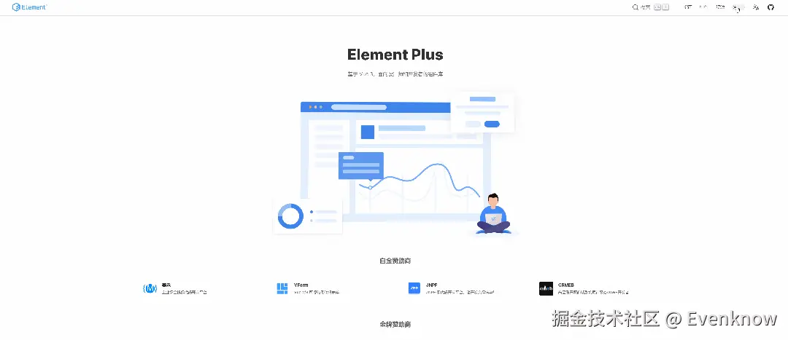
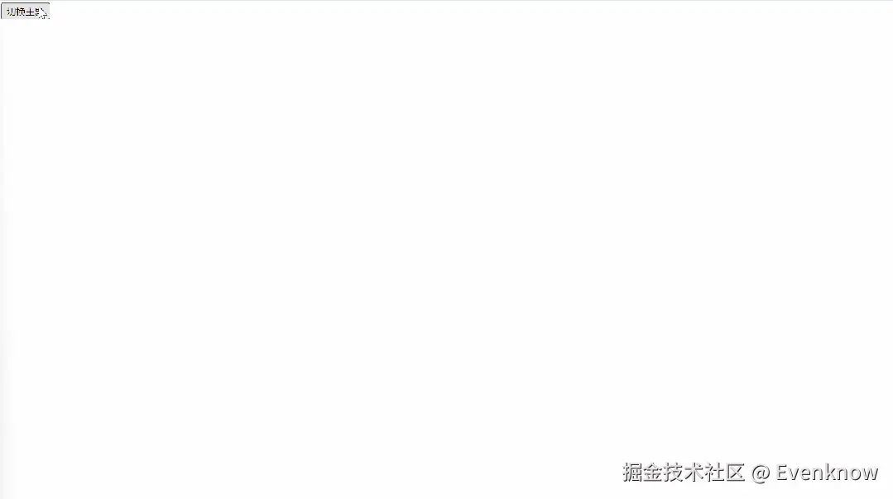

# 主题切换动画让换肤更丝滑

最近，我注意到ElementPlus官网上的主题切换方式颇具创意，特别是那过渡`动画效果`，让人眼前一亮。
经过一番网络搜寻，我找到了实现Element-UI官网主题切换动画的基本方法。首先，我们创建一个HTML文件，添加一个按钮，并编写简单的背景颜色切换代码，以此模拟主题的切换效果。




## 效果如下：


## 代码如下：
```html
<html lang="en">
 
<head>
  <meta charset="UTF-8" />
  <meta name="viewport" content="width=device-width, initial-scale=1.0" />
  <title>主题切换效果</title>
  <style>
    :root {
      /* 默认亮主题 */
      --bg-color: #fff;
      background-color: var(--bg-color);
    }
 
    :root.dark {
      /* 暗主题 */
      --bg-color: #000;
    }
 
    ::view-transition-new(root),
    ::view-transition-old(root) {
      /* 关闭默认动画 */
      animation: none;
    }
  </style>
</head>
 
<body>
  <button id="themeButton">切换主题</button>
  <script>
    const themeButton = document.getElementById("themeButton");
    themeButton.addEventListener("click", (e) => {
      // 执行切换主题的操作
      const transition = document.startViewTransition(() => {
        // 动画过渡切换主题色
        document.documentElement.classList.toggle("dark");
      });
 
      // document.startViewTransition 的 ready 返回一个 Promise
      transition.ready.then(() => {
        // 获取鼠标的坐标
        const { clientX, clientY } = e;
 
        // 计算最大半径
        const radius = Math.hypot(
          Math.max(clientX, innerWidth - clientX),
          Math.max(clientY, innerHeight - clientY)
        );
 
        // 圆形动画扩散开始
        document.documentElement.animate(
          {
            clipPath: [
              `circle(0% at ${clientX}px ${clientY}px)`,
              `circle(${radius}px at ${clientX}px ${clientY}px)`,
            ],
          },
          // 设置时间，已经目标伪元素
          {
            duration: 500,
            pseudoElement: "::view-transition-new(root)",
          }
        );
      });
    });
  </script>
</body>
 
</html>

```

作者：Evenknow
链接：https://juejin.cn/post/7486106426571194408
来源：稀土掘金
著作权归作者所有。商业转载请联系作者获得授权，非商业转载请注明出处。