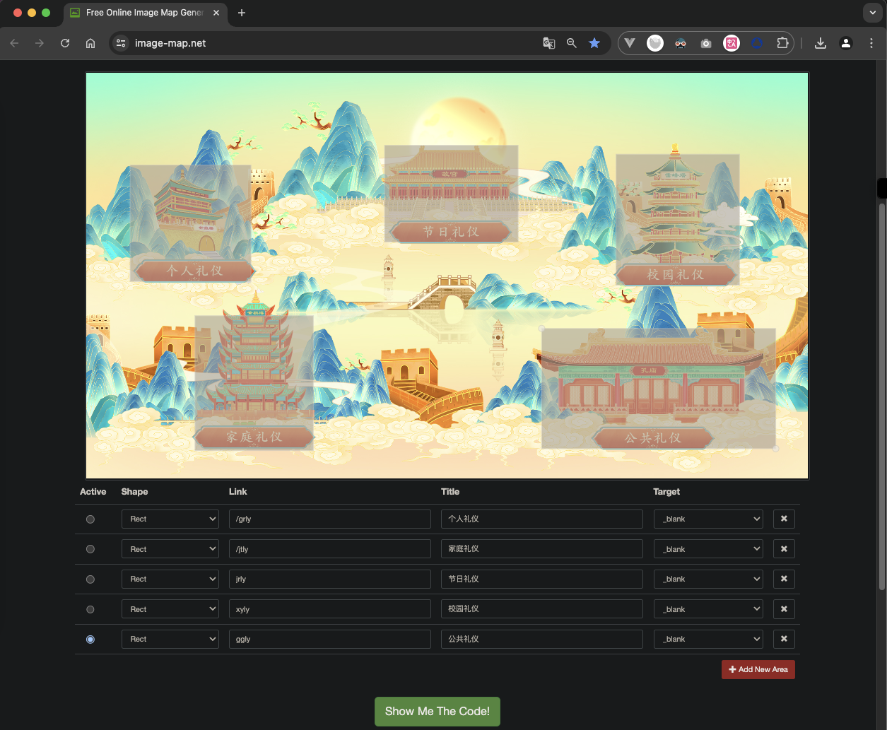
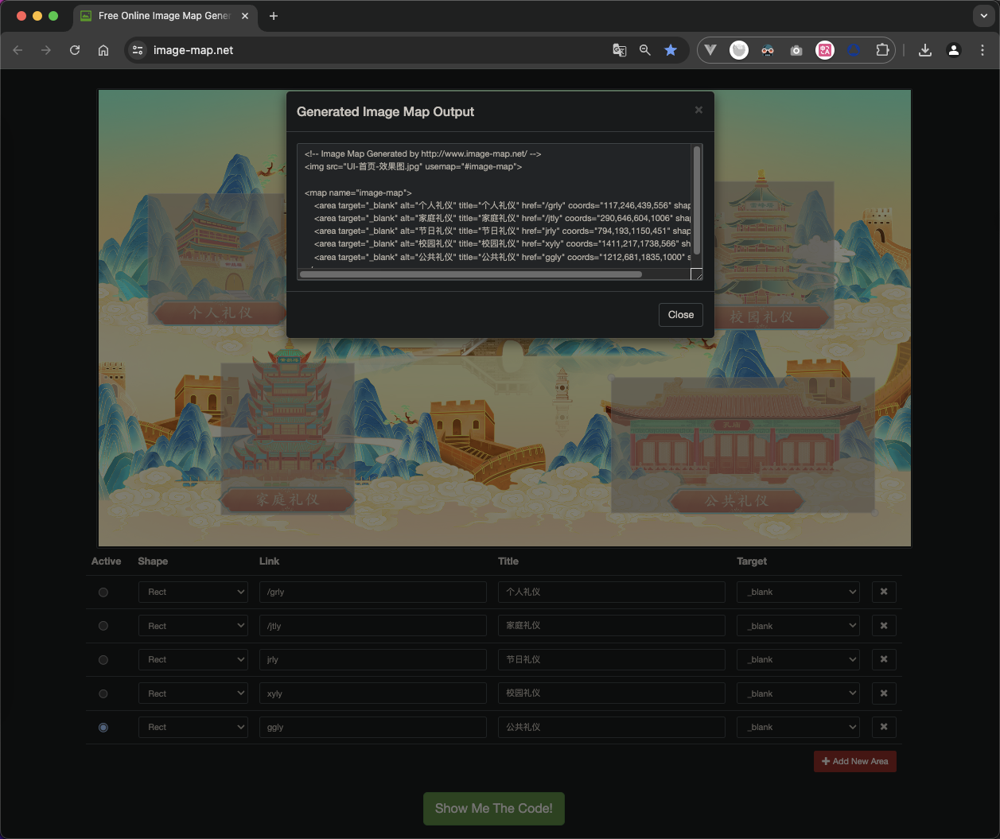
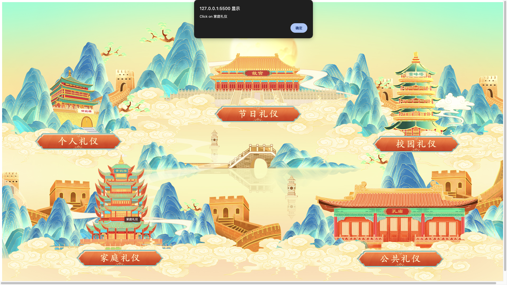

# 前端对图片不同区域进行点击事件

插入一张图片，并设置好图像的有关参数，在​`​​​`​标记中设置参 ​`​usemap="#image-map"`​​，以表示对图像地图的引用。

用`​​<map>​​`​标记设定图像地图的作用区域，并取名：`​​image-map`​​；

分别用​​`<area>​`​标记针对相应位置互粉出多个矩形作用区域，并设定好链接参数href


打开在线图片标记网站 ​https://www.image-map.net/​



生成map代码




完整代码

```html
<!DOCTYPE html>
<html lang="en">
<head>
  <meta charset="UTF-8">
  <meta name="viewport" content="width=device-width, initial-scale=1.0">
  <title>Document</title>
</head>
<body>
  <!-- Image Map Generated by http://www.image-map.net/ -->


<map name="image-map">
    <area onclick="clickImg('个人礼仪')" target="_blank" alt="个人礼仪" title="个人礼仪" href="/grly" coords="117,246,439,556" shape="rect">
    <area onclick="clickImg('家庭礼仪')" target="_blank" alt="家庭礼仪" title="家庭礼仪" href="/jtly" coords="290,646,604,1006" shape="rect">
    <area onclick="clickImg('节日礼仪')" target="_blank" alt="节日礼仪" title="节日礼仪" href="jrly" coords="794,193,1150,451" shape="rect">
    <area onclick="clickImg('校园礼仪')" target="_blank" alt="校园礼仪" title="校园礼仪" href="xyly" coords="1411,217,1738,566" shape="rect">
    <area onclick="clickImg('公共礼仪')" target="_blank" alt="公共礼仪" title="公共礼仪" href="ggly" coords="1212,681,1835,1000" shape="rect">
</map>
<script>
function clickImg(name){
  alert('Click on ' + name)
}
</script>
</body>
</html>
```

## 效果

