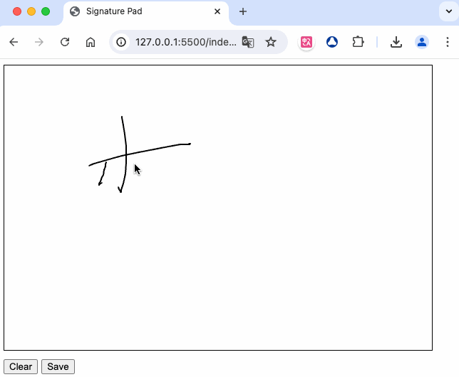

# 电子签名signature

效果：



代码：

```html
<!DOCTYPE html>
<html lang="en">
  <head>
    <meta charset="UTF-8" />
    <meta name="viewport" content="width=device-width, initial-scale=1.0" />
    <title>Signature Pad</title>
    <style>
      .canvas-container {
        width: 600px;
        border: 1px solid #000;
        position: relative;
      }
      .canvas-container canvas {
        display: block;
      }
      .controls {
        margin-top: 10px;
      }
    </style>
  </head>
  <body>
    <div class="canvas-container">
      <canvas id="signatureCanvas" width="600" height="400"></canvas>
    </div>
    <div class="controls">
      <button id="clearButton">Clear</button>
      <button id="saveButton">Save</button>
    </div>
    <script>
      // signature
      window.onload = function () {
        const canvas = document.getElementById("signatureCanvas");
        const ctx = canvas.getContext("2d");
        const clearButton = document.getElementById("clearButton");
        const saveButton = document.getElementById("saveButton");

        let drawing = false;
        let lastX = 0;
        let lastY = 0;

        canvas.addEventListener("mousedown", (e) => {
          drawing = true;
          [lastX, lastY] = [e.offsetX, e.offsetY];
        });

        canvas.addEventListener("mousemove", draw);
        canvas.addEventListener("mouseup", () => (drawing = false));
        canvas.addEventListener("mouseout", () => (drawing = false));

        function draw(e) {
          if (!drawing) return;
          ctx.strokeStyle = "#000";
          ctx.lineJoin = "round";
          ctx.lineCap = "round";
          ctx.lineWidth = 2;

          ctx.beginPath();
          ctx.moveTo(lastX, lastY);
          ctx.lineTo(e.offsetX, e.offsetY);
          ctx.stroke();
          [lastX, lastY] = [e.offsetX, e.offsetY];
        }

        clearButton.addEventListener("click", () => {
          ctx.clearRect(0, 0, canvas.width, canvas.height);
        });

        saveButton.addEventListener("click", () => {
          const dataURL = canvas.toDataURL("image/png");
          const link = document.createElement("a");
          link.href = dataURL;
          link.download = "signature.png";
          link.click();
        });
      };
    </script>
  </body>
</html>

```