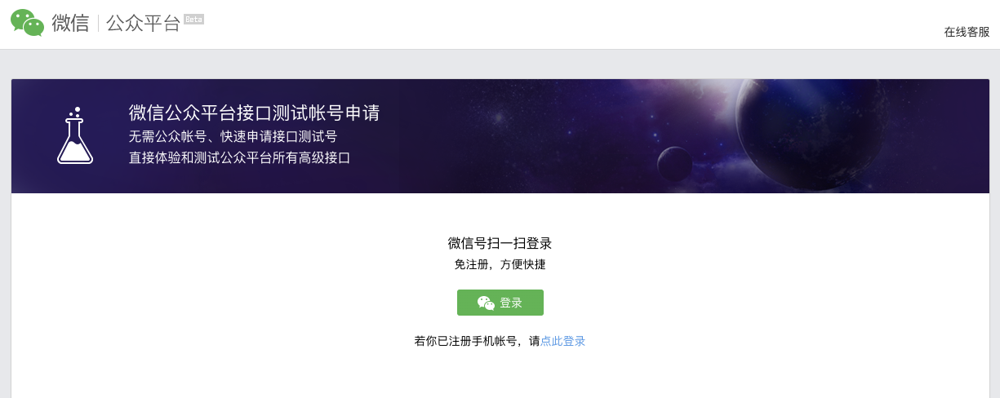
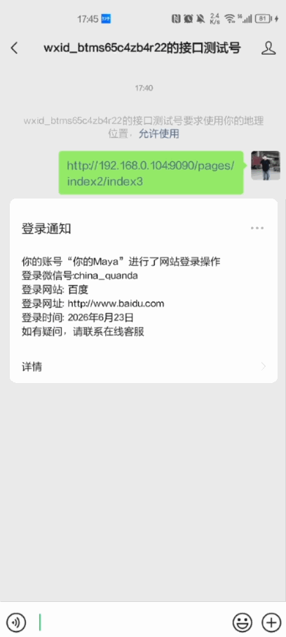

# Node.js和uni-app实现微信公众号推送模板消息

## 介绍

模板消息在公众号的生态里是非常优秀的一种消息推送形式：用户查看便捷，信息传递直接：不用像图文消息那样跳到网页查看；和高级群发一样，用户关注即能收到。

[官方文档](https://developers.weixin.qq.com/doc/offiaccount/Message_Management/Template_Message_Interface.html)

## 前言

微信公众号分订阅号（个人注册）和服务号（企业注册），我们要实现的消息推送需要服务号，虽然我只有订阅号，但我可以通过微信提供的`公众平台测试账号`进行消息推送实现。


## 实现步骤
1. 注册并获取微信公众号的相关配置信息。
2. 在 Node.js 后端中实现微信公众号的接入和消息推送逻辑。
3. 在 uni-app 前端中实现请求后端接口发送模板消息。

## 步骤一 注册并获取微信公众号的相关配置信息

### 1、申请测试账号，并扫码登录

开发过程中直接使用正式微信号、公众号可能会有诸多不便，所以微信公众平台提供接口测试账号，可直接体验和测试公众平台所有高级接口。

[点击去申请测试账号](https://mp.weixin.qq.com/debug/cgi-bin/sandbox?t=sandbox/login)



### 2、获取测试号信息 

复制`AppID`和`AppSecret`，然后复制到后端项目中。


### 3、用微信扫描关注测试公众号

可以使用微信扫描页面下方的测试公众号二维码关注，关注后可获取当前微信号的测试 openid（非公众账号的 openid），可用于代码中临时指定模板消息接收用户，方便开发。


### 4、新增模板消息接口

- 点击`新增测试模板`按钮新增一个模板消息。


- 根据自己所需，输入想要展示的标题、内容即可，点击 【提交】 之后，会生成 【模板ID】 ，后面代码里会用到。


- 为了方便一点大家使用，模板示例模板如下，可以根据自己的需求进行修改。
```text
// 标题：
登录通知

// 内容：
你的账号“{{nickname.DATA}}”进行了网站登录操作
登录微信号:{{username.DATA}}
登录网站: {{websiteName.DATA}}
登录网址: {{websiteUrl.DATA}}
登录时间: {{loginTime.DATA}}
如有疑问，请联系在线客服
```


## 步骤二 在 Node.js 后端中实现微信公众号的接入和消息推送逻辑

```javascript
// 微信公众号推送模板消息
const express = require('express'); // 导入 Express 模块
const cors = require('cors'); // 导入 CORS 模块，用于处理跨域请求
const axios = require('axios'); // 导入 Axios 模块，用于发起 HTTP 请求
const app = express(); // 创建 Express 应用实例

app.use(cors()); // 使用 CORS 中间件解决跨越请求
app.use(express.json()) // 解析 json 格式请求体
app.use(express.urlencoded({ extended: true })) // 解析传统表单请求体

// 微信小程序配置信息
const wxConfig = {
  appid: 'your_app_id',
  secret: 'your_app_secret',
}

// 发送模板消息接口
app.post('/api/weixin/sendTemplateMessage', async (req, res) => {
  // 1、校验必填参数
  if (!req.body.touser || !req.body.template_id || !req.body.data) {
    throw new Error('必填参数不能为空！')
  }
  // 2、获取 Access token
  const accessTokenInfo = await getAccessToken()
  // 3、发送模板消息
  const sendRes = await sendTemplateMessage(accessTokenInfo.access_token, req.body)
  res.status(200).send(sendRes)
})

// 获取 Access token
async function getAccessToken() {
  // 获取 Access token
  // 官方说明地址：https://developers.weixin.qq.com/doc/offiaccount/Basic_Information/Get_access_token.html
  const url = `https://api.weixin.qq.com/cgi-bin/token`;

  const response = await axios({
    method: "get",
    url,
    params: {
      grant_type: 'client_credential',
      appid: wxConfig.appid,
      secret: wxConfig.secret,
    },
  });

  if (response?.data.errcode) {
    if (response?.data.errcode === 40013) {
      throw new Error('AppID无效错误')
    } else {
      throw new Error(JSON.stringify(response.data))
    }
  }

  // response.data： {"access_token":"ACCESS_TOKEN","expires_in":7200}

  return response.data;
}

// 发送模板消息
async function sendTemplateMessage(access_token, data) {
  console.log(access_token, data)
  // 官方说明地址：https://developers.weixin.qq.com/doc/offiaccount/Message_Management/Template_Message_Interface.html#%E5%8F%91%E9%80%81%E6%A8%A1%E6%9D%BF%E6%B6%88%E6%81%AF
  const url = `https://api.weixin.qq.com/cgi-bin/message/template/send`;

  //   data 示例数据:
  //   {
  //     "touser":"OPENID", //接收者openid
  //     "template_id":"ngqIpbwh8bUfcSsECmogfXcV14J0tQlEpBO27izEYtY", // 模板ID
  //     "url":"http://weixin.qq.com/download",  //模板跳转链接（海外账号没有跳转能力）
  //     "miniprogram":{ //跳小程序所需数据，不需跳小程序可不用传该数据
  //       "appid":"xiaochengxuappid12345", //所需跳转到的小程序appid
  //       "pagepath":"index?foo=bar" // 所需跳转到小程序的具体页面路径，支持带参数,（示例index?foo=bar），要求该小程序已发布，
  //     },
  //     "client_msg_id":"MSG_000001", // 防重入id。对于同一个openid + client_msg_id, 只发送一条消息,10分钟有效,超过10分钟不保证效果。若无防重入需求，可不填
  // "data":{ // 模板数据

  //         "nickname":{
  //             "value":"你的Maya"
  //         },
  //         "username": {
  //             "value":"china_quanda"
  //         },
  //         "websiteName": {
  //             "百度"
  //         },
  //         "websiteUrl": {
  //             "value":"http://www.baidu.com"
  //         },
  //         "loginTime": {
  //             "value":"2026年6月23日"
  //         },

  // }
  // }


  const response = await axios({
    method: "post",
    url,
    params: { access_token },
    data
  });

  if (response?.data.errcode) {
    throw new Error(JSON.stringify(response.data))
  }

  // response.data： { "errcode":0, "errmsg":"ok", "msgid":200228332 }
  return response.data;
}

// 启动服务
const PORT = process.env.PORT || 3000;
app.listen(PORT, () => {
  console.log(`Server is running on port ${PORT}`);
});
```


## 步骤三 在 uni-app 前端中实现请求后端接口发送模板消息

```html
<!-- 微信公众号推送模板消息 -->
<template>
	<view style="display: flex;align-items: center;justify-content: center;height: 100vh;">
		<button @click="sendTemplateMessage">点我发送微信公众号模版消息</button>
	</view>
</template>
<script setup>
	// 微信号 在测试号二维码 -> 用户列表 中获取
	const weixinId = 'USER_OPENID' // 替换为实际的 openid
	// 模版id 在模板消息接口 中获取
	const tmplId = 'TEMPLATE_ID' // 替换为实际的模板 ID
	// 请求后端发送模板消息接口
	const requestUrl = 'http://192.168.0.104:3000/api/weixin/sendTemplateMessage' // 替换为实际的后端接口地址
	// 模板跳转链接 （可不填，不填不跳转）
	const url = 'http://www.baidu.com' // 替换为实际的跳转地址

	// 发送模板消息接口
	async function sendTemplateMessage() {
		// 发送请求给后端进行通知
		uni.request({
			url: requestUrl,
			method: 'POST',
			data: {
				touser: weixinId, // 接收者openid
				template_id: tmplId, // 模板ID
				url, // 模板跳转链接 （可不填，不填不跳转）
				data: { // 模板内容
					nickname: {
						value: '你的Maya' // 你的账号
					},
					username: {
						value: 'china_quanda' // 登录微信号
					},
					websiteName: {
						value: '百度' // 登录网站
					},
					websiteUrl: {
						value: 'http://www.baidu.com' // 登录网址
					},
					loginTime: {
						value: '2026年6月23日' // 登录时间
					}
				},
			},
			success: (res) => {
				console.log('发送模板消息接口成功', res);
				uni.showModal({
					title: '模版消息提示',
					content: "发送模板消息接口成功！",
					showCancel: false
				});
			},
			fail: (err) => {
				console.log('发送模板消息接口失败！', err);
			}
		})
	}
</script>
```


## 效果演示


## 注意

需要微信公众号关联微信小程序，这样用户点击消息后就可以直接跳转小程序的页面。

```js
miniprogram: {
  appid: "xiaochengxuappid12345", // 要跳转的微信小程序 appid
  pagepath: "index?foo=bar" // 要跳转的小程序页面路径，支持带参数，比如 "index?foo=bar"
}
```

## 结语

通过上述步骤，你可以在 Node.js 和 uni-app 中实现微信公众号模板消息推送功能。确保你已经正确配置了微信公众号的相关信息，并且在代码中替换了实际的 `appid`、`secret`、`touser` 和 `template_id`。这样就可以实现完整的微信公众号消息推送功能。