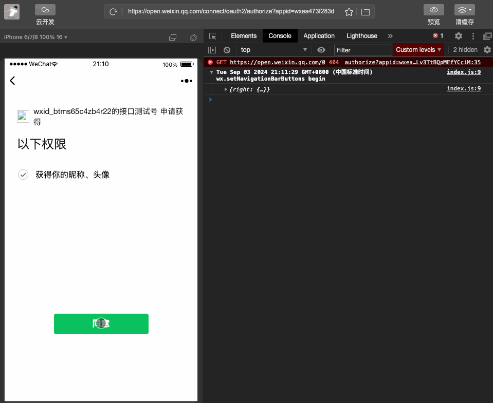
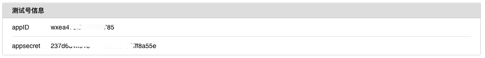
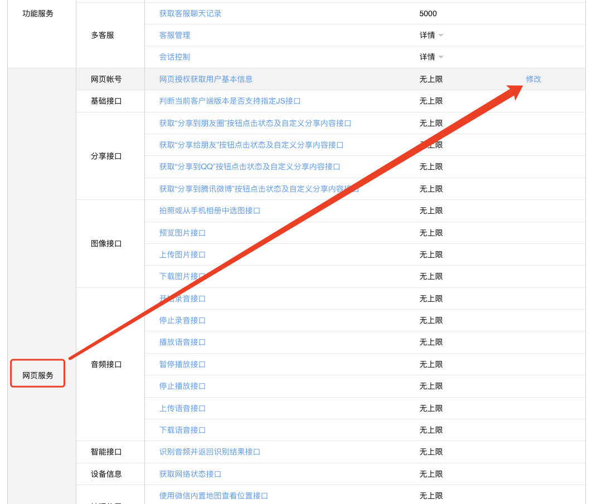
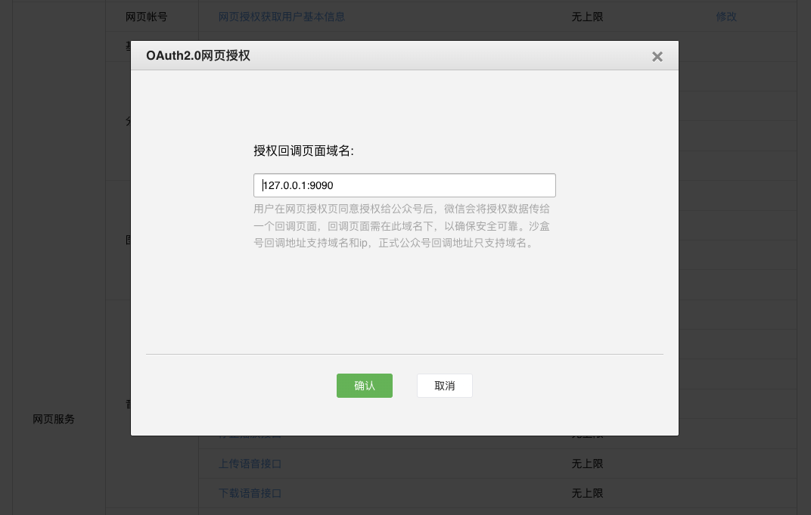
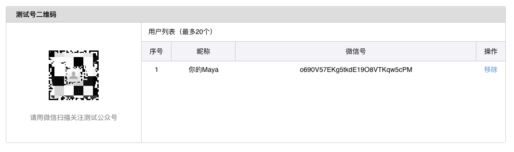

# Node.js和uni-app实现微信公众号网页授权登录

## 前言

要实现微信公众号的网页授权登录功能，涉及到前后端的配合，这里将分为两大部分来说明：后端（使用Node.js）如何配置微信公众号的认证服务，以及前端（使用uni-app）如何集成并调用这些服务。

## 效果演示


## 准备工作

### 1、申请测试账号

[点击去申请测试账号](https://link.juejin.cn/?target=https%3A%2F%2Fmp.weixin.qq.com%2Fdebug%2Fcgi-bin%2Fsandboxinfo%3Faction%3Dshowinfo%26t%3Dsandbox%2Findex)

### 2、获取测试号信息 

复制`AppID`和`AppSecret`，然后复制到后端项目中。



### 3、找到`网页服务` -> `网页账号`，修改配置



### 4、配置内容

**特别说明** 这里需要配置的是ip或者域名，切记不要添加 `http://` 或者 `https://`



### 5、用微信扫描关注测试公众号



## 实现步骤

1. 用户同意授权，获取code。如果用户同意授权，页面将跳转至 redirect_uri/?code=CODE&state=STATE。
2. 通过code换取网页授权access_token
3. 刷新access_token（如果需要）
4. 拉取用户信息(需scope为 snsapi_userinfo)

[微信参考文档](https://link.juejin.cn/?target=https%3A%2F%2Fdevelopers.weixin.qq.com%2Fdoc%2Foffiaccount%2FOA_Web_Apps%2FWechat_webpage_authorization.html%230)

## 前端 uniapp 代码示例

```html
<template>
	<view class="main">
		<view class="user-box">
			<view v-if="userInfo.openid" class="user-info">
				<image class="user-img" :src="userInfo.headimgurl" />
				<text class="user-name">用户昵称：{{userInfo.nickname}}</text>
				<text class="user-openid">openid：{{userInfo.openid}}</text>
			</view>
			<view v-else class="user-empty">
				用户未登录
			</view>
		</view>
		<button @click="oauth">发起微信授权</button>
	</view>
</template>

<script setup>
	import { onLoad } from '@dcloudio/uni-app'
	import { ref } from 'vue'
	const loading = ref(false)
	let userInfo = ref({})

	onLoad((query) => {
		// 如果授权了会获取到 code
		if (query?.code) {
			// 获取到 code 后，向后端发送登录请求
			console.log('获取到 code：', query.code);
			console.log('向后端发送登录请求');
			reqLogin(query.code)
		}
	})
	
	// 请求后端登录
	function reqLogin ( code ){
		if(loading.value) return
		loading.value = true
		uni.showLoading({ title:'授权登录中...',mask:true})
		uni.request({
			url:'http://127.0.0.1:3000/api/weixin/login',
			method:'POST',
			data:{ code },
			success(res) {
				console.log('登录-res',res.data.userInfo);
				userInfo.value = res.data.userInfo
			},
			fail(err) {
				console.log('登录-err',err);
				uni.showToast({
					icon:'fail',
					title:'登录出错了！'
				})
			},
			complete() {
				loading.value = false
				uni.hideLoading()
			}
		})
	}

	// 发起授权
	function oauth() {
		// 微信 appid
		const appid = 'your_app_id'
		
		//获取当前页面地址作为回调地址
		const redirectUri = encodeURIComponent(window.location.href);

		//通过微信官方接口获取code之后，会重新刷新设置的回调地址【redirect_uri】
		window.location.href =
			"https://open.weixin.qq.com/connect/oauth2/authorize?appid=" +
			appid +
			"&redirect_uri=" +
			redirectUri +
			"&response_type=code&scope=snsapi_userinfo&state=1#wechat_redirect";
	}
</script>

<style lang="scss">
	.main{
		display: flex;
		flex-direction: column;
		align-items: center;
		justify-content: center;
		gap: 15px;
		min-height: 100vh;
		background-color: #f5f6f7;
	}
	.user-box{
		.user-info{
			display: flex;
			flex-direction: column;
			align-items: center;
			justify-content: center;
			.user-img{
				width: 60px;
				height: 60px;
				border-radius: 99px;
				border: 1px solid black;
			}
		}
		.user-empty{
			// background-color: #f5f6f7;
			display: flex;
			align-items: center;
			justify-content: center;
			width: 100px;
			height: 100px;
			border: 1px solid black;
			border-radius: 6px;
		}
	}
</style>
```

## 后端 Node.js 代码示例
```javascript
// 发送微信小程序订阅消息

const express = require('express'); // 导入 Express 模块
const cors = require('cors'); // 导入 CORS 模块，用于处理跨域请求
const axios = require('axios'); // 导入 Axios 模块，用于发起 HTTP 请求
const bodyParser = require('body-parser');  // 中间件，用于解析req.body
const app = express(); // 创建 Express 应用实例

app.use(cors()); // 使用 CORS 中间件解决跨越请求
app.use(bodyParser.json());  // 使用中间件解析JSON数据

const port = 3000; // 设置应用监听的端口号

const wxConfig = {// 微信公众号配置信息
  appid: 'your_app_id',
  secret: 'your_app_secret',
}

// 微信小程序用户登陆
app.post('/api/weixin/login', async (req, res) => {

  // 1、获取客户端传来的code
  const code = req.body?.code

  if (!code) {
    throw new Error('code参数不能为空')
  }
  // 2、用 code 换 AccessToken
  const data = await getAccessToken(code)

  // 3、用 AccessToken 换 用户信息
  const userInfo = await getUserinfo(data.access_token,data.openid)

  res.send({
    msg: '登录成功',
    userInfo
  })
})

/**
 * 检验授权凭证（access_token）是否有效
 * @param {*} access_token 
 * @param {*} openid 
 * @returns obj
 */
async function checkAccessTokenValid(access_token,openid) {
  // 检验授权凭证（access_token）是否有效
  // 官方说明地址：https://developers.weixin.qq.com/doc/offiaccount/OA_Web_Apps/Wechat_webpage_authorization.html#4
  const url = `https://api.weixin.qq.com/sns/auth`;
  const response = await axios({
    method: "get",
    url,
    params: {
      openid,
      access_token,
    },
  });

  if (response?.data?.errcode) {
    // if(response?.data.errcode === 40003){
    //   throw new Error('openid无效')
    // }else{
    //   throw new Error(JSON.stringify(response?.data))
    // }
    return false
  }

  // response.data:
  // { "errcode":0,"errmsg":"ok"}

  return true
}

/**
 * 拉取用户信息
 * @param {*} access_token 
 * @param {*} openid 
 * @returns obj
 */
async function getUserinfo(access_token,openid) {
  // 拉取用户信息(需scope为 snsapi_userinfo)
  // 官方说明地址：https://developers.weixin.qq.com/doc/offiaccount/OA_Web_Apps/Wechat_webpage_authorization.html#3
  const url = `https://api.weixin.qq.com/sns/userinfo`;
  const response = await axios({
    method: "get",
    url,
    params: {
      openid,
      access_token,
      lang: 'zh_CN',
    },
  });

  if (response?.data?.errcode) {
    if(response?.data.errcode === 40003){
      throw new Error('openid无效')
    }else{
      throw new Error(JSON.stringify(response?.data))
    }
  }

  // response.data:
  // {   
  //   "openid": "OPENID",
  //   "nickname": NICKNAME,
  //   "sex": 1,
  //   "province":"PROVINCE",
  //   "city":"CITY",
  //   "country":"COUNTRY",
  //   "headimgurl":"https://thirdwx.qlogo.cn/mmopen/g3MonUZtNHkdmzicIlibx6iaFqAc56vxLSUfpb6n5WKSYVY0ChQKkiaJSgQ1dZuTOgvLLrhJbERQQ4eMsv84eavHiaiceqxibJxCfHe/46",
  //   "privilege":[ "PRIVILEGE1" "PRIVILEGE2"     ],
  //   "unionid": "o6_bmasdasdsad6_2sgVt7hMZOPfL"
  // }

  return response.data
}

/**
 * 刷新access_token（如果需要）
 * @param {String} refresh_token 
 * @returns obj
 */
async function refreshToken(refresh_token) {
  // 刷新access_token
  // 官方说明地址：https://developers.weixin.qq.com/doc/offiaccount/OA_Web_Apps/Wechat_webpage_authorization.html#2
  const url = `https://api.weixin.qq.com/sns/oauth2/refresh_token`;
  const response = await axios({
    method: "get",
    url,
    params: {
      appid: wxConfig.appid,
      refresh_token,
      grant_type: 'refresh_token',
    },
  });

  if (response?.data?.errcode) {
    throw new Error(JSON.stringify(response.data))
  }

  // response.data：
  // { 
  //   "access_token":"ACCESS_TOKEN",
  //   "expires_in":7200,
  //   "refresh_token":"REFRESH_TOKEN",
  //   "openid":"OPENID",
  //   "scope":"SCOPE" 
  // }
  
  return response.data
}

/**
 * 获取 Access Token
 * @param {string} code code
 * @returns obj 
 */
async function getAccessToken(code) {
  // 通过code换取网页授权access_token
  // 官方说明地址：https://developers.weixin.qq.com/doc/offiaccount/OA_Web_Apps/Wechat_webpage_authorization.html#1
  const url = `https://api.weixin.qq.com/sns/oauth2/access_token`;

  const response = await axios({
    method: "get",
    url,
    params: {
      appid: wxConfig.appid,
      secret: wxConfig.secret,
      code: code,
      grant_type: 'authorization_code',
    },
  });

  if (response?.data.errcode) {
    if(response?.data.errcode === 40029){
      throw new Error('code无效或错误')
    }else{
      throw new Error(JSON.stringify(response.data))
    }
  }

  // response.data：
  // {
  //   "access_token":"ACCESS_TOKEN",
  //   "expires_in":7200,
  //   "refresh_token":"REFRESH_TOKEN",
  //   "openid":"OPENID",
  //   "scope":"SCOPE",
  //   "is_snapshotuser": 1,
  //   "unionid": "UNIONID"
  // }

  return response.data;
}


// 监听端口
app.listen(port, () => {
  console.log(`Example app listening on port ${port}`, `is open url http://127.0.0.1:${port}`)
})
```

## 结语

以上步骤概述了如何使用Node.js作为后端服务器，结合uni-app进行微信公众号网页授权登录的基本流程。实际开发过程中还需要注意安全性和用户体验等方面的问题。例如，确保传输的数据加密，避免敏感信息泄露；优化加载速度，提升用户满意度等。