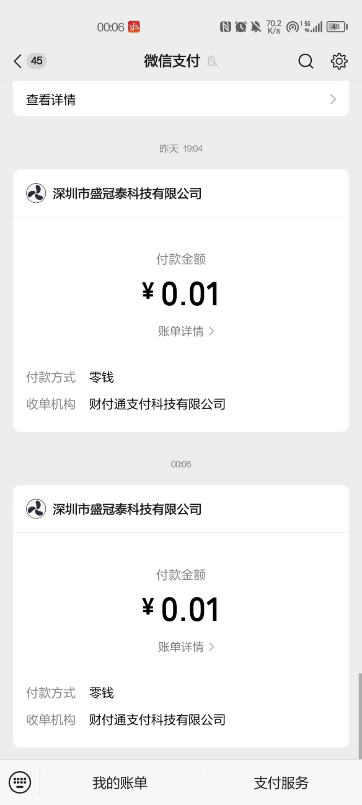
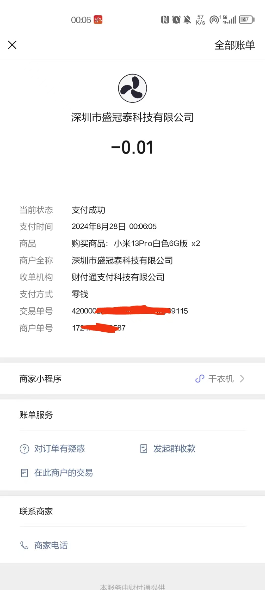
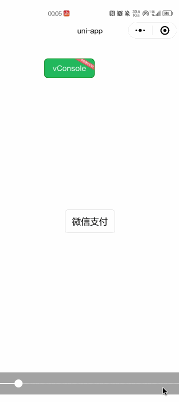
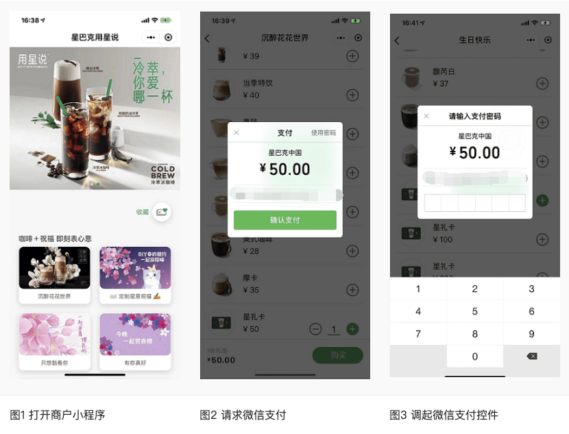
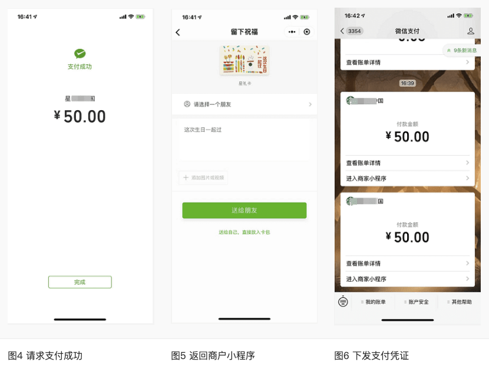

# Node.js和uni-app实现微信小程序支付

## 前言
自己实现一个带支付功能的小程序，前端使用`uniapp`，后端使用`Node.js`，将实现微信小程序支付功能的全流程详细记录下来。使用的是全新的微信支付 APIv3

## 效果演示

<table>
  <tr>
    <td></td>
    <td></td>
  </tr>
  <tr>
    <td></td>
  </tr>
</table>


## 用户付款流程
1. 如图1，用户通过分享或扫描二维码进入商户小程序，用户选择购买，完成选购流程。
2. 如图3，调起微信支付控件，用户开始输入支付密码。

3. 如图4，密码验证通过，支付成功。商户后台得到支付成功的通知。
4. 如图5，返回商户小程序，显示购买成功。
5. 如图6，微信支付公众号下发支付凭证。


## 业务流程图


## 具体操作流程
- 用户通过分享或扫描二维码进入商户小程序，用户选择购买，完成选购流程
- 调用 [wx.login](https://developers.weixin.qq.com/miniprogram/dev/api/open-api/login/wx.login.html) 获取用户临时登录凭证`code`，发送到后端服务器换取`openId`
- 在下单时，小程序需要将购买的商品Id，商品数量，以及用户的`openId`传送到服务器
- 服务器在接收到商品Id、商品数量、`openId`后，生成服务期订单数据，同时经过一定的签名算法，向微信支付发送请求，获取预付单信息`prepay_id`，同时将获取的数据再次进行相应规则的签名，向小程序端响应必要的信息
- 小程序端在获取对应的参数后，调用[wx.requestPayment](https://developers.weixin.qq.com/miniprogram/dev/api/payment/wx.requestPayment.html)发起微信支付，唤醒支付工作台，进行支付
- 接下来的一系列操作都是由用户来操作的包括了微信支付密码，指纹等验证，确认支付之后执行鉴权调起支付
- 鉴权调起支付：在微信后台进行鉴权，微信后台直接返回给前端支付的结果，前端收到返回数据后对支付结果进行展示
- 推送支付结果：微信后台在给前端返回支付的结果后，也会向后台也返回一个支付结果，后台通过这个支付结果来更新订单的状态

## 准备工作
- appid: 微信公众平台分配的小程序AppID。
- secret: 微信公众平台分配的小程序AppSecret。
- mchid: 微信支付商户号。
- mchKey: 微信支付商户密钥。
- serial_no: 商户API证书序列号。
- publicKey: 公钥。
- privateKey: 秘钥。
- [微信支付文档](https://link.juejin.cn/?target=https%3A%2F%2Fpay.weixin.qq.com%2Fwiki%2Fdoc%2Fapiv3%2Fapis%2Fchapter3_5_1.shtml)


## 前端 uni-app 实现
```html
<template>
	<view style="display: flex;align-items: center;justify-content: center;height: 100vh;">
		<button @click="wechatPay">微信支付</button>
	</view>
</template>
<script setup>
	import { ref } from 'vue'
	const openId = ref(null)

	/**
	 * 微信支付
	 */
	const wechatPay = async () => {
		console.log('wechatPay',openId.value);
		if (!openId.value) {
			await wechatLogin()
		}
		await submitOrder()
	}
	
	/**
	 * 微信登录
	 */
	function wechatLogin() {
		return new Promise((resolve, reject) => {
			// 1、获取临时登录凭证 code
			uni.login({
				provider: "weixin",
				success: ({ code }) => {
					// 2、将获取到的 code 发送到后端，用于后端向微信获取 openId 。
					uni.request({
						url: 'http://yourdomain.com/api/weChatMp/login',
						method: 'POST',
						data: { code },
						success: (loginRes) => {
							// 3、将后端返回的 openId 进行保存
							openId.value = loginRes.data.data.openId
							resolve(loginRes)
						},
						fail: () => {
							reject('登录失败！')
							uni.showToast({
								title: '登录失败！',
								icon: 'error',
								duration: 1500
							});
						}
					})
				},
				fail: () => {
					reject('登录出错')
					uni.showToast({
						title: '登录出错！',
						icon: 'error',
						duration: 1500
					});
				}
			})
		})
	}

	/**
	 * 提交订单并支付
	 */
	function submitOrder() {
		return new Promise((resolve, reject) => {
			// 1、将 openId 以及相应需要的商品信息发送到后端
			uni.request({
				url: 'http://yourdomain.com/api/weChatMp/createOrder',
				method: 'POST',
				data: {
					openId: openId.value, // 后台返回的 openId
					productNum: 2, // 假设这是商品数量
					productId: '12345678', // 假设这是商品 id，
					productName: '小米13Pro白色6G版', // 假设这是商品名称，
					productPrice: '9.9' // 假设这是商品价格，
				},
				success(ores) {
					// 2、将后端返回的信息填写到 wx.requestPayment，唤起微信小程序支付
					const result = ores.data.data
					uni.requestPayment({
						provider: 'wxpay',
						// orderInfo: result,
						nonceStr: result.nonceStr, // 随机字符串，长度为32个字符以下
						package: result.package, // 统一下单接口返回的 prepay_id 参数值，提交格式如：prepay_id=***
						paySign: result.paySign, // 签名，具体见微信支付文档
						signType: result.signType,  // 签名算法，应与后台下单时的值一致
						timeStamp: result.timeStamp, // 时间戳，从 1970 年 1 月 1 日 00:00:00 至今的秒数，即当前的时间
						success(payRes) {
							console.log('支付成功', payRes);
							uni.showModal({
								title: '支付提示',
								content: '支付成功',
								showCancel: false,
							})
							resolve(payRes)
						},
						fail(payErr) {
							if(payErr?.errMsg === 'requestPayment:fail cancel'){
								reject('支付已取消！')
								uni.showToast({
									title: '支付已取消！',
									icon: 'error',
									duration: 1500
								});
							}else{
								console.log('支付失败，请重新尝试！', payErr);
								reject('支付失败，请重新尝试！')
								uni.showModal({
									title: '支付提示',
									content: '支付失败，请重新尝试',
									showCancel: false,
								})
							}
						}
					});
				},
				fail(err) {
					reject('订单出错！', err)
					uni.showToast({
						title: '订单出错！',
						icon: 'error',
						duration: 1500
					});
				}
			})
		})
	}
</script>
```

## 后端 Nodejs 实现

```js
// 微信支付
const express = require('express'); // 导入 Express 模块
const cors = require('cors'); // 导入 CORS 模块，用于处理跨域请求
const fs = require('node:fs'); // node内置模块，用于文件系统操作。
const path = require('node:path');//node内置模块，用于处理文件路径。
const axios = require('axios'); // 导入 Axios 模块，用于发起 HTTP 请求
const app = express(); // 创建 Express 应用实例
const WxPay = require('wechatpay-node-v3'); // 导入微信支付模块
const bodyParser = require('body-parser');  // 中间件，用于解析req.body
const crypto = require('crypto'); // 加密模块

app.use(cors()); // 使用 CORS 中间件解决跨越请求
app.use(bodyParser.json());  // 使用中间件解析JSON数据

// 配置静态文件服务，使得/public路径下的文件可以直接访问，如果没有请手动创建
app.use('/public', express.static(path.join(__dirname, 'public')));

const port = 3000; // 设置应用监听的端口号

// 微信小程序配置信息
const wxConfig = {
  appid: 'your_app_id',
  secret: 'your_app_secret',
  mchid: 'your_mch_id', //商户号
  serial_no: 'your_serial_no', //API证书 - 商户API证书序列号 
  publicKey: fs
    .readFileSync(`${__dirname}/certificate/apiclient_cert.pem`)
    .toString(), // 公钥
  privateKey: fs
    .readFileSync(`${__dirname}/certificate/apiclient_key.pem`)
    .toString(), // 秘钥
  apiV3Key: 'your_apiV3Key', //apiV3 秘钥值
  mchKey: 'your_mch_key', // 微信支付商户密钥
}

const wechatPay = new WxPay({
  appid: wxConfig.appid,
  mchid: wxConfig.mchid,
  publicKey: wxConfig.publicKey, // 公钥
  privateKey: wxConfig.privateKey, // 秘钥
});

// 微信用户登陆
app.post('/api/weChatMp/login', async (req, res) => {

  const code = req.body?.code

  if (!code) {
    throw new Error('code参数不能为空')
  }

  const url = `https://api.weixin.qq.com/sns/jscode2session`;

  const response = await axios({
    method: "GET",
    url,
    params: {
      appid: wxConfig.appid,
      secret: wxConfig.secret,
      js_code: code,
      grant_type: 'authorization_code',
    },
  });

  if (response?.errcode) {
    throw new Error(JSON.stringify(response))
  }

  res.send({
    msg: '获取openid成功',
    data: {
      openId: response.data.openid,
    },
  })
})

// 创建订单
app.post('/api/weChatMp/createOrder', async (req, res) => {

  const openId = req.body.openId // openId
  const productId = req.body.productId // 假设这是商品 id，
  const productName = req.body.productName // 假设这是商品名称，
  let productPrice = req.body.productPrice // 假设这是商品价格
  const productNum = req.body.productNum || 1 // 假设这是商品数量

  if (!openId || !openId || !productId || !productName || !productPrice) {
    throw new Error('必要参数不能为空')
  }

  if (typeof productPrice === 'string') {
    productPrice = Number(productPrice)
  }
  productPrice = Math.round(productPrice * 100); // 将元转换为分

  const params = {
    description: `购买商品：${productName} x${productNum}`, // 商品描述
    out_trade_no: Date.now().toString(), // 商户订单号
    notify_url: 'http://yourdomain.com/api/weChatMp/notify', // 通知地址
    amount: { // 订单金额信息
      total: productPrice, // 订单总金额，单位为分。
    },
    payer: { //【支付者】 支付者信息。
      openid: openId, // 【用户标识】 用户在普通商户AppID下的唯一标识。 下单前需获取到用户的OpenID
    },
    scene_info: { // 【场景信息】 支付场景描述
      payer_client_ip: '14.23.150.211', // 【用户终端IP】 用户的客户端IP，支持IPv4和IPv6两种格式的IP地址。
    },
  };

  // 调用小程序下单接口
  const result = await wechatPay.transactions_jsapi(params);

  res.send(result)
})

// 通知回调处理
app.get('/api/weChatMp/notify', async (req, res) => {

  res.send({
    msg: "支付成功",
    data: null
  })
})

// 监听端口
app.listen(port, () => {
  console.log(`Example app listening on port ${port}`, `is open url http://127.0.0.1:${port}`)
})
```

## 结尾

通过以上步骤，你可以实现uni-app和Node.js环境下的微信小程序支付功能。确保所有配置信息正确无误，并且按照微信支付的官方文档进行操作。