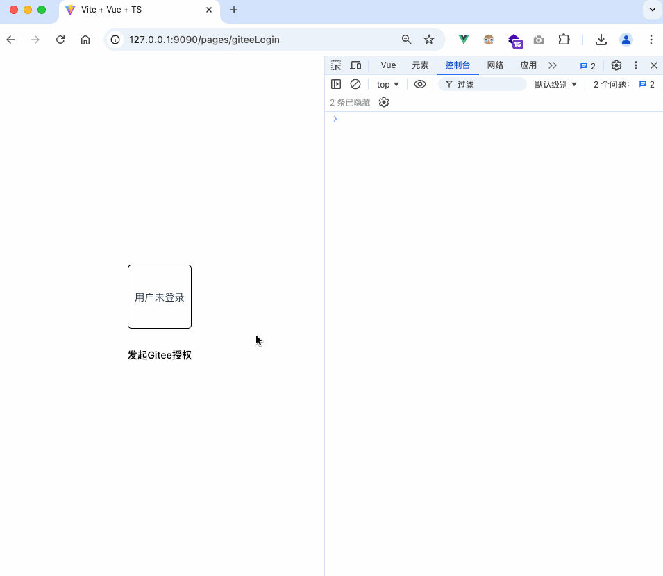
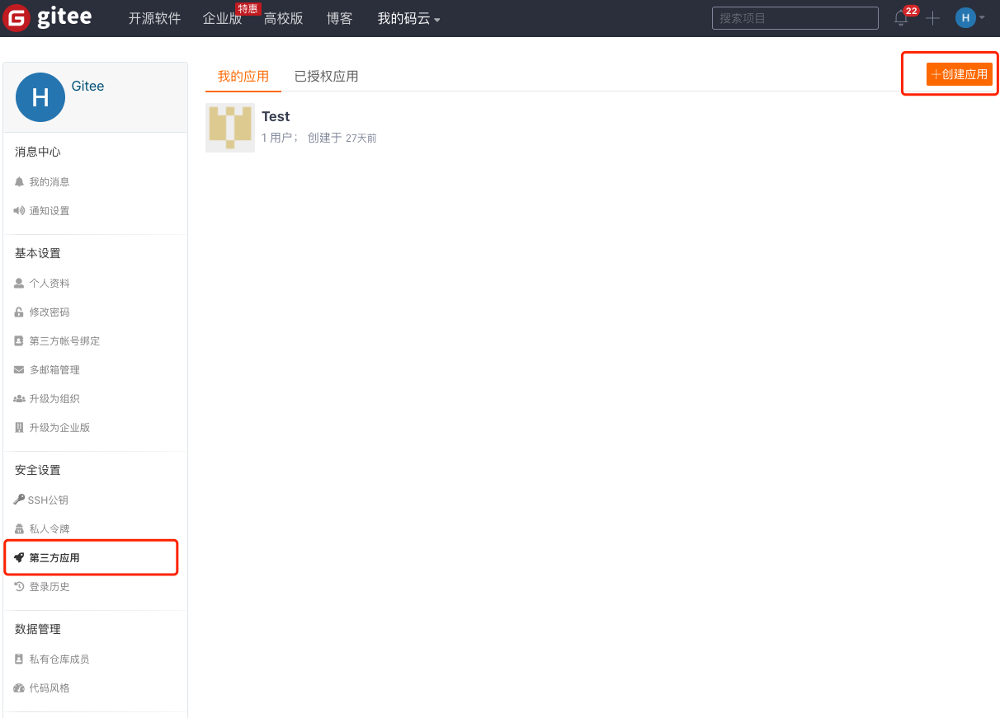
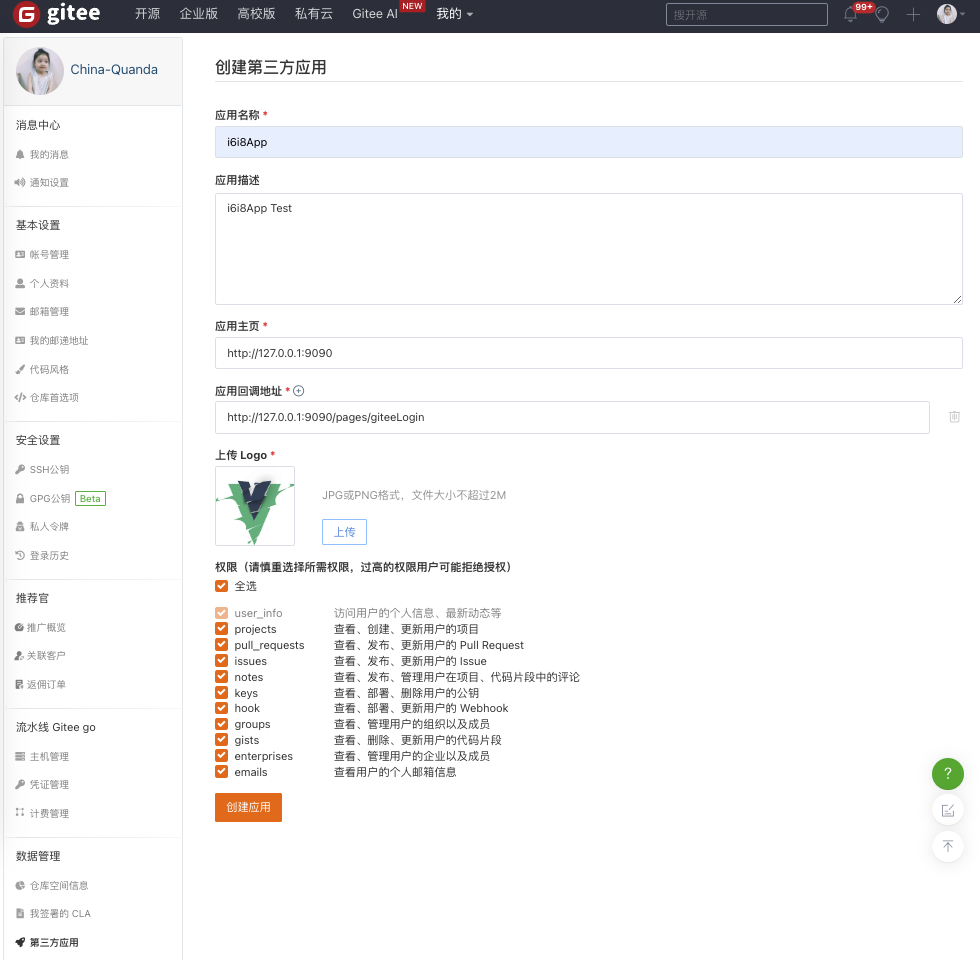
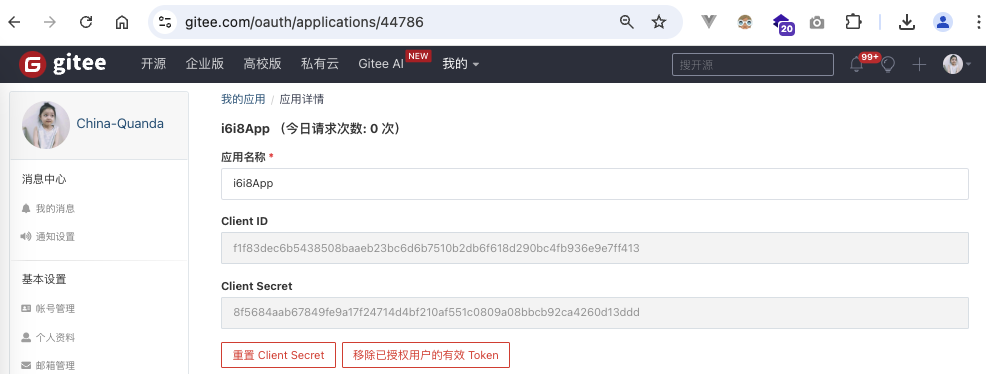

# Node.js和vue3实现Gitee码云OAuth2第三方登录

## 前言

第三方登入太常见了，微信，微博，QQ...总有一个你用过。

在开发中，我们希望用户可以通过Gitee账号登录我们的网站，这样用户就不需要注册账号，直接通过Gitee账号登录即可。

## 效果演示



## 创建 Gitee 应用流程

### 1.在 [修改资料](https://gitee.com/profile) -> [第三方应用](https://gitee.com/oauth/applications)，创建要接入码云的应用。



### 2.填写应用信息

勾选应用所需要的权限。其中: **回调地址**是用户授权后，码云回调到应用，并且回传授权码的地址。



### 3.应用创建成功

创建成功后，会生成 Cliend ID 和 Client Secret。

将`Client ID`和`Client Secret`和`应用回调地址`复制到配置文件中，他们将会在上述OAuth2 认证基本流程用到。




## 前后端调用流程步骤：

- 前端：用户点击按钮跳转到Gitee码云授权页面；
- 前端：用户在授权页面同意授权后，Gitee码云将用户重定向到您的网站；
- 前端：重定向的URL中包含一个授权码code，在该页面中获取授权码；
- 前端：调用后端登录api，将获取到的code传给后端；
- 后端：后端收到code后调用Gitee的token api，获取access_token；
- 后端：获取到access_token后调用 user api，获取用户信息返回给前端；
- 前端：拿到后端返回的用户信息后，将用户信息保存到本地，完成登录。

## 前端 Vue 实现

### 1.安装必要依赖

- axios是一个HTTP客户端库，用于向服务端发送请求。

```sh
npm install axios
```

### 2.替换你的配置信息
```js
// gitee配置信息
const config = {
  // 替换为你的回调地址
  redirect_uri: 'http://127.0.0.1:9090/pages/giteeLogin',
  // 替换为你的 client_id
  client_id: 'f1f83dec6b5438508baaeb23bc6d6b7510b2db6f618d290bc4fb936e9e7ff413',
}
```
### 3.代码示例

```html
<template>
  <div class="user-box">
    <div v-if="userInfo.id" class="user-info">
      
      <text class="user-openid">id:{{ userInfo.id }}</text>
      <text class="user-name">用户昵称：{{ userInfo.name || userInfo.login }}</text>
      <text class="user-desc">用户描述：{{ userInfo.bio }}</text>
    </div>
    <div v-else class="user-empty">
      {{ loading ? '用户登录中...' : userInfo?.id ? '用户已登录' : '用户未登录' }}
    </div>
  </div>
  <button @click="oauth">发起Gitee授权</button>
</template>

<script setup>
import { onMounted, ref } from 'vue'
import axios from 'axios'
const loading = ref(false)
let userInfo = ref({})
// gitee配置信息
const config = {
  // 替换为你的回调地址
  redirect_uri: 'http://127.0.0.1:9090/pages/giteeLogin',
  // 替换为你的 client_id
  client_id: 'f1f83dec6b5438508baaeb23bc6d6b7510b2db6f618d290bc4fb936e9e7ff413',
}

// 请求后端登录
function reqLogin(code) {
  console.log('3.将获取到的code发送给后端进行登录');
  if (loading.value) return
  loading.value = true
  axios.post('http://127.0.0.1:3000/api/gitee/login', { code })
    .then(res => {
      console.log('4.登录成功获取到用户信息', res.data);
      userInfo.value = res.data
    }).catch(err => {
      console.log('登录出错了！', err);
    }).finally(() => {
      console.log('发送登录请求结束');
      loading.value = false
    })
}

// 获取地址栏中的code 获取不到将返回 null
function getCode() {
  // 获取当前 URL 的查询参数
  const urlParams = new URLSearchParams(window.location.search);
  // 从查询参数中获取 'code' 值
  const code = urlParams.get('code');
  if (code) {
    console.log('2.授权后，获取地址栏中的code');
  }
  return code
}

// 发起授权
function oauth() {
  console.log('1.点击授权按钮，跳转到Gitee码云授权页中');
  const url = `https://gitee.com/oauth/authorize?client_id=${config.client_id}&redirect_uri=${config.redirect_uri}&response_type=code`
  window.location.href = url
}

onMounted(() => {
  const code = getCode()
  if (code) reqLogin(code)
})
</script>

<style scoped lang="scss">
.user-box {
  display: flex;
  align-items: center;
  justify-content: center;
  margin-bottom: 20px;

  .user-info {
    display: flex;
    flex-direction: column;
    align-items: center;
    justify-content: center;

    .user-img {
      width: 60px;
      height: 60px;
      border-radius: 99px;
      border: 1px solid black;
    }
  }

  .user-empty {
    // background-color: #f5f6f7;
    display: flex;
    align-items: center;
    justify-content: center;
    width: 100px;
    height: 100px;
    border: 1px solid black;
    border-radius: 6px;
  }
}
</style>
```


## 后端 Node.js 实现

### 1.安装必要依赖
- express是一个Web应用框架，用于构建Web应用。
- cors是一个中间件，用于处理跨域请求。
- axios是一个HTTP客户端库，用于向服务端发送请求。

```sh
npm install express cors axios 
```

### 2.替换你的配置信息

```js
// gitee配置信息
const giteeConfig = {
  // 替换为你的回调地址
  redirect_uri: 'http://127.0.0.1:9090/pages/giteeLogin',
  // 替换为你的 client_id
  client_id: 'f1f83dec6b5438508baaeb23bc6d6b7510b2db6f618d290bc4fb936e9e7ff413',
  // 替换为你的 client_secret
  client_secret: '8f5684aab67849fe9a17f24714d4bf210af551c0809a08bbcb92ca4260d13ddd',
}
```

### 3.代码示例

```js
// Node.js和vue3实现Gitee码云OAuth2第三方登录
const express = require('express'); // 导入 Express 模块
const cors = require('cors'); // 导入 CORS 模块，用于处理跨域请求
const axios = require('axios'); // 导入 Axios 模块，用于发起 HTTP 请求
const app = express(); // 创建 Express 应用实例

app.use(cors()); // 使用 CORS 中间件解决跨越请求
app.use(express.json()) // 解析 json 格式请求体
app.use(express.urlencoded({ extended: true })) // 解析传统表单请求体

// gitee配置信息
const giteeConfig = {
  // 替换为你的回调地址
  redirect_uri: 'http://127.0.0.1:9090/pages/giteeLogin',
  // 替换为你的 client_id
  client_id: 'f1f83dec6b5438508baaeb23bc6d6b7510b2db6f618d290bc4fb936e9e7ff413',
  // 替换为你的 client_secret
  client_secret: '8f5684aab67849fe9a17f24714d4bf210af551c0809a08bbcb92ca4260d13ddd',
}

// gitee登录
app.post('/api/gitee/login', async (req, res) => {
  // 1、校验必填参数
  if (!req.body.code) {
    throw new Error('必填参数不能为空！')
  }
  // 2、获取 Access token
  const accessTokenInfo = await getAccessToken(req.body.code)
  // 3、获取用户信息
  const userInfo = await getUserInfo(accessTokenInfo.access_token)
  // 4、在这步你可以将用户信息存入数据库中等其他操作，这里我直接返回了
  res.status(200).send(userInfo)
})

// 获取 access_token
async function getAccessToken(code) {
  // 官方文档： https://gitee.com/api/v5/oauth_doc#/list-item-2
  // 向gitee发送post请求，成功的话会，response.data里面有一个access_token
  try {
    const response = await axios({
      method: 'post',
      url: 'https://gitee.com/oauth/token',
      params: {
        grant_type: 'authorization_code',
        code,
        redirect_uri: giteeConfig.redirect_uri,
        client_id: giteeConfig.client_id,
        client_secret: giteeConfig.client_secret,
      },
    });

    if (!response.data?.access_token) {
      throw new Error('获取 access_token 失败！')
    }

    // response.data:{
    //   access_token: '3875ff7f7def72c6e05285895e4eb3f2',
    //   token_type: 'bearer',
    //   expires_in: 86400,
    //   refresh_token: '138ea028c08769fd798249bc297b095fa41ee4fdd9d5e55bbcef1a1b36db3338',
    //   scope: 'user_info projects pull_requests issues notes keys hook groups gists enterprises emails',
    //   created_at: 1725805674
    // }

    return response.data

  } catch (error) {
    throw new Error(error.response.data?.error_description)
  }
}


// 获取用户信息
async function getUserInfo(access_token) {
  //官方文档： https://gitee.com/api/v5/swagger#/getV5User
  const response = await axios({
    method: "get",
    url: 'https://gitee.com/api/v5/user',
    params: {
      access_token
    },
    headers: {
      'Content-Type': 'application/json',
      // Authorization: `Bearer ${access_token}`,
    },
  });

  console.log('response',response.data)

  if (!response.data?.id) throw new Error('获取用户信息失败！')

  /**
  response.data = {
    "id": 9534923,
    "login": "china-quanda",
    "name": "China-Quanda",
    "avatar_url": "https://foruda.gitee.com/avatar/1677178346321314348/9534923_china-quanda_1627964208.png",
    "url": "https://gitee.com/api/v5/users/china-quanda",
    "html_url": "https://gitee.com/china-quanda",
    "remark": "",
    "followers_url": "https://gitee.com/api/v5/users/china-quanda/followers",
    "following_url": "https://gitee.com/api/v5/users/china-quanda/following_url{/other_user}",
    "gists_url": "https://gitee.com/api/v5/users/china-quanda/gists{/gist_id}",
    "starred_url": "https://gitee.com/api/v5/users/china-quanda/starred{/owner}{/repo}",
    "subscriptions_url": "https://gitee.com/api/v5/users/china-quanda/subscriptions",
    "organizations_url": "https://gitee.com/api/v5/users/china-quanda/orgs",
    "repos_url": "https://gitee.com/api/v5/users/china-quanda/repos",
    "events_url": "https://gitee.com/api/v5/users/china-quanda/events{/privacy}",
    "received_events_url": "https://gitee.com/api/v5/users/china-quanda/received_events",
    "type": "User",
    "blog": null,
    "weibo": null,
    "bio": "时间过得很快，不记录很难回忆起来",
    "public_repos": 11,
    "public_gists": 0,
    "followers": 4,
    "following": 10,
    "stared": 241,
    "watched": 29,
    "created_at": "2021-08-03T12:11:18+08:00",
    "updated_at": "2024-09-08T14:52:57+08:00",
    "email": "864910436@qq.com"
  }
  */

  return response.data;
}

// 启动服务
const PORT = process.env.PORT || 3000;
app.listen(PORT, () => {
  console.log(`Server running on http://127.0.0.1:${PORT}`);
});
```

## 总结

1. 首先，在gitee码云上注册一个应用，并配置好回调地址，获取`client_id`和`client_secret`。
2. 在前端页面上，通过点击`发起Gitee授权`按钮，替换当前地址为 `https://gitee.com/oauth/authorize`，携带上我们前面获取的`client_id`和`回调地址`。
3. gitee会返回一个`code`，这个`code`是临时的，我们通过这个`code`向gitee请求`access_token`，再通过`access_token`向gitee请求用户信息。
4. 最后，将用户信息返回给前端，前端拿到用户信息后，可以保存到数据库或者本地，或者直接跳转到个人中心页面。
5. 注意，这个项目只是演示如何实现gitee登录，实际应用中，需要做更多的处理，比如用户注册，用户信息保存等。
6. 示例代码仅供参考，实际应用中，需要根据具体的业务需求进行修改。
7. 示例代码中，没有做任何的错误处理，实际应用中，需要做错误处理。

我们发现第三方登录的流程其实都差不多，差别就是不同的平台，和自己应用的业务会有点不一样。所以呢，在做之前先要理清思路，仔细看文档。
