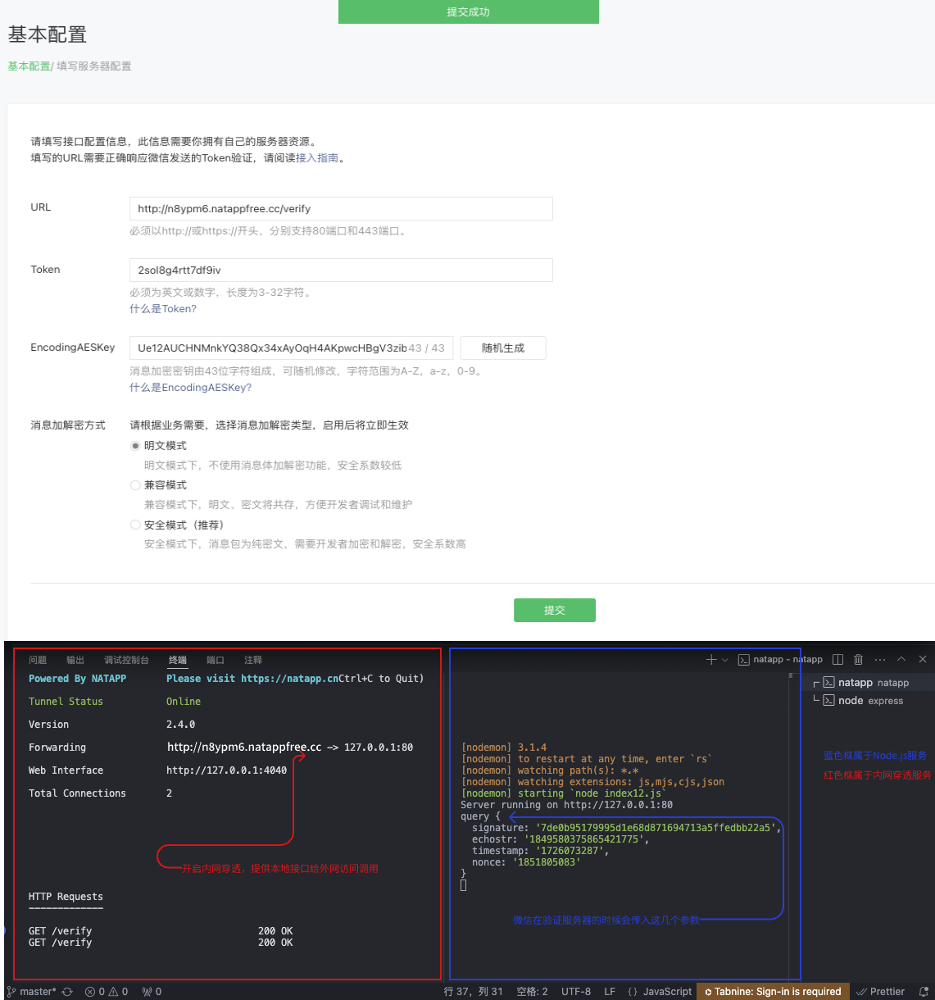

# Node.js对接微信公众号并配置服务器验证

## 实现步骤：

1. 填写服务器配置
2. 验证服务器地址的有效性
3. 依据接口文档实现业务逻辑

## 第一步：填写服务器配置


登录微信公众平台官网后，在公众平台官网的开发-基本设置页面，勾选协议成为开发者，点击“修改配置”按钮，填写服务器地址（URL）、Token和EncodingAESKey，其中URL是开发者用来接收微信消息和事件的接口URL。Token可由开发者可以任意填写，用作生成签名（该Token会和接口URL中包含的Token进行比对，从而验证安全性）。EncodingAESKey由开发者手动填写或随机生成，将用作消息体加解密密钥。

同时，开发者可选择消息加解密方式：明文模式、兼容模式和安全模式。模式的选择与服务器配置在提交后都会立即生效，请开发者谨慎填写及选择。加解密方式的默认状态为明文模式，选择兼容模式和安全模式需要提前配置好相关加解密代码，[详情请参考消息体签名及加解密部分的文档](https://developers.weixin.qq.com/doc/offiaccount/Message_Management/Message_encryption_and_decryption_instructions.html) 。


**URL**：URL字段填写一个接口，不能是IP地址，而且域名必须指向80端口，需要后端配合，能够响应微信发送的验证，如果接口异常无法配置成功。没有固定域名的同志可以使用`natapp`，基于`ngrok`的域名映射工具

**Token**： Token字段随便填写，但要求和后端保持一致，否则也会配置失败。

**EncodingAESKey**：EncodingAESKey由开发者手动填写或随机生成，将用作消息体加解密密钥。

微信会向你填写的地址发送一个请求，然后你需要把他发送的 `echoStr` 返回，所以事先需要在自己服务器上写好 **验证服务器地址的有效性接口**





## 第二步：验证消息的确来自微信服务器

开发者提交信息后，微信服务器将发送GET请求到填写的服务器地址URL上，GET请求携带参数如下表所示：

| 参数 | 描述 |
| --- | --- |
| signature | 微信加密签名，signature结合了开发者填写的token参数和请求中的timestamp参数、nonce参数。 |
| timestamp | 时间戳 |
| nonce | 随机数 |
| echostr | 随机字符串 |


通过检验`signature`对请求进行校验（下面有校验方式）。若确认此次GET请求来自微信服务器，请原样返回`echostr`参数内容，则接入生效，成为开发者成功，否则接入失败。加密/校验流程如下：

1. 将`token`、`timestamp`、`nonce`三个参数进行字典序排序
2. 将三个参数字符串拼接成一个字符串进行sha1加密
3. 获得加密后的字符串可与`signature`对比，标识该请求来源于微信

检验`signature`的`Node.js`示例代码：

```js
// 检查签名
function checkSignature(signature, timestamp, nonce, token) {
  // 1、将token、timestamp、nonce三个参数按照字典序排序
  const arr = [token, timestamp, nonce].sort();
  // 2、将三个参数字符串拼接成一个字符串进行sha1加密
  const sha1 = crypto.createHash('sha1');
  sha1.update(arr.join(''));
  const result = sha1.digest('hex');
  // 3、加密结果与signature比较，相同则验证通过，否则验证失败
  return result === signature;
}
```

完整代码示例：
```js
const express = require('express'); // 导入 Express 模块
const cors = require('cors'); // 导入 CORS 模块，用于处理跨域请求
const app = express(); // 创建 Express 应用实例
const crypto = require('crypto');

app.use(cors()); // 使用 CORS 中间件解决跨越请求
app.use(express.json()) // 解析 json 格式请求体
app.use(express.urlencoded({ extended: true })) // 解析传统表单请求体


const wxConfig = {// 微信公众号配置信息
  // 你将在测试账号页面填写的Token
  token: 'apiToken'
}

// 接口配置信息 服务验证
// 接入指南 https://developers.weixin.qq.com/doc/offiaccount/Basic_Information/Access_Overview.html
app.get('/verify', (req, res) => {
  console.log('query', req.query)
  //  微信调用时会传入以下几个参数
  const { signature, timestamp, nonce, echostr } = req.query
  // 解密信息
  if (checkSignature(signature, timestamp, nonce, wxConfig.token)) {
    // 如果签名正确，原样返回echostr参数内容
    res.send(echostr);
  } else {
    // 如果签名错误，返回错误信息
    throw new Error('如果签名错误');
  }
})

// 检查签名
function checkSignature(signature, timestamp, nonce, token) {
  // 1、将token、timestamp、nonce三个参数按照字典序排序
  const arr = [token, timestamp, nonce].sort();
  // 2、将三个参数字符串拼接成一个字符串进行sha1加密
  const sha1 = crypto.createHash('sha1');
  sha1.update(arr.join(''));
  const result = sha1.digest('hex');
  // 3、加密结果与signature比较，相同则验证通过，否则验证失败
  return result === signature;
}

// 启动服务
const PORT = process.env.PORT || 80;
app.listen(PORT, () => {
  console.log(`Server running on http://127.0.0.1:${PORT}`);
});
```

## 第三步：依据接口文档实现业务逻辑

验证URL有效性成功后即接入生效，成为开发者。你可以在公众平台网站中申请微信认证，认证成功后，将获得更多接口权限，满足更多业务需求。

成为开发者后，用户每次向公众号发送消息、或者产生自定义菜单、或产生微信支付订单等情况时，开发者填写的服务器配置URL将得到微信服务器推送过来的消息和事件，开发者可以依据自身业务逻辑进行响应，如回复消息。

公众号调用各接口时，一般会获得正确的结果，具体结果可见对应接口的说明。返回错误时，可根据返回码来查询错误原因。[全局返回码说明](https://developers.weixin.qq.com/doc/offiaccount/Getting_Started/Global_Return_Code.html)

用户向公众号发送消息时，公众号方收到的消息发送者是一个OpenID，是使用用户微信号加密后的结果，每个用户对每个公众号有一个唯一的OpenID。

此外，由于开发者经常有需在多个平台（移动应用、网站、公众账号）之间共通用户账号，统一账号体系的需求，微信开放平台（open.weixin.qq.com）提供了UnionID机制。开发者可通过OpenID来获取用户基本信息，而如果开发者拥有多个应用（移动应用、网站应用和公众账号，公众账号只有在被绑定到微信开放平台账号下后，才会获取UnionID），可通过获取用户基本信息中的UnionID来区分用户的唯一性，因为只要是同一个微信开放平台账号下的移动应用、网站应用和公众账号，用户的UnionID是唯一的。换句话说，同一用户，对同一个微信开放平台账号下的不同应用，UnionID是相同的。详情请在微信开放平台的资源中心-移动应用开发-微信登录-授权关系接口调用指引-获取用户个人信息（UnionID机制）中查看。

另请注意，微信公众号接口必须以http://或https://开头，分别支持80端口和443端口。
