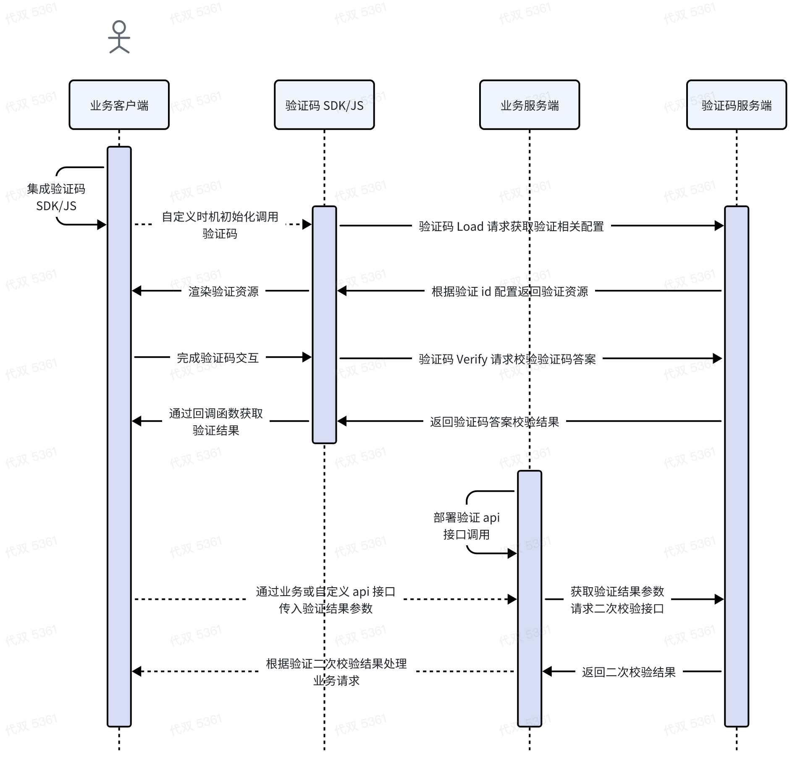
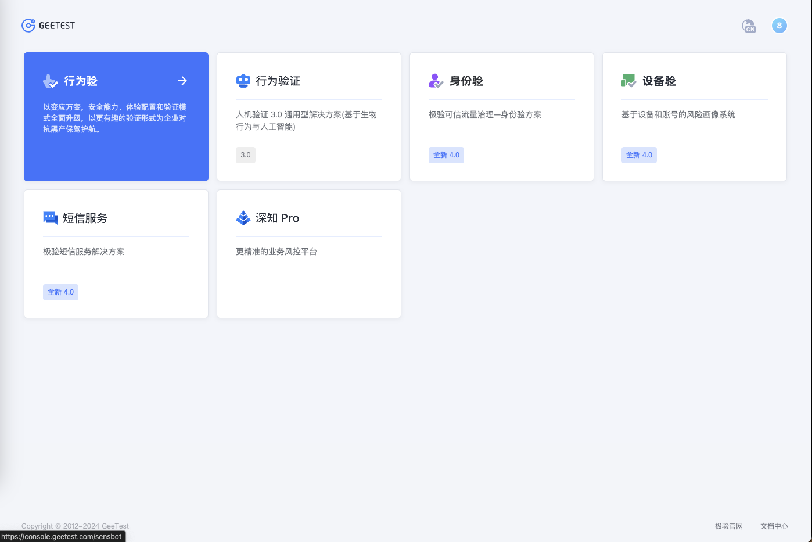
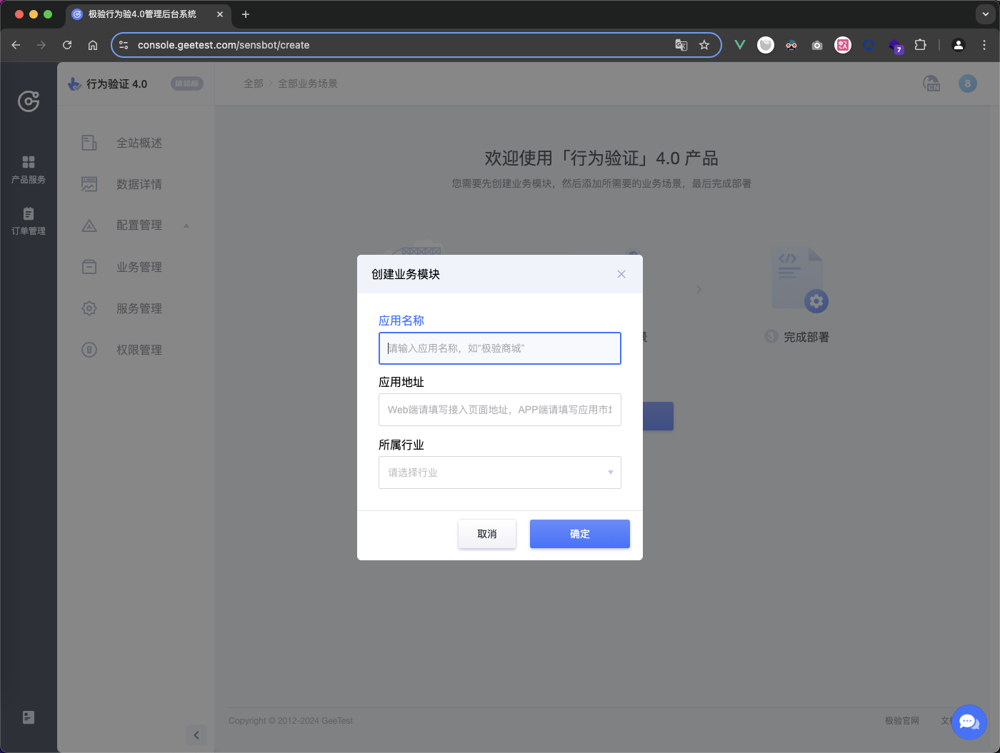
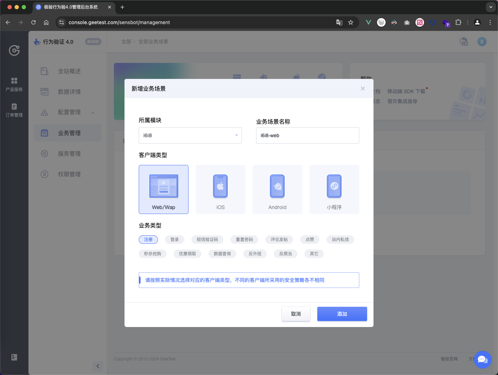
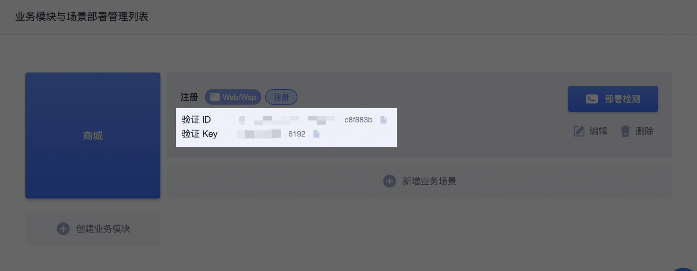

# Node.js接入geetest极验行为验证4.0

## 使用场景

网站和APP，在所有可能被机器行为攻击的场景，例如但不限于注册、登录、短信接口、查询接口、营销活动、发帖评论等等，都可以部署使用「行为验证」，来抵御机器批量操作。

[产品体验地址](https://gt4.geetest.com/)


## 验证码流程时序图



## 极验产品后台使用

### 1、获取账号

如您需体验行为验证 4.0 产品，请事先注册极验产品账号，[可点击此处](https://www.geetest.com/Register)提交账号申请

### 2、通过注册邮箱登录极验产品后台后，选择【[行为验](https://auth.geetest.com/product)】产品



### 3、进入【行为验】产品后台后，根据提示选择【创建业务模块】输入应用名称、应用地址、所属行业。



### 4、创建业务模块完成后，点击【新增业务场景】，输入场景名称、选择客户端类型、业务类型后生成部署所需的 `captcha_id` 和 `captcha_key`。



> 验证流程上不会校验不同场景和客户端是否共用一套 `id` 和 `key`，但为区分验证数据和配置不同的验证策略，建议不同的业务场景单独创建 `id` 和 `key` 部署



### 5、点击【部署检测】-【跳过指引】，即可进行后续场景的数据查看和验证形式配置等操作

## 服务端接入

当用户在前端界面通过验证码后，会产生一批与验证码相关的参数，用户的业务请求带上这些参数，后台业务接口再将这些参数上传到极验二次校验接口，确认该用户本次验证的有效性。

[服务端部署文档说明](https://docs.geetest.com/gt4/deploy/server)

### 1、获取 `captcha_id` 和 `captcha_key`

参考上述步骤登录极验产品后台-业务管理，获取到服务端部署所需的 `captcha_id`（验证 ID）和 `captcha_key`（验证 key），或联系您的项目对接人获取。

### 2、获取客户端验证参数并签名

在客户端完成验证后，可通过回调函数获取验证码相关参数，并通过业务自定义接口如注册登录等传入服务端，服务端拿到客户端验证参数后，需要使用客户端验证参数 `lot_number` 和 `captcha_key` 参考示例进行签名生成 `sign_token`。

### 3、上传验证参数提交二次校验

将客户端和服务端最终验证参数提交二次校验接口，进行二次校验，并根据二次校验返回结果处理最终的业务请求

> 参数请求格式请使用 application/x-www-form-urlencoded 格式，否则将返回报错-50005

### 4、处理容灾降级逻辑

注意处理二次校验接口异常情况，当请求极验二次验证接口异常或响应状态非200时对请求进行放行处理，避免因为接口请求超时或服务未响应而阻碍业务流程。

### 5、处理业务逻辑

根据极验二次校验接口返回的结果状态，进行后续的业务逻辑处理：仅当二次校验接口返回 `result` 为 `success` 时，才允许通过业务流程。

服务端预计开发周期：30分钟

服务端接入常见问题，[请参考此处](https://docs.geetest.com/gt4/faq/server)

### 6、接入示例

#### 二次校验接口

| 接口信息 | 说明 |
|:---:|:--:|
|  接口地址  |  [http://gcaptcha4.geetest.com/validate](http://gcaptcha4.geetest.com/validate) |
|  协议支持  |  https/http |
|  请求方法  |  GET/POST |
|  请求格式  |  application/x-www-form-urlencoded |
|  返回类型  |  json |

**请求参数**

| 参数名 | 类型 | 是否必填 | 说明 |
|:---:|:--:|:--:|:--:|
|  lot_number  |  string |  是 |  验证流水号 |
|  captcha_output  |  string |  是 |  验证输出信息 |
|  pass_token  |  string |  是 |  验证通过标识 |
|  gen_time  |  string |  是 |  验证通过时间戳 |
|  captcha_id  |  string |  是 |  验证 id |
|  sign_token	  |  string |  是 |  验证签名 |

**响应参数**

一般只需要处理校验成功和校验失败时的返回，异常返回一般只会出现在客户接入时没有以正确的方式进行请求。

**1.校验成功返回示例**

```json
{
    "status": "success", // 请求状态
    "result": "success", // 二次校验结果
    "reason": "", // 校验结果说明
    "captcha_args": { // 验证输出参数
        "used_type": "slide", 
        "user_ip": "127.0.0.1", 
        "lot_number": "4dc3cfc2cdff448cad8d13107198d473", 
        "scene": "反爬虫", 
        "referer": "http://127.0.0.1:8077/"
        // ...
    }
}
```
**2.校验失败返回示例**

```json
{
    "status": "success", // 请求状态
    "result": "fail", // 二次校验结果
    "reason": "pass_token expire", // 校验结果说明
    "captcha_args": { // 验证输出参数
        ...
    }
}
```

**3.请求异常返回示例**

```json
{
    "status": "error", // 请求状态
    "code": "-50005", // 错误码
    "msg": "illegal gen_time", // 错误信息
    "desc": { // 错误描述
        "type": "defined error"
    }
}
```

#### Node.js 接入代码示例
```javascript
// 使用 Node.js 框架 express 演示
const express = require('express'); // 导入 Express 模块
const cors = require('cors'); // 导入 CORS 模块，用于处理跨域请求
const axios = require('axios'); // 导入 Axios 模块，用于发起 HTTP 请求
const crypto = require('crypto');
const app = express(); // 创建 Express 应用实例

app.use(cors()); // 使用 CORS 中间件解决跨越请求

const port = 3000; // 设置应用监听的端口号

// geetest极验配置信息
const geetestConfig = {
  id: '7e111794121d87ca0959954f89580e1a', //公钥 public key
  key: '5dcbe6cb44549d3be1a48cbf18dd7bde',// 密钥 secret key
  server:'http://gcaptcha4.geetest.com/validate' // 服务地址server url
}

// 设置路由处理函数，用于验证
app.get('/login', async (req, res) => {

  console.log('login-req', req.query); // 打印请求查询参数

  // 收到前端传来的参数
  const { captcha_id,lot_number,captcha_output,pass_token,gen_time } = req.query

  // 如果没有该参数直接报错
  if(!captcha_id){
    throw new Error('请求参数有误')
  }

  // captcha_id 错误
  if(captcha_id !== geetestConfig.id){
    throw new Error('请求参数有误')
  }

  // 生成签名, 使用标准的hmac算法，使用用户当前完成验证的流水号lot_number作为原始消息message，使用客户验证私钥作为key
  // 采用sha256散列算法将message和key进行单向散列生成最终的 “sign_token” 签名
  const sign_token = crypto.createHmac("sha256", geetestConfig.key).update(lot_number, 'utf8').digest('hex'); 

  // 向极验发送二次校验接口验证，响应json数据如：{"result": "success", "reason": "", "captcha_args": {}}
  const response = await axios({
    method: "get",
    url:`${geetestConfig.server}`,
    params: {
      captcha_id,
      lot_number,
      captcha_output,
      pass_token,
      gen_time,
      sign_token
    },
  });

  // geetest服务响应异常
  if(response.status != 200){
    throw new Error('Geetest Response Error' + response.status)
  }
  // 验证失败
  if(response.data.result != 'success'){
    throw new Error('Geetest Validate Failed, Reason:' + response.data.reason)
  }

  // 验证成功返回结果
  res.send(response.data).json();
})

// 监听端口
app.listen(port, () => {
  console.log(`Example app listening on port ${port}`, `is open url http://127.0.0.1:${port}`)
})
```


#### 各语言示例demo

| 开发语言 | 地址 |
|:---:|:--:|
|  C#  |  [地址](https://github.com/GeeTeam/gt4_csharp_aspnetcoremvc_demo) |
|  Golang  |  [地址](https://github.com/GeeTeam/gt4_golang_demo) |
|  Java  |  [地址](https://github.com/GeeTeam/gt4-java-demo) |
|  Node  |  [地址](https://github.com/GeeTeam/gt4_node_express_demo) |
|  Php  |  [地址](https://github.com/GeeTeam/gt4-php-demo) |
|  Python  |  [地址](https://github.com/GeeTeam/gt4-python-demo) |
|  Ruby  |  [地址](https://github.com/GeeTeam/gt4-ruby-demo) |


