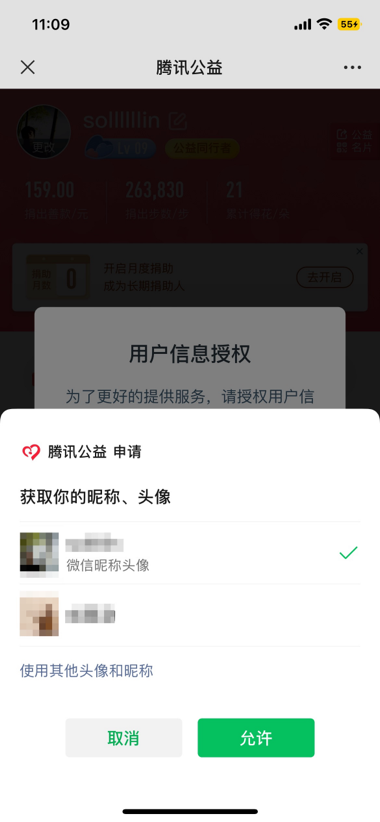
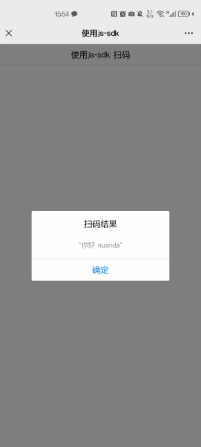
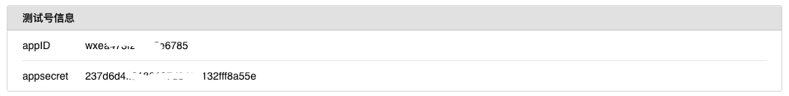
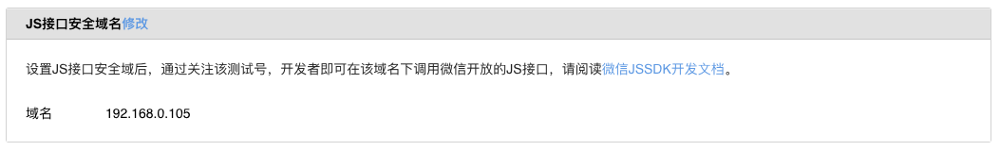

# Node.js结合uni-app对微信公众号网页开发中的JS-SDK权限验证配置

## 概述

微信JS-SDK是[微信公众平台](https://mp.weixin.qq.com/cgi-bin/loginpage?t=wxm2-login&lang=zh_CN)面向网页开发者提供的基于微信内的网页开发工具包。

通过使用微信JS-SDK，网页开发者可借助微信高效地使用拍照、选图、语音、位置等手机系统的能力，同时可以直接使用微信分享、扫一扫、卡券、支付等微信特有的能力，为微信用户提供更优质的网页体验。



## 背景

不管是微信公众号h5开发，还是微信小程序开发，前端总是要依赖后端去完成各种调试。比如微信授权登录，再比如微信 JS-SDK 的使用需要后端获取signature，而这个签名是通过后端服务器来生成的。

话说求人不如求己，所以今天带大家来介绍如何使用 Node.js 实现微信公众号的 JSSDK 调用。

## 效果演示


## 步骤一 微信公众号测试号配置

### 1、先申请一个测试号

对于开发初期还不能上线正式环境的项目来说，可以申请一个测试号，来进行一些功能的测试。

[申请测试号地址](https://mp.weixin.qq.com/debug/cgi-bin/sandboxinfo?action=showinfo&t=sandbox/index)

### 2、先熟读一遍官方文档，文档地址如下：

[微信开发JS-SDK使用说明文档](https://developers.weixin.qq.com/doc/offiaccount/OA_Web_Apps/JS-SDK.html#0)


### 3、获取测试号信息 

复制`AppID`和`AppSecret`，然后复制到后端项目中。



### 4、设置 JS接口安全域名

找到`JS接口安全域名` 修改为当前服务器的域名，这里我使用的是本地，所以直接填了本地局域网ip。



**特别说明** 这里需要配置的是ip或者域名，切记不要添加 `http://` 或者 `https://`

## 步骤二 前端 uniapp 实现

### 1、安装必要的依赖

```sh
npm i weixin-js-sdk -S
```

### 2、引入微信SDK
```js
import wxSdk from 'weixin-js-sdk'
```

### 3、全部代码示例

```html
<template>
	<view>
		<button @click="useJsSdk">使用js-sdk 扫码</button>
	</view>
</template>

<script setup>
	import wxSdk from 'weixin-js-sdk'

	/**
	 * 使用微信js-sdk 扫码api
	 */
	function useJsSdk() {
		initWechatConfig(['scanQRCode']).then(() => {
			wxSdk.scanQRCode({
				needResult: 1, // 默认为0，扫描结果由微信处理，1则直接返回扫描结果，
				scanType: ["qrCode", "barCode"], // 可以指定扫二维码还是一维码，默认二者都有
				success: (res) => {
					var result = res.resultStr; // 当needResult 为 1 时，扫码返回的结果
					uni.showModal({
						title: '扫码结果',
						content: JSON.stringify(result),
						showCancel: false,
					});
				}
			});
		})
	}

	/**
	 * 获取微信配置
	 */
	function getWechatConfig() {
		return new Promise((resolve, reject) => {
			uni.request({
				url: 'http://192.168.0.105:3000/api/weixin/wxConfig',
				data: {
					url: window.location.href.split('#')[0]
				},
				method: 'GET',
				success(res) {
					resolve(res.data)
				},
				fail(err) {
					reject(err)
				}
			})
		})
	}

	/**
	 * 初始化微信配置
	 */
	function initWechatConfig(jsApiList = []) {

		return new Promise(async (resolve, reject) => {

      // 发送请求获取微信配置
			const config = await getWechatConfig()

			wxSdk.config({
				debug: false, // 开启调试模式
				appId: config.appId, // 必填，公众号的唯一标识
				timestamp: config.timestamp, // 必填，生成签名的时间戳
				nonceStr: config.nonceStr, // 必填，生成签名的随机串
				signature: config.signature, // 必填，签名
				jsApiList // 必填，需要使用的JS接口列表
			})

			wxSdk.ready(() => {
				// config信息验证后会执行ready方法，所有接口调用都必须在config接口获得结果之后，config是一个客户端的异步操作，所以如果需要在页面加载时就调用相关接口，则须把相关接口放在ready函数中调用来确保正确执行。对于用户触发时才调用的接口，则可以直接调用，不需要放在ready函数中。
				resolve()
			})

			wxSdk.error((err) => {
				// config信息验证失败会执行error函数，如签名过期导致验证失败，具体错误信息可以打开config的debug模式查看，也可以在返回的res参数中查看，对于SPA可以在这里更新签名。
				reject(err)
			})
		})
	}
</script>
```

## 步骤三 后端 Node.js 实现

### 1、安装必要依赖

- 安装 `express` 或其他 Node.js web 框架来做后端服务。
- 安装 `axios` 或其他 HTTP 库来发送请求。
- 安装 `cors` 用于处理跨域请求。
- 安装 `sha1` 用于加密。

### 2、修改微信公众号配置信息

```js
// 微信公众号配置信息
const wxConfig = {
  appid: 'your_app_id',
  secret: 'your_app_secret',
}
```

### 3、全部代码示例

```javascript
const express = require('express'); // 导入 Express 模块
const cors = require('cors'); // 导入 CORS 模块，用于处理跨域请求
const axios = require('axios'); // 导入 Axios 模块，用于发起 HTTP 请求
const sha1 = require('js-sha1') // 引入加密方法

const app = express(); // 创建 Express 应用实例

app.use(cors()); // 使用 CORS 中间件解决跨越请求

const port = 3000; // 设置应用监听的端口号

const wxConfig = {// 微信公众号配置信息
  appid: 'your_app_id',
  secret: 'your_app_secret',
}

// 获取微信配置 api 接口
app.get('/api/weixin/wxConfig', async (req, res) => {
  // 1、接收前端传来的 url 
  const url = req.query?.url || ''
  // 2、判断是否传入了 url
  if (!url) throw new Error('url 不能为空！')
  // 3、获取 access_token
  const access_tokenInfo = await getAccessToken()
  // 4、用 access_token 获取 jsapi_ticket
  const jsapi_ticketInfo = await getJsapiTicket(access_tokenInfo.access_token)
  // 5、生成时间戳
  const timestamp = generateTimestamp()
  // 6、生成随机字符串
  const nonceStr = generateNoncestr()
  // 7、生成签名
  const signature = generateSignature(jsapi_ticketInfo.ticket, nonceStr, timestamp,url)
  // 8、响应数据给前端
  res.send({
    appId: wxConfig.appid,
    timestamp,
    nonceStr,
    signature
  })
})

// 获取 Ticket 通过 Access Token
async function getJsapiTicket(access_token) {
  // JS-SDK使用权限签名算法
  // 官方说明地址：https://developers.weixin.qq.com/doc/offiaccount/OA_Web_Apps/JS-SDK.html#62
  const url = `https://api.weixin.qq.com/cgi-bin/ticket/getticket`;

  const response = await axios({
    method: "get",
    url,
    params: {
      type: 'jsapi',
      access_token,
    },
  });
  

  if (response?.data.errcode) {
    throw new Error(JSON.stringify(response.data))
  }

  // response.data：
  // {
  //   "errcode":0,
  //   "errmsg":"ok",
  //   "ticket":"bxLdikRXVbTPdHSM05e5u5sUoXNKd8-41ZO3MhKoyN5OfkWITDGgnr2fwJ0m9E8NYzWKVZvdVtaUgWvsdshFKA",
  //   "expires_in":7200
  // }

  return response.data;
}

// 获取 Access token
async function getAccessToken() {
  // 获取 Access token
  // 官方说明地址：https://developers.weixin.qq.com/doc/offiaccount/Basic_Information/Get_access_token.html
  const url = `https://api.weixin.qq.com/cgi-bin/token`;

  const response = await axios({
    method: "get",
    url,
    params: {
      grant_type: 'client_credential',
      appid: wxConfig.appid,
      secret: wxConfig.secret,
    },
  });

  if (response?.data.errcode) {
    if (response?.data.errcode === 40013) {
      throw new Error('AppID无效错误')
    } else {
      throw new Error(JSON.stringify(response.data))
    }
  }

  // response.data： {"access_token":"ACCESS_TOKEN","expires_in":7200}

  return response.data;
}

// 生成时间戳
const generateTimestamp = () => Date.parse(new Date()) / 1000

// 生成随机字符串
const generateNoncestr = () => {
  const n = 17
  let nonceStr = ''
  const str = 'ABCDEFGHIJKLMNOPQRSTUVWXYZabcdefghijklmnopqrstuvwxyz'
  const len = str.length
  for (let i = 0; i < n; i += 1) {
    const rand = Math.floor(Math.random() * len)
    nonceStr += str.charAt(rand)
  }
  return nonceStr
}

// 生成签名
const generateSignature = (jsapi_ticket, noncestr, timestamp, url) => {
  // 介绍 https://developers.weixin.qq.com/doc/offiaccount/OA_Web_Apps/JS-SDK.html#62
  const obj = {
    jsapi_ticket,// 有效的jsapi_ticket
    noncestr,//随机字符串
    timestamp,//时间戳
    url // 当前网页的URL
  }
  let str = ''
  Object.keys(obj).forEach((k) => {
    str += `&${k}=${obj[k]}`
  })
  return sha1(str.slice(1))
}

// 监听端口
app.listen(port, () => {
  console.log(`Example app listening on port ${port}`, `is open url http://127.0.0.1:${port}`)
})
```

## 结语

以上步骤详细介绍了如何使用Node.js作为后端服务器，结合uni-app进行微信公众号网页开发中的JS-SDK权限验证配置。确保每个环节正确执行，以保证最终功能的正常运行。