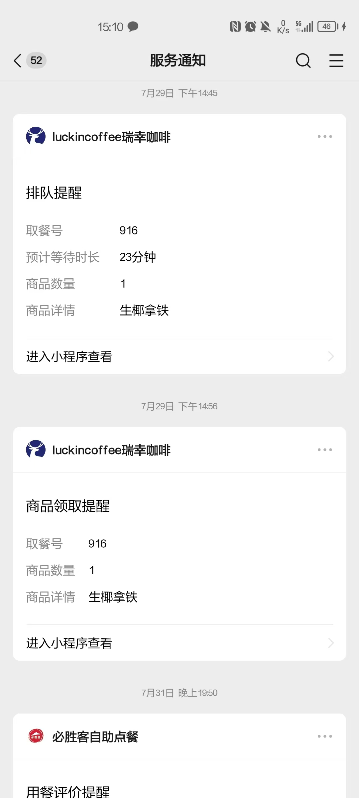
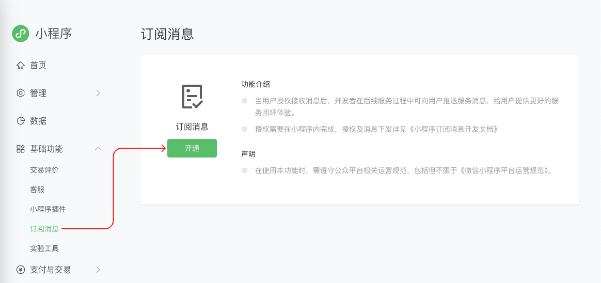
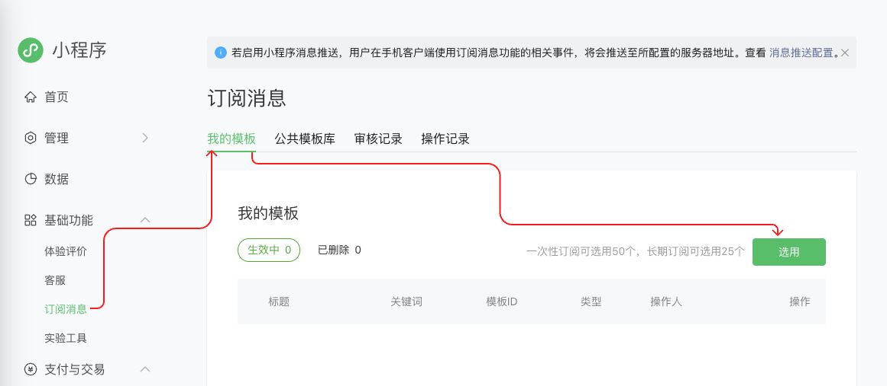
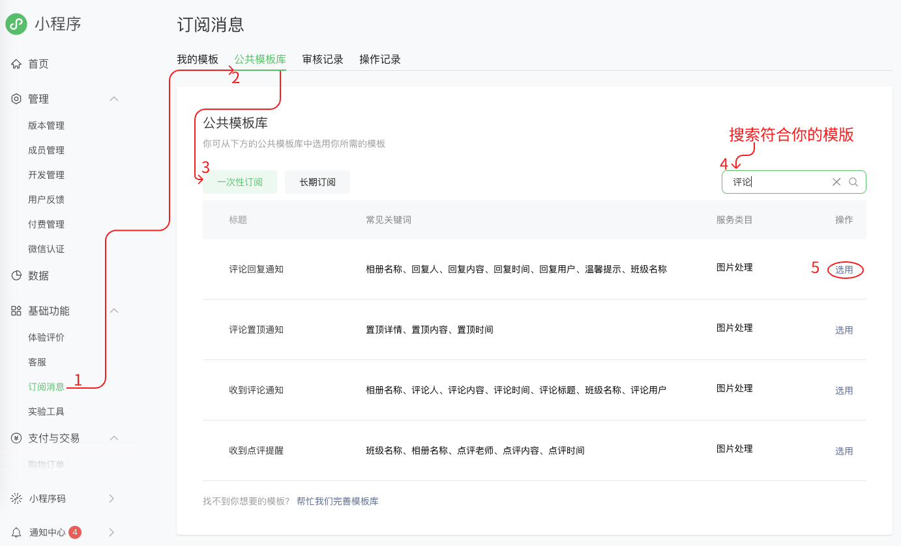
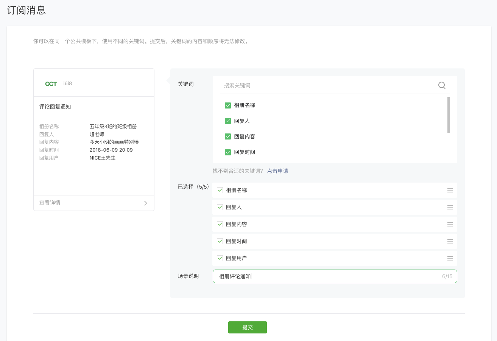
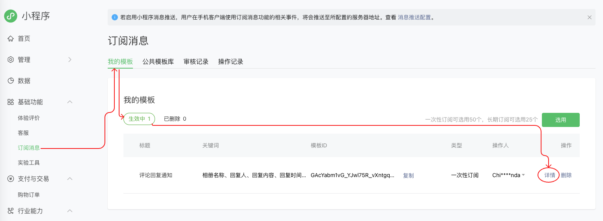
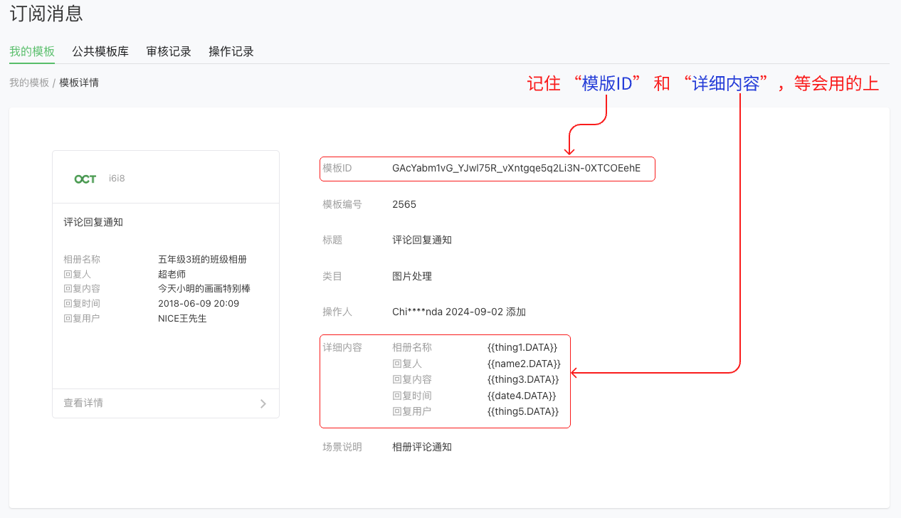
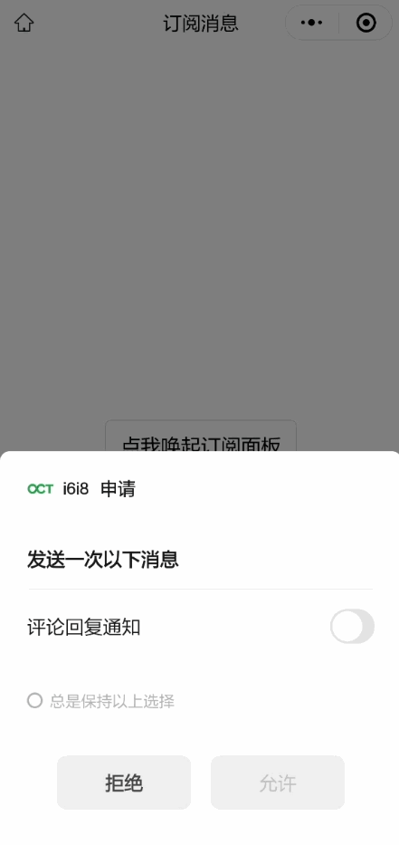
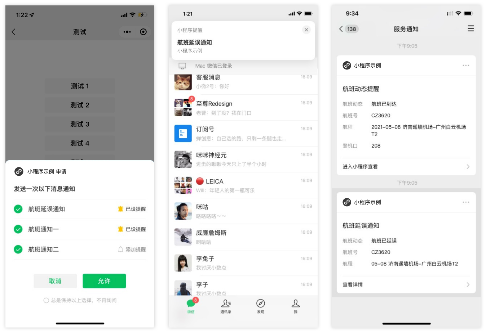
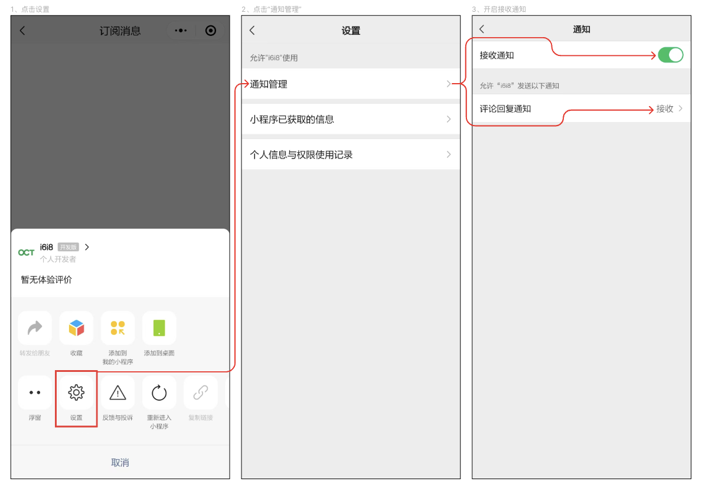

# Nodejs和uni-app实现微信小程序订阅消息功能

## 介绍：

消息能力是小程序能力中的重要组成部分，微信官方提供了订阅消息能力，以便实现开发者实现服务的闭环和更优的体验。可以支持在用户自主订阅后，推送消息到用户端（服务通知），用户点击查看详情可跳转至小程序的页面，实现服务的闭环，提高活跃度和用户粘性。

## 业务场景：

用户在微信小程序使用某个服务，比如购买、预约等服务，在用户预约成功后向该用户推送一条预约成功的消息提醒。



## 发送订阅消息步骤：
- 开通消息订阅：开发者可以申请开通订阅消息能力，开启后开发者可以调用接口向用户推送消息；
- 配置消息模板：申请生成消息模板ID,确定模板详情:标题、内容等；
- 前端订阅消息：通过按钮或者支付回调向用户发起订阅消息的询问；
- 后端进行推送：用户同意订阅后，后端请求微信消息推送接口携带模板ID、模板内容（可理解成数据字段）用户open_id、跳转地址等参数进行推送；
- 用户收到消息：用户在服务通知中收到该模板消息的卡片，点击可转向小程序中的跳转地址,可传参。


## 一、开通消息订阅

- 打开[微信公众平台](https://mp.weixin.qq.com/)地址，扫码登录后台, 并找到订阅消息
- 若您未开通消息订阅模板, 会先提示您去开通此功能.




## 二、配置消息模板
- 登录微信公众平台之后，消息模板的配置入口在小程序管理后台中的`基础功能` - `订阅消息`里，你会看到下面这张图展示的内容：
- 点击`选用`按钮，进入公共模板库中



- 由于长期性订阅消息，目前仅向政务民生、医疗、交通、金融、教育等线下公共服务开放，后期将逐步支持到其他线下公共服务业务。仅就线下公共服务这一点，长期性订阅消息就和大部分开发者无缘了。 所以我们这里只能以使用一次性订阅消息为例。
- 手动配置模板ID(若在公共模板库中没有找到合适的,可以申请添加新模板、审核通过后即可使用).



- 根据自身业务需求，选择创建适合自己的模板
- 点击`选用`模板，进入模板详情页
- 填写模板参数，并提交审核



- 配置完成后提交, 你就会在我的模板看到该条订阅消息相关信息.
- 需等待微信官方审核通过后，方可使用。
> 注意：创建模板提交审核，尽量提前创建模板，避免审核失败。



- 点击`详情`按钮进入模版详情页,可以看到我们配置的信息：
- 下图的`模板ID`就是我们需要的。



## 三、前端订阅消息 前端 uni-app 代码实现

### 1、替换你的请求基础地址：

```js
// 请求基础地址
const requestBaseUrl = 'YOUR_URL_ADDRESS'
```

### 2、替换你的模版Id：

```js
// 模版id
const tmplId = 'your_template_id'
```

### 3、代码示例：

```html
<template>
	<view style="display: flex;align-items: center;justify-content: center;height: 100vh;">
		<button @click="subscribe">点我唤起订阅面板</button>
	</view>
</template>
<script setup>
	import { ref } from 'vue'
	
	// 用户 openId
	const openId = ref(null)
	// 请求基础地址
	const requestBaseUrl = 'http://192.168.43.245:3000/api/weChatMp'

	// 发送订阅消息
	async function subscribe() {

		// 如果没有 openId 就代表未登录
		if (!openId.value) {
			await wechatLogin()
		}

		// 模版id
		const tmplId = 'GAcYabm1vG_YJwl75R_vXntgqe5q2Li3N-0XTCOEehE'

		// 接口文档地址：https://developers.weixin.qq.com/miniprogram/dev/api/open-api/subscribe-message/wx.requestSubscribeMessage.html
		uni.requestSubscribeMessage({
			tmplIds: [tmplId],
			success(res) {
				console.log('接口调用成功的回调函数', res)
				if (res[tmplId] == 'accept') { // 用户同意后
					// 发送请求给后端进行通知
					uni.request({
						url: `${requestBaseUrl}/sendSubscribeMsg`,
						method: 'POST',
						data: {
							touser: openId.value, // 接收者（用户）的 openid
							page: `/pages/index/index`, // 点击模板卡片后的跳转页面，仅限本小程序内的页面。支持带参数,（示例index?foo=bar）。该字段不填则模板无跳转
							template_id: tmplId, // 所需下发的订阅模板id
							data: { // 模板内容，格式形如 { "key1": { "value": any }, "key2": { "value": any } }的object
								thing1: {
									value: '李氏家族大合照' // 相册名称
								},
								name2: {
									value: '大伯' // 回复人
								},
								thing3: {
									value: '你和小时候一毛一样' // 回复内容
								},
								date4: {
									value: '2028年11月11日' // 回复时间
								},
								thing5: {
									value: '你的Maya' // 回复用户
								}
							},
							miniprogramState: 'developer', // 跳转小程序类型：developer为开发版；trial为体验版；formal为正式版；默认为正式版
							lang: 'zh_CN' // 进入小程序查看”的语言类型，支持zh_CN(简体中文)、en_US(英文)、zh_HK(繁体中文)、zh_TW(繁体中文)，默认为zh_CN
						},
						success: (res) => {
							console.log('服务器发送订阅消息成功', res);
							uni.showModal({
								title: '消息订阅提示',
								content: "服务器发送订阅消息成功！",
								showCancel:false
							});
						},
						fail: (err) => {
							console.log('服务器发送订阅消息失败！', err);
						}
					})
				} else if (res[tmplId] == 'reject') { // 用户拒绝授权
					wx.showModal({
						title: '温馨提示',
						content: "您已关闭消息推送，如需要消息推送服务，请点击确定跳转设置页面打开授权后再次尝试。",
						success: (modal) => {
							if (modal.confirm) { // 点击确定
								wx.openSetting({
									withSubscriptions: true
								})
							}
						}
					})
				}
			},
			fail(err) {
				console.log('接口调用失败的回调函数', err)
				if (err.errCode == '20004') {
					wx.showModal({
						title: '温馨提示',
						content: "您的消息订阅主开关已关闭，如需要消息推送服务，请点击确定跳转设置页面打开授权后再次尝试。",
						success: (modal) => {
							if (modal.confirm) { // 点击确定
								wx.openSetting({
									withSubscriptions: true
								})
							}
						}
					})
				}
			}
		})
	}

	/**
	 * 微信登录
	 */
	function wechatLogin() {
		return new Promise((resolve, reject) => {
			// 1、获取临时登录凭证 code
			uni.login({
				provider: "weixin",
				success: ({ code }) => {
					// 2、将获取到的 code 发送到后端，用于后端向微信获取 openId 。
					uni.request({
						url: `${requestBaseUrl}/login`,
						method: 'POST',
						data: { code },
						success: (loginRes) => {
							// 3、将后端返回的 openId 进行保存
							openId.value = loginRes.data.data.openId
							resolve(loginRes)
						},
						fail: () => {
							reject('登录失败！')
							uni.showToast({
								title: '登录失败！',
								icon: 'error',
								duration: 1500
							});
						}
					})
				},
				fail: () => {
					reject('登录出错')
					uni.showToast({
						title: '登录出错！',
						icon: 'error',
						duration: 1500
					});
				}
			})
		})
	}
</script>

<style lang="scss" scoped>
</style>
```

## 四、后端进行推送 后端 Node.js 代码实现

### 1、安装依赖
- 安装 `express` 或其他 Node.js web 框架来做后端服务。
- 安装 `axios` 或其他 HTTP 库来发送请求。
- 安装 `cors` 用于处理跨域请求。
- 安装 `body-parser` 用于解析req.body。

### 2、替换小程序配置
```javaScript
const wxConfig = {// 微信小程序配置信息
  appid: 'your_appid',// 替换为你的 AppID
  secret: 'your_secret',// 替换为你的 AppSecret
}
```

### 3、代码示例：

```javaScript
const express = require('express'); // 导入 Express 模块
const cors = require('cors'); // 导入 CORS 模块，用于处理跨域请求
const axios = require('axios'); // 导入 Axios 模块，用于发起 HTTP 请求
const bodyParser = require('body-parser');  // 中间件，用于解析req.body
const app = express(); // 创建 Express 应用实例

app.use(cors()); // 使用 CORS 中间件解决跨越请求
app.use(bodyParser.json());  // 使用中间件解析JSON数据

const port = 3000; // 设置应用监听的端口号

const wxConfig = {// 微信小程序配置信息
  appid: 'your_appid',// 替换为你的 AppID
  secret: 'your_secret',// 替换为你的 AppSecret
}

// 设置路由处理函数，用于发送订阅消息
app.post('/api/weChatMp/sendSubscribeMsg', async (req, res) => {

  if (!req.body?.touser || !req.body?.template_id || !req.body?.data) {
    throw new Error('必填参数不能为空！')
  }

  // 获取 Access Token
  const access_token = await getAccessToken(wxConfig.appid, wxConfig.secret);

  const requestData = {
    touser: req.body.touser, // 接收者（用户）的 openid
    page: req.body?.page || `/pages/index/index`, // 点击模板卡片后的跳转页面，仅限本小程序内的页面。支持带参数,（示例index?foo=bar）。该字段不填则模板无跳转
    template_id: req.body.template_id, // 所需下发的订阅模板id
    data: req.body.data,
    miniprogramState: req.body?.miniprogramState || 'developer', // 跳转小程序类型：developer为开发版；trial为体验版；formal为正式版；默认为正式版
    lang: req.body?.lang || 'zh_CN' // 进入小程序查看”的语言类型，支持zh_CN(简体中文)、en_US(英文)、zh_HK(繁体中文)、zh_TW(繁体中文)，默认为zh_CN
  }

  // 发送订阅消息 接口英文名（sendMessage）
  // 官方说明地址： https://developers.weixin.qq.com/miniprogram/dev/OpenApiDoc/mp-message-management/subscribe-message/sendMessage.html
  const url = `https://api.weixin.qq.com/cgi-bin/message/subscribe/send?access_token=${access_token}`;
  const response = await axios.post(url, requestData);

  if (response?.errcode) {
    throw new Error(JSON.stringify(response.errcode))
  }

  res.send(response.data).json();
})

// 设置路由处理函数，用于微信小程序用户登陆
app.post('/api/weChatMp/login', async (req, res) => {

  const code = req.body?.code

  if (!code) {
    throw new Error('code参数不能为空')
  }

  const url = `https://api.weixin.qq.com/sns/jscode2session`;

  const response = await axios({
    method: "GET",
    url,
    params: {
      appid: wxConfig.appid,
      secret: wxConfig.secret,
      js_code: code,
      grant_type: 'authorization_code',
    },
  });

  if (response?.errcode) {
    throw new Error(JSON.stringify(response))
  }

  res.send({
    msg: '获取openid成功',
    data: {
      openId: response.data.openid,
    },
  })
})

/**
 * 获取 Access Token
 * @param {string} appid 小程序appid
 * @param {string} secret 小程序secret
 * @returns access_token 
 */
async function getAccessToken(appid, secret) {
  // 获取接口调用凭据 接口英文名叫getAccessToken
  // 官方说明地址：https://developers.weixin.qq.com/miniprogram/dev/OpenApiDoc/mp-access-token/getAccessToken.htm
  const url = `https://api.weixin.qq.com/cgi-bin/token`;

  const response = await axios({
    method: "get",
    url,
    params: {
      grant_type: 'client_credential',
      appid,
      secret,
    },
  });

  if (response?.errcode) {
    throw new Error(JSON.stringify(getCodeRes))
  }

  return response.data.access_token;
}


// 监听端口
app.listen(port, () => {
  console.log(`Example app listening on port ${port}`, `is open url http://127.0.0.1:${port}`)
})
```

## 五、用户收到消息 最终效果：


## 订阅消息添加提醒
用户在订阅小程序**长期订阅消息**时，可以根据自己的使用情况添加提醒。添加后，用户在收到消息时，在微信内将由横幅通知提醒。

当用户添加了提醒，开发者通过[wx.getSetting](https://developers.weixin.qq.com/miniprogram/dev/api/open-api/setting/wx.getSetting.html)获取的该模板的订阅状态为`acceptWithAlert`。

订阅弹窗样式如下：



## 小程序订阅消息有哪几种？
[官方类型文档](https://developers.weixin.qq.com/miniprogram/dev/framework/open-ability/subscribe-message-overview.html)

### 新版一次性订阅消息Beta

新版一次性订阅消息是一种无需用户在弹窗中主动订阅即可向用户下发消息的能力，用户的订阅方式为：

1. 当用户在小程序中进行微信支付后，开发者可将微信支付订单号作为 `code` 向用户下发服务通知
2. 开发者可在小程序中将触发服务的 `button` 组件的 `open-type` 的值设置为 `liveActivity`，当用户点击 `button` 后可获得 `code` ，后续可使用此 `code` 向用户下发服务通知

详见[订阅消息接入 Beta开发指南](https://developers.weixin.qq.com/miniprogram/dev/framework/open-ability/subscribe-message-2.html)文档。


### 一次性订阅消息（用户通过弹窗订阅）
一次性订阅消息用于解决用户使用小程序后，后续服务环节的通知问题。

开发者在小程序中调用 `requestSubscribeMessage` 接口后，将向用户展示弹窗，用户可打开自己想要接受的消息开关。用户订阅后，开发者可不限时间地下发一条对应的服务消息；每条消息可单独订阅或退订。
详见[小程序订阅消息开发指南](https://developers.weixin.qq.com/miniprogram/dev/framework/open-ability/subscribe-message.html)文档。

### 长期订阅消息（用户通过弹窗订阅）

一次性订阅消息可满足小程序的大部分服务场景需求，但线下公共服务领域存在一次性订阅无法满足的场景，如航班延误，需根据航班实时动态来多次发送消息提醒。为便于服务，我们提供了长期性订阅消息，用户订阅一次后，开发者可长期下发多条消息。

目前长期性订阅消息仅向政务民生、医疗、交通、金融、教育等线下公共服务开放，后期将逐步支持到其他线下公共服务业务。

详见[小程序订阅消息开发指南](https://developers.weixin.qq.com/miniprogram/dev/framework/open-ability/subscribe-message.html)文档。

同时长期订阅消息支持[语音提醒](https://developers.weixin.qq.com/miniprogram/dev/framework/open-ability/subscribe-message.html#%E8%AE%A2%E9%98%85%E6%B6%88%E6%81%AF%E8%AF%AD%E9%9F%B3%E6%8F%90%E9%86%92)与[添加提醒](https://developers.weixin.qq.com/miniprogram/dev/framework/open-ability/subscribe-message.html#%E8%AE%A2%E9%98%85%E6%B6%88%E6%81%AF%E6%B7%BB%E5%8A%A0%E6%8F%90%E9%86%92)能力。

### 设备订阅消息
设备订阅消息是一种特殊类型的订阅消息，它属于长期订阅消息类型，且需要完成「[设备接入](https://developers.weixin.qq.com/miniprogram/dev/framework/device/device-access.html)」才能使用。

设备订阅消息用于在设备触发某些需要人工介入的事件时（例如设备发生故障、设备耗材不足等），向用户发送消息通知。

详见[设备订阅消息](https://developers.weixin.qq.com/miniprogram/dev/framework/device/device-message.html)文档。

## 如何做好订阅消息？

关于订阅消息的使用，我建议：

- 关于订阅时机：让用户在需要用到消息的时候，触发订阅机制，而不要让用户一打开小程序就进行订阅；
- 关于订阅内容：引导用户订阅跟用户当前的服务相关的模板消息，其他暂时用不到的模板建议等用户用到之后再订阅，以免用户产生误解而取消订阅；
- 关于订阅流程：建议开发者将订阅消息融入到自己的产品体验流程中；
- 关于强制订阅：不建议进行强制订阅，避免出现用户不订阅就无法进行下一步操作的情况，引起用户反感。

## 多场景配置触发订阅环节及消息模板 

针对不同场景下的订阅消息发送需求，用户触发的场景也可以多样化

以餐饮行业为例：（以下场景仅示例，开发者可灵活配置）

| 业务场景 | 用户触发环节 | 对应的订阅消息模板 |
| ----- | ----- | ----- |
| 自助点餐场景，用户支付成功后，申请发送取餐提醒 | 点击下单按钮 | 取餐提醒 |
| 排队场景，用户取号完成后，申请发送排队提醒 | 点击取号按钮 | 排队提醒 |
| 会员场景，用户领取会员卡后，申请发送会员活动提醒 | 点击领取卡片按钮 | 会员活动提醒 |
| 领券场景，用户领券后，申请发送优惠券过期提醒及活动提醒 | 点击领券按钮 | 优惠券过期提醒 |

## 引导取消订阅消息的用户重新订阅

假设用户在订阅申请弹窗中，勾选了“总是保持以上选择，不再询问”，并点击了“取消”，则用户取消了订阅，可引导用户重新订阅。

可引导用户点击小程序右上角`···`，进入设置页，点击`通知管理` -> 开启`接收通知`。

