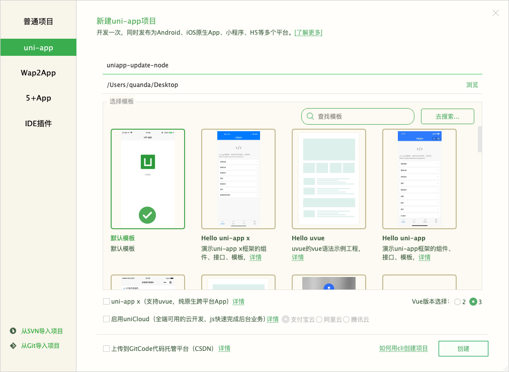
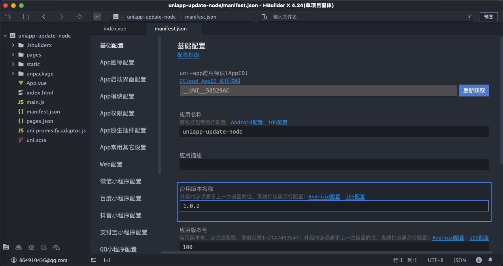
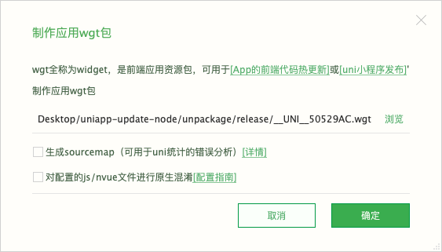
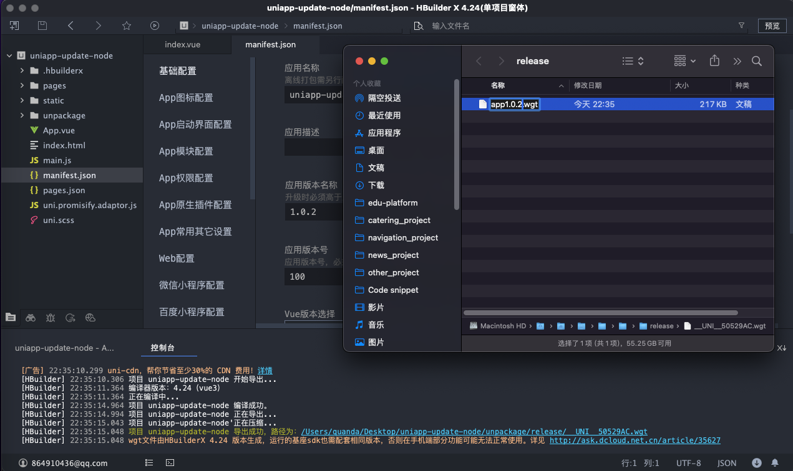
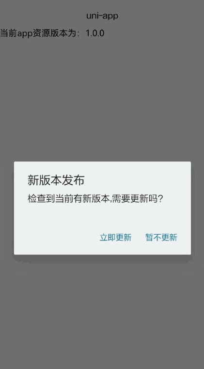

# uni-app和Node.js实现app更新功能

## 业务背景

`uniapp` 打包 `ios`，`android` 之后，有时候紧急修复或修改 `ui`，还需要走应用市场审核，往往审核时间就需要几天，如果是有bug需要升级就会很着急，有热更之后，可以避免应用市场长时间审核，用户很快就能收到更新。

## 整体思路：

要在uni-app中实现app更新功能，并使用Node.js作为后端服务，可以按照以下思路和步骤进行：

### 1、后端服务

- 使用Express创建一个简单的Web服务器。
- 提供两个API接口:
  - `/checkForUpdate/:version` 用于检查是否有新版本。
  - `/downloadApp/:version` 用于下载app。

### 2、uni-app前端

- 在页面加载时调用checkForUpdate方法检查是否有新版本。
- 如果有新版本，弹出提示框询问用户是否要更新。
- 如果用户选择更新，则下载新版本文件并下载安装过程。

## 步骤一 创建Node.js后端服务

### 1、安装必要依赖：

- 安装 `express` 或其他 Node.js web 框架来做后端服务。
- 安装 `cors` 用于处理跨域请求。
```bash
npm install express cors
```

### 2、创建一个简单的后端服务：

- 在项目根目录下创建一个名为 `public` 的文件夹，并在其中创建一个名为 `apps` 的文件夹用于存放要更新的 `App` 。
- 将app打包好的app命名为：`appx.x.x.wgt`app更新文件放到 `apps` 文件夹中。
- 在项目根目录下创建一个名为 `server.js` 的文件，并写入以下代码：
```javascript

// app更新
const express = require('express'); // 导入 Express 模块
const cors = require('cors'); // 导入 CORS 模块，用于处理跨域请求
const fs = require('node:fs'); // node内置模块，用于文件系统操作。
const path = require('node:path');//node内置模块，用于处理文件路径。

const app = express(); // 创建 Express 应用实例。

app.use(cors()); // 使用 CORS 中间件解决跨越请求。

// 配置静态文件服务，使得/public路径下的文件可以直接访问，如果没有请手动创建。
app.use('/public', express.static(path.join(__dirname, 'public')));

// 存放app版本的文件夹，如果没有请手动创建。
const appDir = path.join(__dirname, 'public/apps');

// 服务器的地址 类似于：http://localhost:3000
let serverAddress = ''

/**
 * 根据客户端提供的版本号检查是否有新版本。
 */
app.get('/checkForUpdate/:version', async (req, res) => {

  // uniapp当前版本号
  const appCurrentVersion = req.params.version
  // uniapp最新版本号
  let appLatestVersion = ''

  try {
    // 读取存放app目录下的所有文件
    const files = fs.readdirSync(appDir);

    // 过滤出以app开头的文件
    const appFiles = files.filter(file => path.basename(file).startsWith('app'));

    // 对文件列表进行排序，按照版本号从小到大排序
    const sortedFiles = appFiles.sort((a, b) => {
      const aParts = a.split('.').map(Number);
      const bParts = b.split('.').map(Number);

      for (let i = 0; i < Math.max(aParts.length, bParts.length); i++) {
        if (aParts[i] > bParts[i]) return 1;
        if (aParts[i] < bParts[i]) return -1;
      }

      return 0;
    });

    // 数组中最后一项版本就是最大最新的版本
    appLatestVersion = sortedFiles.pop()

    // 再对当前文件进行处理 ,将 app1.0.3.wgt => '1.0.3'
    appLatestVersion = appLatestVersion.replace(/^app/, '').replace(/\.wgt$/, '')

  } catch (error) {
    throw new Error('Error reading public directory:' + error)
  }

  // 如果请求的版本小于最新版本，则提供下载链接
  if (appLatestVersion > appCurrentVersion) {
    res.send({
      version: appLatestVersion, // 当前最新版本
      url: `${serverAddress}/downloadApp/${appLatestVersion}`, // 更新下载地址
      update: true, // 是否更新
      mandatoryUpdate:true // 强制更新
    })
  } else {
    res.send({
      version: '',
      url: '',
      update: false,
      mandatoryUpdate:false
    })
  }
})

/**
 * 提供文件下载
 */
app.get('/downloadApp/:version', async (req, res) => {
  // 要下载的 app 版本号
  const version = req.params.version
  const appName = `app${version}.wgt`
  // app 存放路径
  const appFilePath = `${appDir}/${appName}`

  // 检查文件是否存在
  fs.stat(appFilePath, (err, stats) => {
    if (err) {
      throw new Error(`未找到 app${version}版本下载地址`)
    }

    // 设置响应头
    // 指示浏览器以下载的方式处理文件，并设置文件名。
    res.setHeader('Content-Disposition', `attachment; filename=${appName}`);
    // 表示文件类型未知或二进制文件。
    res.setHeader('Content-Type', 'application/octet-stream');

    // 创建文件流
    const fileStream = fs.createReadStream(appFilePath);

    // 当文件流结束时，关闭响应
    fileStream.on('end', () => {
      console.log('File download completed.');
    });

    // 如果发生错误，处理错误
    fileStream.on('error', (error) => {
      throw new Error('Error downloading the file.:' + error)
    });

    // 将文件流管道发送到客户端
    fileStream.pipe(res);
  });
})

const port = 3000; // 设置应用监听的端口号
// 启动服务器并监听端口
const server = app.listen(port, () => {
  // 获取服务器绑定的地址信息
  const addressInfo = server.address();
  const host = addressInfo.address === '::' ? 'localhost' : addressInfo.address;
  const port = addressInfo.port;
  serverAddress = `http://${host}:${port}`
  console.log(`Server is running at http://${host}:${port}`);
});
```

### 3. 启动后端服务
打开终端，进入到项目根目录，执行以下命令:
```bash
node server.js
```

## 步骤二 创建uni-app前端应用

### 1、创建uni-app项目

打开`HBuilderX` 选择菜单栏上的 [文件] -> [新建] -> [项目] 创建一个新的uni-app项目。



### 2、实现检查更新逻辑

打开项目根目录下的`pages/index/index.vue`文件，新增`checkForUpdate`方法，并在`onLoad`生命周期中调用该方法。

```javascript
<template>
	<text class="title" style="text-align: center;">
		当前app资源版本为：{{appWgtVersion}}
	</text>
</template>

<script setup>
import { ref } from 'vue'
import { onLoad } from '@dcloudio/uni-app'
const appWgtVersion = ref('')

// 在页面加载时调用checkForUpdate方法检查是否有新版本。
onLoad(() => {
	checkForUpdate()
})

/**
 * 检查是否需要更新app
 */
function checkForUpdate() {
	// 只在 app 中才会执行以下代码
	// #ifdef APP-PLUS
	// 获取手机系统信息
	const systemInfo = uni.getSystemInfoSync()
	// 获取到 app 资源包版本
	appWgtVersion.value = systemInfo.appWgtVersion
	// 向 Node.js 后端发送请求检查是否需要更新
	uni.request({
		url: 'http://192.168.43.245:3000/checkForUpdate/' + appWgtVersion.value,
		success: (res) => {
			console.log('request-res', res);
			if (res.data && res.data.update) {
				uni.showModal({
					title: '新版本发布',
					content: '检查到当前有新版本,需要更新吗？',
					showCancel: true,
					confirmText: '立即更新',
					cancelText: '暂不更新',
					// 接口调用成功
					success: (modalRes) => {
						if (modalRes.confirm) {
							// 立即更新app操作
							uni.showLoading({
								title: '正在下载'
							})
							console.log('res.data.url',res.data.url);
							// 开始下载任务
							const downloadTask = uni.downloadFile({
								url: res.data.url,
								success: (downloadRes) => {
									if (downloadRes.statusCode === 200) {
										uni.showLoading({
											title: '正在安装更新...'
										});
										plus.runtime.install(downloadRes.tempFilePath, {
											force: true
										}, () => {
											console.log('install success...');
											uni.hideLoading()
											plus.runtime.restart();
										}, (e) => {
											console.log('install fail...', e);
											uni.hideLoading()
											uni.showToast({
												title: '安装失败:' + JSON.stringify(e),
												icon: 'fail',
												duration: 1500
											});
										});
										setTimeout(() => {
											uni.hideLoading();
											uni.showToast({
												title: '安装成功！',
												icon: 'none'
											});
										}, 3000);
									}
								},
								// 接口调用失败
								fail: (fail) => {
									console.log('网络错误，下载失败！', fail);
									uni.hideLoading();
								},
								// 接口调用结束
								complete: () => {
									console.log('----------------Complete----------------:', downloadTask)
									downloadTask.offProgressUpdate(); //取消监听加载进度
								}
							});
							//监听下载进度
							downloadTask.onProgressUpdate(res => {
								// console.log('下载进度百分比:' + res.progress); // 下载进度百分比
								// console.log('已经下载的数据长度:' + res.totalBytesWritten); // 已经下载的数据长度，单位 Bytes
								// console.log('预期需要下载的数据总长度:' + res.totalBytesExpectedToWrite); // 预期需要下载的数据总长度，单位 Bytes
							});
						} else {
							// 暂不更新app操作
							// 如果是你的发布需要强制更新的话,不更新app可以直接退出 APP 不让使用
							if(res.data.mandatoryUpdate){
								if (systemInfo.platform === 'android') {
									// 安卓退出app
									plus.runtime.quit();
								} else {
									// 判断为ios的手机，退出App
									plus.ios.import("UIApplication").sharedApplication().performSelector("exit");
								}
							}
						}
					}
				});
			}
		},
		fail: (fail) => {
			console.log('检查更新请求失败！', fail);
		}
	});
	// #endif
}
</script>
```

### 3、制作应用wgt包

#### 1、打开项目根目录下的`manifest.json`配置文件，在`基础设置`中将`应用版本名称`设置为`1.0.2`。



#### 2、选择菜单栏上的 [发行] -> [原生App-制作应用wgt包]




#### 3、将打包好的wgt包更名为`app1.0.2.wgt`。

后端是按照这个命名规范来进行升级的，所以我们按照这个规范来。



#### 4、将打包好的`app1.0.2.wgt`包放在后端服务器的`/public/apps`文件夹中。

### 4、测试app更新功能

#### 1、打开项目根目录下的`manifest.json`配置文件，在`基础设置`中将`应用版本名称`设置为`1.0.0`，只要低于服务器中的版本即可。

#### 2、运行app到手机
运行到手机后，页面会弹出更新提示框

##### 点击“立即更新”按钮

app会自动下载并安装更新，安装更新后的app后，会自动启动并运行。



##### 点击“稍后更新”按钮

在App`非强制更新`的情况下则`关闭更新提示框`。


##### 点击“稍后更新”按钮

在App`强制更新`的情况下则`退出App`。


## 注意事项
- 确保Node.js后端服务和uni-app前端应用在同一网络环境中运行。
- 测试时，请确保文件路径和URL正确无误。

以上步骤提供了一个基本的uni-app和Node.js实现app更新功能的示例。你可以根据具体需求进行调整和扩展。