使用 Vite 打包一个 TypeScript 编写的 utils 工具库，并在发布到 npm 之前使用 Vitest 进行测试，同时利用 GitHub Actions 自动化发布流程

## 前言

我们在日常开发中经常会使用 npm install 安装别人的包，使用别人的插件。

当你在前端开发有一段时间之后你也会知道，那些npm包实际上就是别人写好的一些代码来供你调用。

开发久了难免就想自己造轮子了，当然现在轮子这么多，不一定要自己造了，你可以不做，但不能不会。

那么今天就来讲讲如何通过Vite + TypeScript + Vitest + GitHub Actions 自动化发布流程来发布一个属于自己的npm包。


## 步骤
- 安装必要的依赖
- 创建项目
- 项目配置
- 编写代码
- 单元测试
- 编写 README.md
- 构建和发布命令配置
- 手动发布到 npm
- 自动发布到 npm
- 测试 npm 包

## 一、安装必要的依赖
- 安装 Vite: `npm install vite --save-dev`
- 安装 TypeScript: `npm install typescript --save-dev`
- 安装 vite-plugin-dts 插件以支持 `npm install vite-plugin-dts --save-dev`
- 安装 Vitest: `npm install vitest --save-dev`
- 安装 @types/node 以便支持 Node.js 环境下的类型定义: `npm install @types/node --save-dev`

## 二、创建项目

使用 Vite 快速创建一个原生 TypeScript 开发的项目非常简单。按照以下步骤进行操作：


- 确保你已经安装了最新版本的 Node.js（建议使用 LTS 版本）。
- 打开终端，并进入你想创建项目的目录。
- 运行以下命令来创建一个新的 Vite 项目：
```bash
pnpm create vite utils --template vanilla-ts
```
这将创建一个名为 `utils` 的文件夹，并使用 `vanilla-ts` 模板来初始化一个原生 TypeScript 项目。
`--template vanilla-ts` 是在使用 `Vite` 创建项目时的一个选项参数。它指定了所使用的项目模板为 “vanilla-ts”。

- 进入项目目录：
```bash
cd utils
```
- 安装项目的依赖：
```bash
pnpm install
```
- 运行以下命令来启动开发服务器：
```bash
pnpm run dev
```

这将启动 Vite 的开发服务器，并在浏览器中打开项目。

现在，你就可以开始在 `src` 目录下编写你的原生 TypeScript 代码了。Vite 会自动监听你的代码变化，并实时更新你的应用程序。
你可以根据你的需求修改和扩展项目，例如添加其他依赖、配置构建选项等。
请注意，原生 TypeScript 项目使用 Vite 不需要额外的配置，因为 Vite 默认支持 TypeScript。如果你想更深入地定制项目的配置，可以查阅 Vite 的官方文档或社区资源。


运行后的截图，点击count会++。项目结构和counter.js文件。


## 三、项目配置

### 1、Vite 配置
在项目根目录下创建 `vite.config.ts` 文件 :
```javascript
import { defineConfig } from 'vite';

export default defineConfig({
  build: {
    lib: {
      entry: './src/index.ts', // 工具库入口
      name: 'Utils', // 工具库名称
      fileName: (format) => `index.${format}.js`, // 工具库名称
      // formats: ['es', 'umd', 'cjs'], // 打包模式，默认是es和umd
    }
  },
  // outDir: "lib", // 自定义构建输出目录 默认为 dist
});
```

### 2、类型声明文件 配置

`vite-plugin-dts` 是一个 Vite 插件，用于自动生成 TypeScript 类型声明文件（.d.ts）。

在使用 Vite 构建 TypeScript 项目时，通常需要手动编写类型声明文件来描述项目中的模块、组件和函数的类型。这个过程可能会比较繁琐和容易出错。vite-plugin-dts 的目的就是简化这个过程，它会基于项目中的源代码自动生成类型声明文件，减少手动编写的工作量。

然后，在 Vite 的配置文件 vite.config.js 中将插件引入：

```javascript
import { defineConfig } from 'vite';
import dts from 'vite-plugin-dts'

export default defineConfig({
  plugins: [dts()], // 启用插件 vite-plugin-dts
  //...
});
```

当你启动 Vite 构建项目时，vite-plugin-dts 将会自动扫描你的源代码并生成对应的类型声明文件。这些文件将会保存在 dist 目录下的 types 文件夹中。

vite-plugin-dts 还提供了一些配置选项，可以根据你的需要进行自定义。例如，你可以指定生成类型声明文件的输出路径、忽略某些文件或文件夹、自定义类型声明的文件名等。

运行` npm run build` 命令的时候 dist 文件夹中就会自动生成 index.d.ts 文件，发布之后别人下载使用时就会有类型提示了。

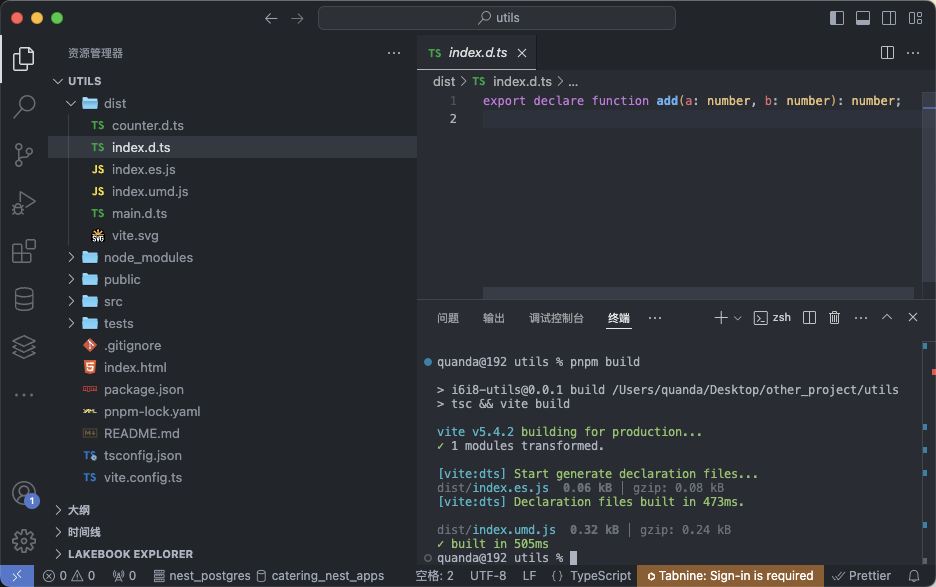


### 3、Vitest 配置
- 在 `package.json` 中添加测试脚本:

```json
"scripts": {
  "test": "vitest",
  "test:run": "vitest run"
}
```

### 4、package.json 配置

`package.json` 文件里面有很多字段要填写，否则不能正确发布。最重要的是以下几个字段：

- `name`: 包名，该名字是唯一的。可在 npm 官网搜索名字，如果存在则需换个名字。
- `version`: 版本号，不能和历史版本号相同，每次发布都要增大才能发布成功。
- `files`: 需要上传的文件，一般是 dist 目录下的文件，也可根据需要配置需要发布的文件。
- `main`: commonJs的包路径,入口文件，默认为 index.js，这里改为 dist/index.umd.js。
- `module`: ESModule的包路径,模块入口，这里改为 dist/index.es.js。
- `types`: ts类型文件路径,类型声明文件入口，这里改为 dist/index.d.ts。
- `private`: 是否为私有包， 需要更改为 false 才能发布到 npm。 
- `type`: 文件的默认加载方式，若不填则默认为commonJs。但是无论`package.json`中的`type`字段为何值，`.mjs`的文件都按照es模块来处理，`.cjs`的文件都按照commonJs模块来处理

到这里就是一个基础的配置，了解这些就能解决首次发布的基本问题。

像 `description`,`repository`,`bugs`,`keywords`这些属性看需要配置，如果你是想做一个便利大家使用的开源，建议越完善越好

完整的 `package.json` 如下：

```json
{
  "name": "i6i8-utils",
  "private": false,
  "version": "1.0.0",
  "type": "module",
  "main": "/dist/index.umd.js",
  "module": "/dist/index.es.js",
  "types": "/dist/index.d.ts",
  "description": "工具库",
  "files": [
    "dist/*"
  ],
  "keywords": [
    "utils",
    "typescript"
  ],
  "author": {
    "name": "quanda li",
    "email": "864910436@qq.com"
  },
  "repository": {
    "type": "git",
    "url": "git+https://github.com/China-quanda/i6i8-utils.git"
  },
  "bugs": {
    "url": "https://github.com/China-quanda/i6i8-utils/issues",
    "email": "864910436@qq.com"
  },
  "license": "MIT",
  "scripts": {
    "dev": "vite",
    "build": "tsc && vite build",
    "prepublishOnly": "npm run build && npm run test:run",
    "preview": "vite preview",
    "test": "vitest",
    "test:run": "vitest run"
  },
  "devDependencies": {
    "@types/node": "^22.5.0",
    "typescript": "^5.5.3",
    "vite": "^5.4.1",
    "vite-plugin-dts": "^4.0.3",
    "vitest": "^2.0.5"
  }
}


```

**这里简单提下打包名称里有 `es` 和 `umd` 是什么意思 ?**

Javascript 的模块化从前后端区分的话有两大类：

1、commonJS 也就是服务端 node 的模块化标准 （require / module.export）

2、客户端的标准则有 amd / umd / es Module 等

- `amd` 使用（require / define）
- `umd` 是一种同时兼容node和浏览器的标准
- `es` Module 是ES6 的模块化标准（export / import）


## 四、编写代码
- 在 src 目录下编写您的工具库代码，例如 `index.ts`:
```typescript
export function add(a: number, b: number): number {
  return a + b;
}
```

## 五、单元测试

对于一个工具函数来说，单元测试非常非常非常重要。不会单元测试的可以看一下《JavaScript测试驱动开发》这本书。

编写单元测试，确保你的代码能够正常工作并符合预期。

- 在根目录下与`src`同级目录下创建 `tests` 目录并在其中编写测试文件，例如 `add.test.ts`:

```typescript
import { expect, it, describe } from 'vitest'
import { add } from '../src/index';

describe('对add函数进行测试', () => {
  it('should return 3 with 1+2', () => {
    expect(add(1, 2)).toBe(3)
  })
  it('should return 0 with 0+0', () => {
    expect(add(0, 0)).toBe(0)
  })
  it('should return 5 with 2+3', () => {
    expect(add(2, 3 as any)).toBe(5)
  })
})
```

- 以下两种测试方法都可以测试，我们只需要在选择 `vscode编辑器中的vitest插件` 或者 `shell命令行运行` 其中一种测试即可。

- 在 vscode 编辑器中搜索 vitest 插件安装。可以有更完美的配合

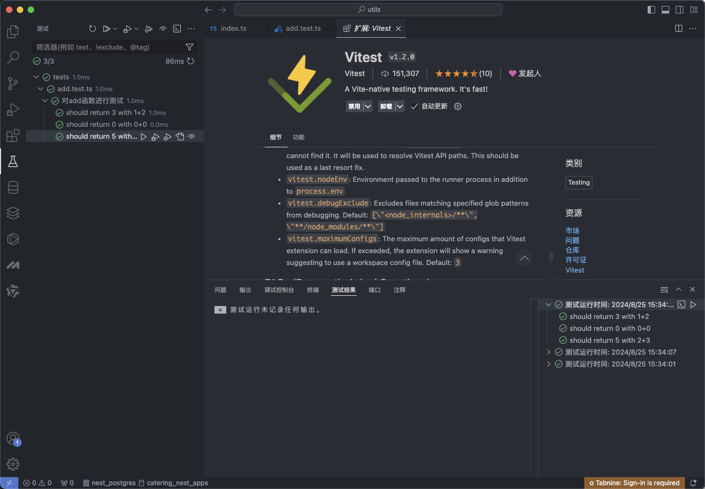

- 使用 `npm run test:run` 进行测试，测试结果如下：
```bash
> @qd/utils-web@1.0.0 test:run /Users/quanda/Desktop/other_project/utils
> vitest run


 RUN  v2.0.5 /Users/quanda/Desktop/other_project/utils

 ✓ tests/add.test.ts (3)
   ✓ 对add函数进行测试 (3)
     ✓ should return 3 with 1+2
     ✓ should return 0 with 0+0
     ✓ should return 5 with 2+3

 Test Files  1 passed (1)
      Tests  3 passed (3)
   Start at  15:16:11
   Duration  210ms (transform 21ms, setup 0ms, collect 15ms, tests 1ms, environment 0ms, prepare 44ms)

```

- 可以看到都测试通过了，符合我们的预期用法。

## 六、编写 README.md
- 在根目录下创建 `README.md` 文件，并添加一些关于工具库的描述和用法。

```markdown
# i6i8-utils

## 简介
工具库，包含一些常用的工具函数。

## 安装

pnpm add i6i8-utils

yarn add i6i8-utils

npm install i6i8-utils


## 使用
import { add } from 'i6i8-utils'
console.log(add(1, 2)) // 3
```

## 七、构建和发布命令配置
- 添加构建脚本到 `package.json`:

```json
"scripts": {
  "build": "vite build",
  "prepublishOnly": "npm run build && npm run test:run"
}
```

- 运行 `npm run build` 以构建库。

- 运行 `npm run test:run` 以运行测试。

## 八、手动发布到 npm

> 发布到npm上的包应该遵循一些最佳实践，如给包添加适当的版本号、提供清晰的文档和示例代码、确保代码质量等。这些都有助于提高你的包的可用性和可维护性，吸引更多的用户和贡献者。


- 这边是默认已经拥有了npm账号的，如果没有的话移步 [npm官网](http://www.npmjs.com/) 注册并创建 npm 账号。

### 1、先查看 npm 的 registry 如果显示的不是官方源，就要改回来

```bash
npm config get registry
```

- 设置 npm 的 registry 为官方源 
```bash
npm config set registry https://registry.npmjs.org
```

### 2、登录到 npm: ( 如果已登陆可以忽略这一步 )

- 检查是否已经登录,如果已经登录，会提示用户名

```sh
npm whoami
```

登录命令

```sh
npm login
```

- 登录成功后提示：

```bash
quanda@192 utils % npm login
npm notice Log in on https://registry.npmjs.org/
Login at:
https://www.npmjs.com/login?next=/login/cli/41cc7ed3-5815-4a7e-b1d6-74b3621406ad
Press ENTER to open in the browser...

Logged in on https://registry.npmjs.org/.
```

### 3、为项目打 tag 
- 可打可不打，打 tag 可以方便管理版本，方便回滚。
- 使用 npm version 命令，给项目打上 tag 版本号，可根据自己需求修改

```sh
# major 主版本
# minor 功能版本
# patch 修复版本
npm version minor
```
- 打tag后执行结果：
```sh
quanda@192 utils % npm version minor
v1.1.0
```

### 4、执行 npm publish 将包发布到 npm 上。

通过运行`npm publish`命令将你的`utils`包发布到 npm。确保你已经登录到 npm账号，并且在项目文件夹的根目录下运行该命令。发布成功后，你的`utils`包将在 npm 上可供其他开发人员使用。

- 执行 npm publish 发布包
```sh
quanda@192 utils % npm publish

> i6i8-utils@1.0.0 prepublishOnly
> npm run build && npm run test:run


> i6i8-utils@1.0.0 build
> tsc && vite build

vite v5.4.2 building for production...
✓ 1 modules transformed.

[vite:dts] Start generate declaration files...
dist/index.es.js  0.06 kB │ gzip: 0.08 kB
[vite:dts] Declaration files built in 460ms.

dist/index.umd.js  0.32 kB │ gzip: 0.24 kB
✓ built in 491ms

> i6i8-utils@1.0.0 test:run
> vitest run


 RUN  v2.0.5 /Users/quanda/Desktop/other_project/utils

 ✓ tests/add.test.ts (3)
   ✓ 对add函数进行测试 (3)
     ✓ should return 3 with 1+2
     ✓ should return 0 with 0+0
     ✓ should return 5 with 2+3

 Test Files  1 passed (1)
      Tests  3 passed (3)
   Start at  14:52:35
   Duration  213ms (transform 19ms, setup 0ms, collect 16ms, tests 2ms, environment 0ms, prepare 37ms)

npm notice
npm notice 📦  i6i8-utils@1.0.0
npm notice Tarball Contents
npm notice 244B README.md
npm notice 72B dist/counter.d.ts
npm notice 59B dist/index.d.ts
npm notice 60B dist/index.es.js
npm notice 320B dist/index.umd.js
npm notice 0B dist/main.d.ts
npm notice 1.5kB dist/vite.svg
npm notice 990B package.json
npm notice Tarball Details
npm notice name: i6i8-utils
npm notice version: 1.0.0
npm notice filename: i6i8-utils-1.0.0.tgz
npm notice package size: 2.0 kB
npm notice unpacked size: 3.2 kB
npm notice shasum: 43ad7c509ab109add19fe358eaf62584b525abf6
npm notice integrity: sha512-yLzaScXCKUNxU[...]tmV9GuuJO+sXw==
npm notice total files: 8
npm notice
npm notice Publishing to https://registry.npmjs.org with tag latest and default access
+ i6i8-utils@1.0.0
quanda@192 utils % 
```

- 发布成功后就可以在 npm 查看

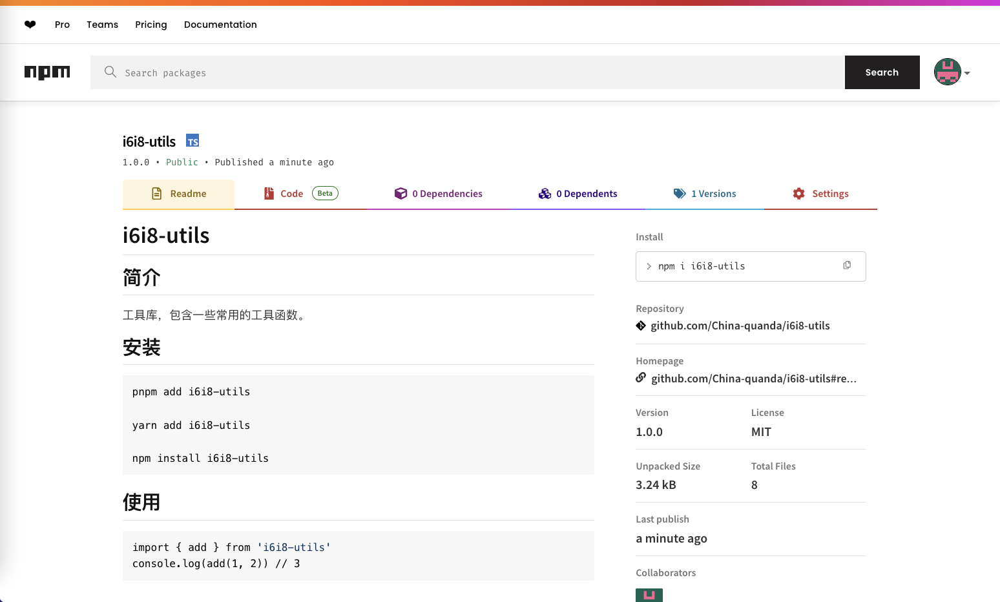

最后的使用就和我们平时安装其他 npm 包一样了， npm install XX 后在项目中 import 就可以正常使用了。

**更新命令 （第一次发布请跳过）**

```sh
npm version patch
```
> 注意：`npm version patch`是在你原有的版本号，假设`v1.0.0`，他会在这个基础上加1，如果你的版本不是加1，你可以不用`npm version patch`,直接手动改`package.json`,然后再`npm publish`


## 九、自动发布到 npm

每次手动发布新版本到 npm 比较麻烦，使用 Github Workflow 可以实现当版本有变化时，自动发包到 npm。

### 1、获取 Npm Access Token
要想让 Github Action 能有权利发布指定的 npm 包, 需要获取 npm 的 通行证. 这个通行证就是 npm token, 所以我们需要登入 npm 官网, 生成一个 token，用它打通 GitHub 和 NPM。

- 首先，进入 NPM 首页，登录后点击右上角的 `头像` -> `Access Tokens` -> `Generate New Token` -> `Classic Token`

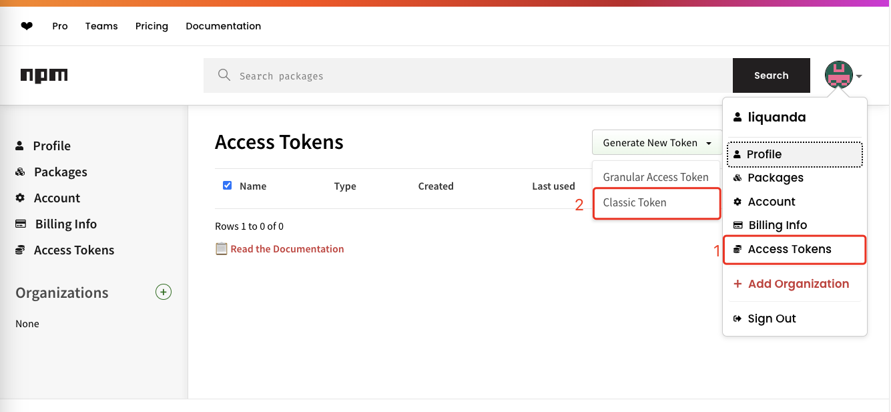

- 接着，给 token 起个名字，并选择 publish 权限，最后点击 Generate Token 按钮。

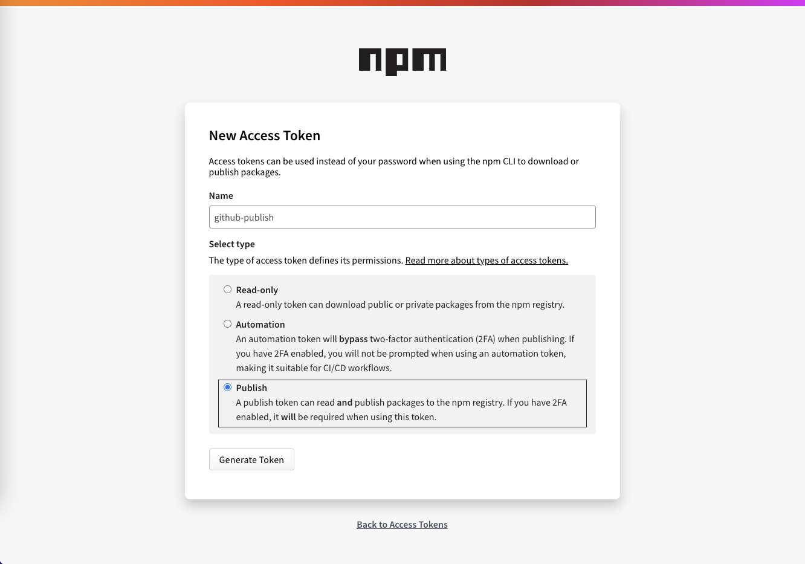

- 生成 token 后记得复制生成的 token保存，关闭页面后就再也看不到了。

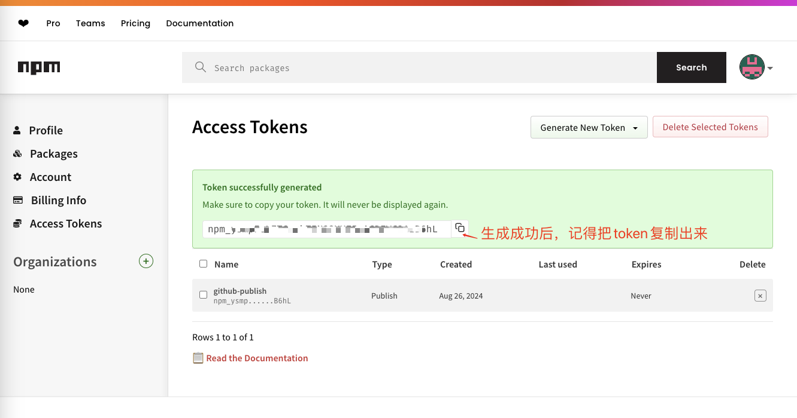

<!-- npm_ysmpLqdFcLZTGegkTINQQXUZ5mACDZVC31zB6hL -->

### 2、设置 Github Secrets

- 转到你的 GitHub 仓库。
- 点击仓库页面顶部的 Settings（设置）。
- 在左侧菜单中选择 Secrets and variables -> Actions。

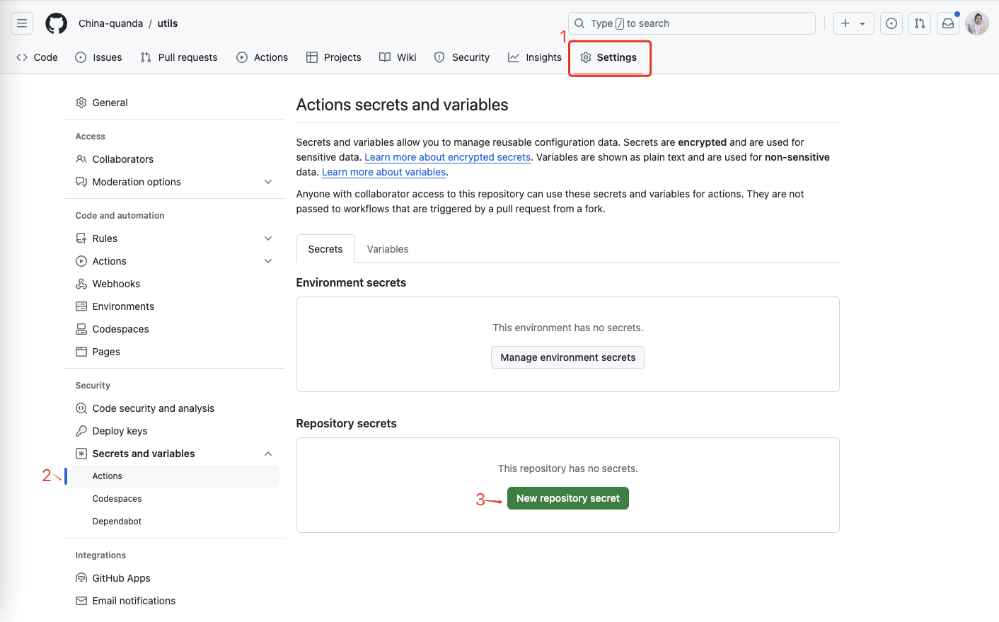

- 在 Name 字段输入`NPM_TOKEN`。
- 在 Secret 字段粘贴你刚才生成的 NPM token。
- 点击 Add secret。

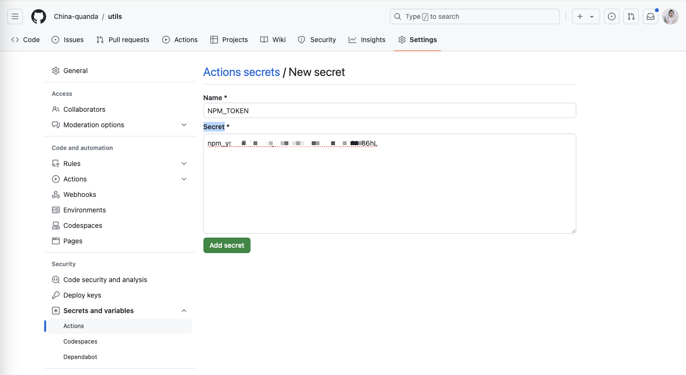


### 3、编写 workflows 工作流

- 点击 Tab 栏上的 Actions ，我们要发布到 NPM，所以选择其中的 Punlish Node.js Package 。

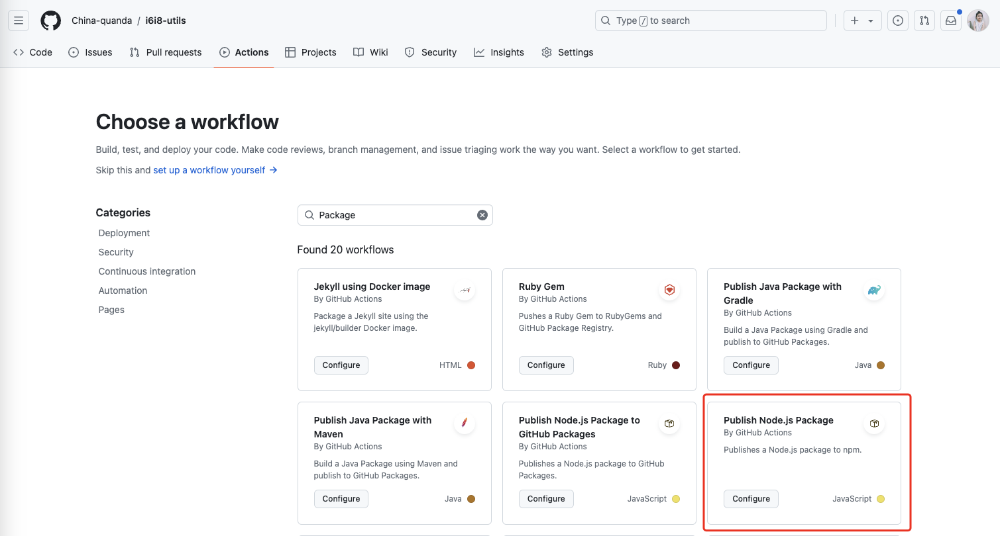

- 此时，会自动新建一个 `npm-publish.yml` 脚本，修改脚本后，点击右上角 `Commit changes` 保存并提交，在项目中就会生成对应的脚本文件。

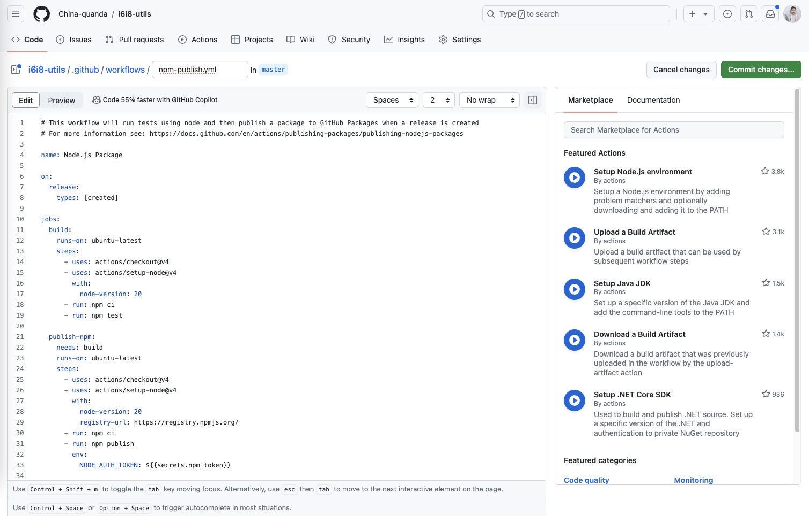

- 当然，你也可以直接在本地新建 .github/workflows/npm-publish.yml 文件，修改完后再上传。

> 我们这边才用的是自己在本地新建的方式哈

在项目根目录添加 .github/workflows/npm-publish.yml 文件，配置发包的工作流。

- 在项目根目录下创建 `.github/workflows/npm-publish.yml` 文件:
```yaml
name: NPM Publish
on:
  push:
    branches:
      - master
jobs:
  build:
    runs-on: ubuntu-latest
    steps:
      - name: Checkout
        uses: actions/checkout@v4
      - name: Setup pnpm
        uses: pnpm/action-setup@v3
        with:
          version: 9
      - name: Setup Node.js
        uses: actions/setup-node@v4
        with:
          node-version: 20
          cache: pnpm
      - name: Install dependencies
        run: pnpm install
      - name: Run tests
        run: pnpm run test:run
  publish-npm:
    needs: build
    runs-on: ubuntu-latest
    steps:
      - uses: actions/checkout@v4
      - uses: actions/setup-node@v4
        with:
          node-version: 20
          registry-url: https://registry.npmjs.org/
      - run: npm install
      - run: npm publish
        env:
          NODE_AUTH_TOKEN: ${{ secrets.NPM_TOKEN }}
      - run: ls -a

```

> 注意：npm token 是用于发布 npm 包的，请不要将 token 泄露给其他人。：上传的npm包，在72小时后不可删除，如果是测试用的包，记得72小时内删除

- 将 npm token 存储为 GitHub Secret (`NPM_TOKEN`)。
- 当代码推送到 GitHub 仓库的主分支时，GitHub Actions 将自动执行测试、构建和发布流程。
这样，您就可以将自己编写的 TypeScript 工具库通过 Vite 打包，并使用 Vitest 测试，最后通过 GitHub Actions 自动化发布到 npm 上供其他人使用了。

- 将本地仓库代码推送到 GitHub 仓库。

在推送代码到 GitHub 仓库之前，请确保`package.json`里的`version`字段版本号已经更新，之前我们手动推送前的版本号version 是1.0.0，我们现在将 version 改变成1.0.1

```json
{
  "version": "1.0.1",
}
```
- 使用 git 推送命令：
```bash
git push
```
- git 推送完成状态：

```bash
quanda@192 utils % git push
枚举对象中: 20, 完成.
对象计数中: 100% (20/20), 完成.
使用 8 个线程进行压缩
压缩对象中: 100% (17/17), 完成.
写入对象中: 100% (20/20), 23.42 KiB | 7.80 MiB/s, 完成.
总共 20（差异 0），复用 0（差异 0），包复用 0（来自  0 个包）
To https://github.com/China-quanda/i6i8-utils.git
 * [new branch]      master -> master
分支 'master' 设置为跟踪 'github/master'。
quanda@192 utils % 
```

- 等待 GitHub Actions 执行完毕后，您可以在 GitHub 仓库的 Actions 页面中查看工作流的运行结果。
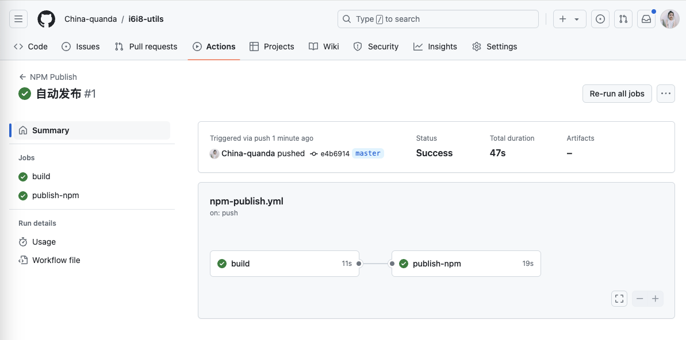

- 执行完毕后就可以在 npm 查看了版本号已经更新了
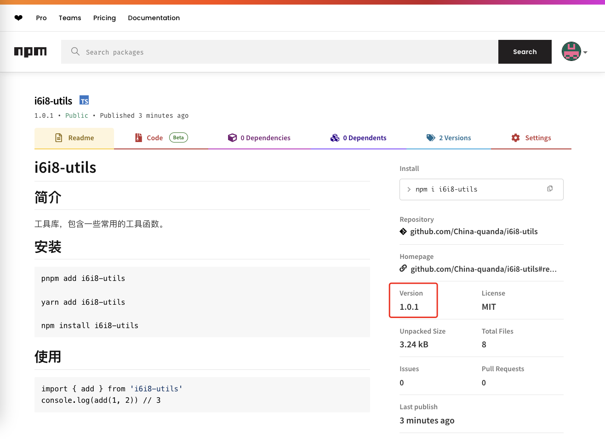

## 十、测试npm包

发布之后，很快啊，我们就能下载这个npm包进行测试了。

```sh
pnpm add i6i8-utils

yarn add i6i8-utils

npm install i6i8-utils
```

- 我们先创建一个测试项目，然后安装`i6i8-utils`。

- 可以看到 add 函数计算的结果和 ts 的类型提示都有：

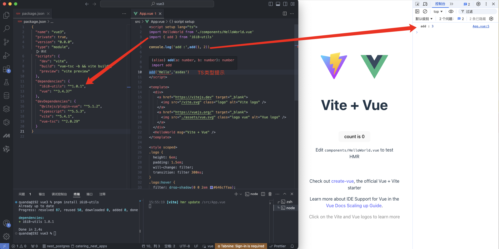

## 结语：

通过以上步骤，你可以成功地使用 Vite 打包 TypeScript 编写的工具库，并通过 GitHub Actions 自动化其发布过程。