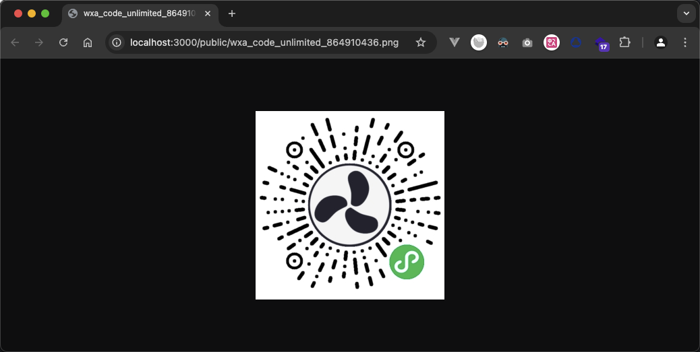

# 使用 node.js 生成不限制的微信小程序码

使用 `node.js` 的`web`框架 `express.js` 生成不限制的微信小程序码

在 Node.js 中生成微信小程序码通常涉及到与微信官方 API 的交互。微信提供了生成小程序码的接口，这些码可以用于打开特定的小程序页面或者带有参数的页面。以下是一个简单的步骤指南和示例代码来说明如何使用 Node.js 生成微信小程序码。

## 准备工作

### 1、注册并创建小程序：

- 在微信公众平台注册并创建一个小程序。
- 获取 AppID 和 AppSecret。

### 2、安装依赖：

- 安装 `express` 或其他 Node.js web 框架来做后端服务。
- 安装 `axios` 或其他 HTTP 库来发送请求。
- 安装 `cors` 用于处理跨域请求。

## 生成小程序码步骤：

- 获取 Access Token：通过调用微信的 API 接口获取 Access Token [接口说明](https://developers.weixin.qq.com/miniprogram/dev/OpenApiDoc/mp-access-token/getAccessToken.html)。
- 生成小程序码：使用 Access Token 调用生成小程序码的接口 [接口说明](https://developers.weixin.qq.com/miniprogram/dev/OpenApiDoc/qrcode-link/qr-code/getUnlimitedQRCode.html)。

## 示例代码

首先确保安装了必要的 npm 包:

```bash
npm install express axios cors
```

### 1、获取 Access Token

```javascript
/**
 * 获取 Access Token
 * @param {string} appid 小程序appid
 * @param {string} secret 小程序secret
 * @returns access_token 
 */
async function getAccessToken(appid, secret) {
  // 获取接口调用凭据 接口英文名叫getAccessToken
  // 官方说明地址：https://developers.weixin.qq.com/miniprogram/dev/OpenApiDoc/mp-access-token/getAccessToken.htm
  const url = `https://api.weixin.qq.com/cgi-bin/token`;

  const response = await axios({
    method: "get",
    url,
    params: {
      grant_type: 'client_credential',
      appid,
      secret,
    },
  });

  if (response.data?.errcode) {
    throw new Error(JSON.stringify(response.data))
  }

  return response.data.access_token;
}
```

### 2、生成小程序码

```javascript
/**
 * 生成小程序码
 * @param {String} access_token access_token
 * @param {Object} data 全部参数请查看：https://developers.weixin.qq.com/miniprogram/dev/OpenApiDoc/qrcode-link/qr-code/getUnlimitedQRCode.html#%E8%AF%B7%E6%B1%82%E5%8F%82%E6%95%B0
 * @returns 图片 Buffer
 */
async function generateWxaCodeUnlimited(access_token, data) {
  // 获取不限制的小程序码 接口英文名 getUnlimitedQRCode
  // 官方说明地址：https://developers.weixin.qq.com/miniprogram/dev/OpenApiDoc/qrcode-link/qr-code/getUnlimitedQRCode.html
  const url = `https://api.weixin.qq.com/wxa/getwxacodeunlimit`;

  const response = await axios({
    method: "post",
    url,
    data,
    params: {
      access_token,
    },
    responseType: "arraybuffer",
  });

  if (response.data?.errcode) {
    throw new Error(JSON.stringify(response.data))
  }

  return response.data
}
```

### 3、将 buffer 转换为文件

```javascript
/**
 * 将buffer转换为文件
 * @param {Buffer} buffer buffer
 * @param {String} savePath 要保存的路径
 * @param {String} filename 文件名称
 * @returns 返回保存的文件路径
 */
async function bufferToFile(buffer, savePath, filename) {
  // 写入文件
  fs.writeFile(`.${savePath + filename}`, buffer, (err) => {
    if (err) {
      throw new Error(err);
    }
  });

  console.log('Image saved successfully', `Image saved as ${savePath + filename}`);

  return savePath + filename
}
```

### 4、将 buffer 转换为 Base64
```javascript
/**
 * 将 buffer 转换为 Base64
 * @param {Buffer} buffer buffer
 * @returns 
 */
function bufferToBase64(buffer) {
  const base64 = `data:image/jpeg;base64,${buffer.toString('base64')}`
  return base64
}
```

### 5、设置路由处理函数，用于生成小程序码

```javascript

// 设置路由处理函数，用于生成小程序码
app.get('/getCode', async (req, res) => {
  // 打印请求查询参数
  console.log('req', req.query);

  // 替换为你的场景值
  const { scene = 'your_scene' } = req.query

  // 获取 Access Token
  const access_token = await getAccessToken(wxConfig.appid, wxConfig.secret);

  // 生成小程序码
  const buffer = await generateWxaCodeUnlimited(access_token, { ...req.query, scene });

  // 将buffer转换为文件
  const fileUrl = await bufferToFile(buffer, '/public/', `wxa_code_unlimited_${scene}.png`);

  // 将 buffer 转换为 Base64 字符串
  const base64 = bufferToBase64(buffer);

  res.send({// 响应结果
    path: `http://${req.hostname}:${port}${fileUrl}`, // 返回图片的路径
    base64: base64, // 返回 Base64 字符串
  }).json();
})
```

### 6、请求接口测试
```bash
$ # GET to /getCode
$ curl "http://localhost:3000/getCode?scene=864910436"
$ # result -> {
  #  "path":"http://localhost:3000/public/wxa_code_unlimited_864910436.png",
  #  "base64":"data:image/jpeg;base64,eyJlcnJjb03N2NhNGUzNyJ9"
  # }
```


### 7、前端小程序测试
- 打开 请求到的数据 path 或者 base64 的值后即可看到生成出来的小程序码



- 使用小程序使用 `wx.scanCode()` api 扫描生成的小程序码
```javascript
// pages/test.js
// 官方说明地址 https://developers.weixin.qq.com/miniprogram/dev/api/device/scan/wx.scanCode.html
wx.scanCode({
  success (res) {
    console.log(res)

    // 扫码成功返回的结果为：
    // res {
    //   "charSet": "utf-8", 
    //   "result": "", 
    //   "path": "pages/index?scene=864910436", 
    //   "codeVersion": 0, 
    //   "errMsg": "scanCode:ok", 
    //   "rawData": "bDJQQjlPekJtKkt2UGtYJGlYJiFrYzM2", 
    //   "scanType": "WX_CODE"
    // }

    wx.navigateTo({
      url: res.path,
    })
  }
})


// pages/index.js
Page({
  onLoad (query) {
    // scene 需要使用 decodeURIComponent 才能获取到生成二维码时传入的 scene
    const scene = decodeURIComponent(query.scene)
    console.log(scene) // 864910436
  }
})
```


## 完整代码
```javascript
// index.js
const express = require('express'); // 导入 Express 模块
const cors = require('cors'); // 导入 CORS 模块，用于处理跨域请求
const axios = require('axios'); // 导入 Axios 模块，用于发起 HTTP 请求
const fs = require("fs"); // 导入 Node.js 的 fs 模块，用于文件系统操作

const app = express(); // 创建 Express 应用实例

app.use(cors()); // 使用 CORS 中间件解决跨越请求

const port = 3000; // 设置应用监听的端口号

// 配置静态文件服务，使得/public路径下的文件可以直接访问，如果没有请手动创建
app.use('/public', express.static('public')); 

const wxConfig = {// 微信小程序配置信息
  appid: 'your_appid',// 替换为你的 AppID
  secret: 'your_secret',// 替换为你的 AppSecret
}

// 设置路由处理函数，用于生成小程序码
app.get('/getCode', async (req, res) => {
  console.log('req', req.query); // 打印请求查询参数

  // 替换为你的场景值
  const { scene = 'your_scene' } = req.query

  // 获取 Access Token
  const access_token = await getAccessToken(wxConfig.appid, wxConfig.secret);

  // 生成小程序码
  const buffer = await generateWxaCodeUnlimited(access_token, { ...req.query, scene });

  // 将buffer转换为文件
  const fileUrl = await bufferToFile(buffer, '/public/', `wxa_code_unlimited_${scene}.png`);

  // 将 buffer 转换为 Base64 字符串
  const base64 = bufferToBase64(buffer);

  res.send({// 响应结果
    path: `http://${req.hostname}:${port}${fileUrl}`, // 返回图片的路径
    base64: base64, // 返回 Base64 字符串
  }).json();
})

/**
 * 获取 Access Token
 * @param {string} appid 小程序appid
 * @param {string} secret 小程序secret
 * @returns access_token 
 */
async function getAccessToken(appid, secret) {
  // 获取接口调用凭据 接口英文名叫getAccessToken
  // 官方说明地址：https://developers.weixin.qq.com/miniprogram/dev/OpenApiDoc/mp-access-token/getAccessToken.htm
  const url = `https://api.weixin.qq.com/cgi-bin/token`;

  const response = await axios({
    method: "get",
    url,
    params: {
      grant_type: 'client_credential',
      appid,
      secret,
    },
  });

  if (response.data?.errcode) {
    throw new Error(JSON.stringify(response.data))
  }

  return response.data.access_token;
}

/**
 * 生成小程序码
 * @param {String} access_token access_token
 * @param {Object} data 全部参数请查看：https://developers.weixin.qq.com/miniprogram/dev/OpenApiDoc/qrcode-link/qr-code/getUnlimitedQRCode.html#%E8%AF%B7%E6%B1%82%E5%8F%82%E6%95%B0
 * @returns 图片 Buffer
 */
async function generateWxaCodeUnlimited(access_token, data) {
  // 获取不限制的小程序码 接口英文名 getUnlimitedQRCode
  // 官方说明地址：https://developers.weixin.qq.com/miniprogram/dev/OpenApiDoc/qrcode-link/qr-code/getUnlimitedQRCode.html
  const url = `https://api.weixin.qq.com/wxa/getwxacodeunlimit`;

  const response = await axios({
    method: "post",
    url,
    data,
    params: {
      access_token,
    },
    responseType: "arraybuffer",
  });

  if (response.data?.errcode) {
    throw new Error(JSON.stringify(response.data))
  }

  return response.data
}

/**
 * 将 buffer 转换为文件
 * @param {Buffer} buffer buffer
 * @param {String} savePath 要保存的路径
 * @param {String} filename 文件名称
 * @returns 返回保存的文件路径
 */
async function bufferToFile(buffer, savePath, filename) {
  // 写入文件
  fs.writeFile(`.${savePath + filename}`, buffer, (err) => {
    if (err) {
      throw new Error(err);
    }
  });

  console.log('Image saved successfully', `Image saved as ${savePath + filename}`);

  return savePath + filename
}

/**
 * 将 buffer 转换为 Base64
 * @param {Buffer} buffer buffer
 * @returns 
 */
function bufferToBase64(buffer) {
  const base64 = `data:image/jpeg;base64,${buffer.toString('base64')}`
  return base64
}

// 监听端口
app.listen(port, () => {
  console.log(`Example app listening on port ${port}`, `is open url http://127.0.0.1:${port}`)
})
```

## 注意事项
替换 your_appid, your_secret 为你的实际值。
以上就是使用 Node.js 生成不限制数量的微信小程序码的过程。你可以根据具体需求调整参数和处理逻辑。
