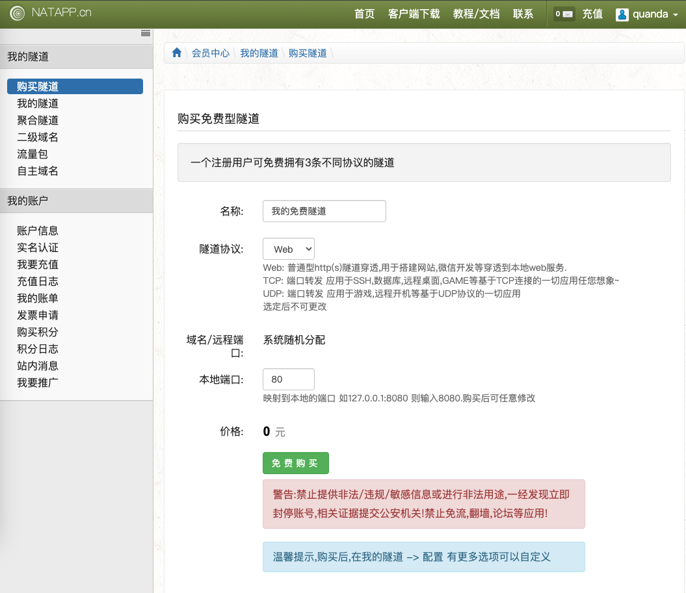

# Mac使用NATAPP完成内网穿透

## 背景

有时候我们自己做个小网站，或者开发微信公众号、支付做测试时，因为没有公网ip而犯难，毕竟买一台云服务器带独立ip的，加上域名是一笔不小的开支。这时如果有一个内网穿透工具，让自己本地电脑充当服务器，让互联网，移动网能访问自己本地电脑上发布的网站，或者微信小程序，公众号测试程序，那是非常方便的。今天就介绍一个内网穿透的工具，而且是有免费版的。

## 一、注册账号
首先在natapp注册账号 [点击跳转注册页面](https://natapp.cn/register)

## 二、登录购买隧道

### 1.选择隧道，免费/付费均可

选择第一个免费的就行


### 2.购买隧道

在购买前需要实名认证支付宝授权。我们进行实名授权，授权完成后，我们来到购买隧道页面：

根据需要选择隧道协议,这里以web演示

此处的端口根据你项目的端口来填，之后可以随时更改。就比如说你想让别人访问你本机的80端口，那么这里就填写80即可。点击免费购买完成购买。



### 3.查看购买隧道，并取得`authtoken`

购买完成后在我的隧道中可以看到刚才购买的隧道：


点击复制 即可得到`authtoken`这个`authtoken`便是您的隧道登录凭证.如这里得到的`authtoken`为`9ab6b9040a624f40`

## 三、客户端下载

[官网下载地址](https://natapp.cn/)

我这里是Mac系统Apple芯片的，就下载的是ARM64的。根据自己的操作系统进行下载对应版本即可：


## 四、NATAPP配置与启动

本文介绍的是Mac系统下的NATAPP客户端使用教程，如需查看其他系统 请查看[官网教程](https://natapp.cn/article/natapp_newbie)


下载解压完成后，这个时候我们的安装包还不能直接打开运行。需要找到我们下载该文件的目录，作者的文件在Downloads下。

```sh
cd Downloads
```

给NATAPP文件授权：

```sh
chmod a+x natapp
```
授权完成后，就能看到该文件被识别为了Unix可执行文件。

## 五、运行客户端

来到终端，到该文件夹的目录运行：

`你的authtoken`=`9ab6b9040a624f40`

```sh
./natapp -authtoken=你的authtoken
```
注意参数输入正确性,不要有多余的空格等!

运行成功后，会在终端中看到如下信息：


- Tunnel Status  Online 代表链接成功
- Version      当前客户端版本,如果有新版本,会有提示
- Forwarding    当前穿透 网址 或者端口
- Web Interface  是本地Web管理界面,可在隧道配置打开或关闭,仅用于web开发测试
- Total Connections 总连接数
- Avg Conn Time 0.00ms 这里不代表,不代表,不代表 延时,需要注意!


图中的Forwarding信息 http://ywy9n8.natappfree.cc -> 127.0.0.1:80 

该网址 http://ywy9n8.natappfree.cc 就是可以全球访问的网址,可以发给您的小伙伴试试 

**注意：** 前提是本地web应用启动并且使用了80端口。如果是测试微信公众号，将此域名填入接入页面就可以测试接入微信了。需要注意的是免费版，重启客户端后域名会变，因为是随机的端口和域名。付费版不会。

