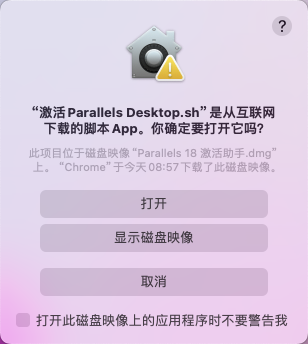
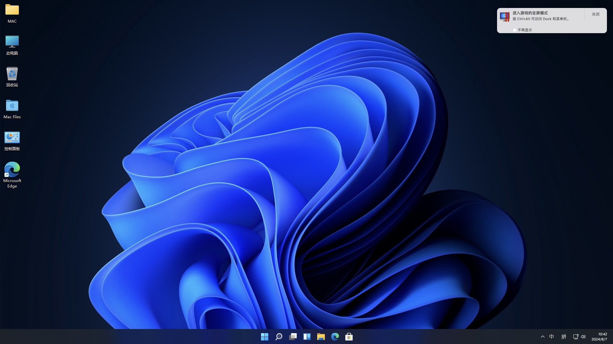

# Pd18虚拟机：Parallels Desktop 18 for Mac

## 介绍

Parallels Desktop 18（简称PD18）是一款强大的虚拟机软件，允许用户在Mac上同时运行macOS和Windows操作系统，支持Intel和M系列芯片。它实现了Mac与Windows之间的无缝文本复制粘贴和对象拖放，使得跨操作系统开发和测试变得轻松快捷。PD18优化了Windows应用程序的运行，确保不会拖慢Mac的运行速度，并且持续更新以保持与最新的macOS、Windows或Linux版本的兼容性，确保用户能够不间断地继续工作。

## 下载

选择其中一个进行下载

| 渠道 | 下载地址 |
| -------- | -------- | 
| 官网正版 | [点击下载](http://macabc.cn:5244/d/Parallels%20Desktop/PD18/Parallels%20Desktop18%E6%87%92%E4%BA%BA%E5%8C%85.dmg?sign=bDjGCefCawrBm_dDOsIAr1yny7r-tdJH_aNGoXoIb48=:0) |
| 备用下载 | [点击下载](https://cowtransfer.com/s/c4f0e1b7bce04c) |

## 安装系统镜像

| 系统版本 | 安装教程 | 下载地址 |
| -------- | -------- |  -------- | 
| windows11 | [安装教程](https://www.yuque.com/xunijiaoyu/rl7zpz/pim4g2fo0ciawhp2) | [点击下载](https://www.yuque.com/xunijiaoyu/rl7zpz/pim4g2fo0ciawhp2) |
| windows10 | [安装教程](https://www.yuque.com/xunijiaoyu/rl7zpz/rqy3ry5ncndbvfme) | [点击下载](https://www.yuque.com/xunijiaoyu/rl7zpz/rqy3ry5ncndbvfme) |

## 激活

1、双击打开安装包 `Parallels Desktop18懒人包.dmg`

2、点击打开 `ParallelsDesktop18-18.11.dmg`

3、点击打开 `安装app`

4、点击安装app后会弹出启动窗口

5、启动完成后会弹出 安装助手窗口，我们先不安装然后东西

6、右键点击 `Parallels Desktop`，选择 `偏好设置`

7、打开 Parallels Desktop 偏好设置 后

7.1 将默认的每周更新`检查更新`更改为`从不`
7.2 将默认自动勾选的`自动下载更新`更改为`取消勾选`

8、再回到 `Parallels Desktop18懒人包.dmg`

双击打开 `Parallels 18 激活助手.dmg`

9、在`ParallelsDesktop18-激活助手`窗口点击 `激活 Parallels Desktop.sh`

10、打开警告提示窗口 中直接选择 `打开`

11、此时会打开终端窗口，安装提示输入开机密码后按回车键

12、提示这个就是激活成功啦

13、检查软件是否真正的激活成功

14、右键点击 `Parallels Desktop`，选择 `关于Parallels Desktop`

可以看到已经激活成功：

15、右键点击 `Parallels Desktop`，选择 `账户和许可证`

16、在`我的许可证`窗口中可以看到 许可证的状态为`永久许可证`了

至此 Parallels Desktop 18 激活成功啦！

## 安装系统镜像

1、双击打开下载好的 `M-Win11-懒人包-会员专用.dmg`

2、在弹出的窗口中 双击打开`Parallels`文件夹

3、将`Windows 11.pvm` 拖到 `Parallels`文件夹 中

4、双击打开刚拖进来的 `Windows 11.pvm`

至此系统镜像安装成功啦！