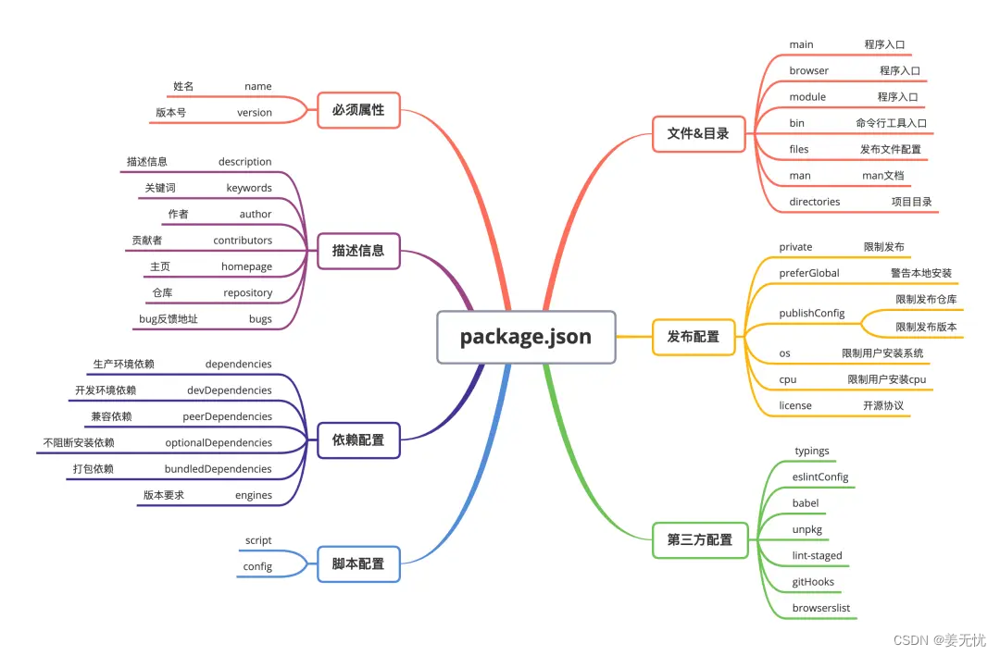

# package.json 详解

## 介绍

package.json 是 Node.js 项目根目录中的一个文件，它包含与项目相关的各种信息。该文件提供给 npm 的信息使其能够识别并处理项目的依赖关系。



package.json 文件主要包括：

列出项目所依赖的包
指定了项目可以使用/正在使用的包的版本
使您的构建过程可复制，因此更容易与其他开发人员共享
包含其他元数据，如项目描述、特定发行版中的项目版本、许可证信息，甚至属性数据等
对于 npm 和包的最终用户都是至关重要的

## 1.快速创建 package.json 文件

使用 npm init 命令可以跟进交互式命令行快速创建 package.json 文件。如果你想使用默认值快速创建，可以直接带上参数 -y 或者 --yes。

```bash
➜ ✗ npm init -y
Wrote to /Users/express/package.json:

```

## package.json 属性全面解读

### name

name 是指软件包名。

**命名规则：**

- 名称必须小于或等于 214 个字符。这包括范围软件包的范围。
- 作用域软件包的名称可以以点或下划线开头。如果没有作用域，则不允许这样做。
- 新软件包名称中不能有大写字母。
- 名称最终会成为 URL、命令行参数和文件夹名称的一部分。因此，名称中不能包含任何非 URL 安全字符。
- 名称可选择以作用域作为前缀，例如 @myorg/mypackage。

**提示：**

- 不要使用与 Node 核心模块相同的名称。
- 不要在名称中使用 "js "或 “node”。因为你编写的是 package.json 文件，所以我们假定它是 js，你可以使用 "引擎 "字段指定引擎。(见下文）。
- 该名称可能会作为参数传递给 require()，因此应该简短，但也要有合理的描述性。
- 你可能需要检查一下 npm 注册表，看看是否已经有使用该名称的软件，以免过于依赖它。
  [npm link](https://www.npmjs.com/)
  > 这是发布包的注意事项，如果你的项目不准备分享发布，则无所谓，建议和你项目相同。
```json
"name": "bun"
```


### version

指发布包版本号,x.x.x 的形式。
版本必须能被 node-semver 解析，node-semver 作为依赖项与 npm 捆绑。(npm install semver 可自行使用）。
```json
"version": "1.0.4"
```


**命名版本号建议遵循版本语义规范：**

| 代码状态 | 阶段 | 规则 | 示例 |
| -------- | -------- | -------- | -------- |
| 首次发布 | 新项目 | 从 1.0.0 开始 | 1.0.0|
| 向后兼容的错误修复 | 补丁发布 | 递增第三个数字，相当于修改了 bug,小改动 | 1.0.1|
| 向后兼容的新功能 | 小版本 | 递增中间数位，并将最后一位数重置为零，例如增加了新功能 | 1.1.0 |
| 破坏向后兼容性的更改 | 主要版本 | 将第一位数字递增，并将中间和最后一位数字重置为零，破坏性重大更新，改动很大 | 2.0.0 |

### description
项目描述

这是一个字符串。这有助于人们发现你的软件包，因为它会在 npm 搜索中列出。
```json
"description": "A fast all-in-one JavaScript runtime"
```

### keywords
项目关键字

这是一个字符串数组。这有助于人们在 npm 搜索中发现你的软件包。
```json
"keywords": ["Bun", "runtime", "Javascript"]
```

### homepage
项目主页的网址

你可以写你git仓库readme地址，例如：

```json
"homepage": "https://github.com/owner/project#readme"
```

### bugs
项目问题跟踪器的网址和/或报告问题的电子邮件地址。这些信息对遇到软件包问题的人很有帮助。
```json
{
  "bugs": {
    "url": "https://github.com/owner/project/issues",
    "email": "project@hostname.com"
  }
}
```
您可以指定一个或两个值。如果只想提供一个 url，可以将 "bugs "的值指定为一个简单的字符串，而不是一个对象。

如果提供了 url，npm bugs 命令将使用该 url。

### license
开源声明许可

license 是 package.json 文件中的一个信息字段，可让其他开发人员了解使用或分发软件包时的限制和权限。常见的开源许可证有 BSD、MIT、Apache 等，具体可以参考（https://www.ruanyifeng.com/blog/2011/05/how_to_choose_free_software_licenses.html）

您应指定软件包的许可证，以便人们知道他们可以如何使用该软件包，以及您对其设置的任何限制。

单个：
```json
{
  "license": "BSD-3-Clause"
}
```
多个：
```json
{
  "license": "(ISC OR GPL-3.0)"
}
```
```
不要任何开源许可：
```json
{
  "license": "UNLICENSED"
}
```

### author
项目作者名

包含一个 "姓名 "字段以及可选的 "url "和 “电子邮件”，就像这样：

```json
{
  "name": "Barney Rubble",
  "email": "b@rubble.com",
  "url": "http://barnyrubble.tumblr.com/"
}
```
可以简写：
```json
{
  "author": "Barney Rubble <b@rubble.com> (http://barnyrubble.tumblr.com/)"
}
```

### contributors

"贡献者 "是一个作者数组，规则和author一样。

### private

为true代表是私有的项目

如果在 package.json 中设置 “private”：true，那么 npm 将拒绝发布它。

### main

入口文件

main 属性指定了项目的入口文件，在 browser 和 Node 环境中都可以使用。

main 字段是一个模块 ID，它是程序的主要入口。也就是说，如果你的软件包名为 foo，用户安装后执行 require(“foo”) 命令，就会返回主模块的 exports 对象。

这应该是一个相对于软件包文件夹根目录的模块。

对于大多数模块来说，最合理的做法是有一个主脚本，而通常没有太多其他脚本。

如果未设置 main，则默认为软件包根目录下的 index.js。

```json
{
  "main": "lib/index.js"
}
```

### config

配置 "对象可用于设置软件包脚本中使用的配置参数，这些参数会在升级过程中持续存在。例如，如果一个软件包有以下配置：

```json
{
  "name": "foo",
  "config": {
    "port": "8080"
  }
}
```

### scripts
运行命令集合（字典）
脚本 "属性是一个字典，包含在软件包生命周期的不同时间运行的脚本命令。键是生命周期事件，值是在该时刻运行的命令。

`package.json`文件的 `scripts`属性支持大量内置脚本、预设生命周期事件以及任意脚本。这些脚本都可以通过运行 npm run-script 或 npm run 来执行。名称匹配的前置和后置命令也会被执行（例如 premyscript、myscript、postmyscript）。使用 npm explore – npm run 可以运行来自依赖项的脚本。

scripts 属性包含在软件包生命周期的不同时间运行的命令，键值对包含脚本名称和要执行的相应用户脚本或命令。常用的有本地启动start、开发环境 dev、生产环境 build、语法检测 lint 和 lint:fix、单元测试 test 等。

例如：
```json
{
  "scripts": {
    "precompress": "{{ executes BEFORE the `compress` script }}",
    "compress": "{{ run command to compress files }}",
    "postcompress": "{{ executes AFTER `compress` script }}",
    "build-runtime": "esbuild --target=esnext  --bundle src/runtime/index.ts --format=iife --platform=browser --global-name=BUN_RUNTIME > src/runtime.out.js; cat src/runtime.footer.js >> src/runtime.out.js",
    "build-fallback": "esbuild --target=esnext  --bundle src/fallback.ts --format=iife --platform=browser --minify > src/fallback.out.js",
    "postinstall": "bash .scripts/postinstall.sh",
    "typecheck": "tsc --noEmit && cd test && bun run typecheck",
    "fmt": "prettier --write --cache './{src,test,bench,packages/{bun-types,bun-inspector-*,bun-vscode,bun-debug-adapter-protocol}}/**/*.{mjs,ts,tsx,js,jsx}'",
    "lint": "eslint './**/*.d.ts' --cache",
    "lint:fix": "eslint './**/*.d.ts' --cache --fix"
  }
}
```
```bash
npm run compress
```

有一个默认的 npm start命令，它会执行根目录的server文件，可以修改它。
后面路径写法：
命令行脚本 + 执行文件path + 参数

- **可执行命令行脚本：** 可以是全局的可执行bash脚本，也可一是依赖包目录下（node_modules/.bin）的bash脚本。
- **执行文件：** 脚本运行的目标文件。
- **参数：** 参数使用 – 传递–前缀标志和选项，否则 npm 将对其进行解析。例如
```bash
node index.js --path=123
```
或者
```bash
npm run test -- --grep="pattern"
```
参数用 process.argv接收。

### dependencies
生产依赖关系对象，对象内的所有依赖在正式发布打包时包含在内
依赖关系在一个简单对象中指定，该对象将软件包名称映射到版本范围。版本范围是一个字符串，包含一个或多个空格分隔的描述符。依赖关系也可以用 tar 包或 git URL 来标识。
依赖格式如下：

- version ： 必须与版本完全匹配
- /> version ： 必须大于该版本，例如：>1.0.0,则依赖要比1.0.0版本大。
- >=version ：大于等于~
- <version : 必须小于该版本
- <=version：小于等于该版本
- ~version：“大致相当于当前版本”，只接受小版本（第三个数变动）向后变动,1.0.x。
- ^version：“与版本兼容”，只接受第2个数，第三个数变动，1.x.x
- 1.2.x ： 1.2.0、1.2.1 等，但不包括 1.3.0
- http://… ： 作为依赖项的 URL
- 或者"" ： 与任何版本匹配
- version1 - version2 ： version1到version2范围内，>=version1 <=version2
- range1 || range2 ：如果满足范围 1 或范围 2，则通过。
- git… ： 将 Git URL 作为依赖项，这个形式有点多，例如：git+ssh://git@github.com:npm/cli.git#v1.0.27
  git+ssh://git@github.com:npm/cli#semver:^5.0
  git+https://isaacs@github.com/npm/cli.git
  git://github.com/npm/cli.git#v1.0.27
- tag ： 可以时发布的标记版本，例如latest，代表最新版本
- path/path/path : 本地项目依赖路径。
```json
"dependencies": "{
  "<package name>": "^4.1.4",
  "<package name>": "~1.3.2",
  "<package name>": "1.0.2",
  "<package name>": "<=1.3.2"
}
```

### devDependencies
本地开发环境依赖、项目构建、和测试依赖的存放目录

在发布正式生产包时不会包含在内。
如果有人打算下载并在其程序中使用您的模块，那么他们可能不希望或不需要下载并构建您使用的外部测试或文档框架。

在这种情况下，最好将这些附加项目映射到 devDependencies 对象中。

devDependencies 属性定义了开发过程所需的软件包依赖关系。开发依赖项有助于其他开发人员复制构建步骤。你可以使用 npm install --save-dev 将依赖包安装到 devDependencies 依赖中。
```json
"devDependencies": {
  "first-dev-package": "^5.8.1",
  "second-dev-package": "3.2.2—4.0.0"
}
```
使用 devDependencies 列出生产环境中不必要的软件包，但有助于创建与原始设置一致的开发环境。

### peerDependencies
项目的同行依赖，也可以说项目在这些依赖的基础上创造，所以别人下载你的包会同时下载peerDependencies下的依赖包。

这个属性重点介绍一下，通常是在插件开发的场景下，你的插件需要某些依赖的支持，但是你又没必要去安装，因为插件的宿主会去安装这些依赖，你就可以用peerDependencies去声明一下需要依赖的插件和版本，如果出问题npm就会有警告来提醒使用者去解决版本冲突问题。
peerDependencies 和普通依赖差不多，但它不是定义 A 和 B（即您正在开发的项目和它所依赖的项目）之间的强需求，而是指定您的代码需要但不直接需要的软件包
```json
"peerDependencies": {
  "react": ">=16.9.0",
  "react-dom": ">=16.9.0"
}
```
请注意以下几点：

并非所有开发者都需要指定同伴依赖关系。只有当你发布自己的 NPM 软件包时，才会考虑列出 peerDependencies。
你需要在 package.json 的 peerDependencies 字段中手动列出依赖关系。具体做法是在 node_modules 目录中指定你的项目希望其主应用程序拥有的每个软件包的名称和语义版本。
最好让你的同伴依赖关系宽松到不同的次版本和补丁版本。因此，假设您要发布的软件包依赖于 React 17.3.1 版本。在这种情况下，请指定 "react"："^17.3.1"（或 "react"：">= 17.3.1 < 18"）。这样做将使您的软件包与其他 React 版本（可能大于或等于 v17.3.1，但小于 v18）的应用程序广泛兼容。


### peerDependenciesMeta
同行依赖可选版本，可配置依赖是否可选。
```json
{
  "name": "tea-latte",
  "version": "1.3.5",
  "peerDependencies": {
    "tea": "2.x",
    "soy-milk": "1.2"
  },
  "peerDependenciesMeta": {
    "soy-milk": {
      "optional": true
    }
  }
}
```

### bundleDependencies

打包依赖，定义了一个依赖数组，将在发布项目时将其中的依赖打包在一起。

如果需要在本地保存 npm 软件包，或通过单个文件下载来获得它们，可以通过在 bundleDependencies 数组中指定软件包名称并执行 npm pack，将软件包捆绑到一个压缩包文件中。
```json
{
  "name": "awesome-web-framework",
  "version": "1.0.0",
  "bundleDependencies": ["renderized", "super-streams"]
}
```

我们可以通过运行 npm pack 获取 awesome-web-framework-1.0.0.tgz 文件。该文件包含依赖包 renderized 和 super-streams，执行 npm install awesome-web-framework-1.0.0.tgz 即可将其安装到新项目中。请注意，软件包名称中不包含任何版本，因为这些信息已在依赖项中指定。

### overrides

依赖覆盖

如果需要对依赖包的依赖项进行特定更改，例如替换存在已知安全问题的依赖包版本、用分叉包替换现有依赖包，或确保所有地方都使用相同版本的软件包，则可以添加overrides。
重载提供了一种方法，可将依赖树中的软件包替换为另一个版本，或完全替换为另一个软件包。
例如：
```json
{
  "overrides": {
    "foo": "1.0.0"
  }
}
```
无论什么情况foo的版本都是1.0.0
可以嵌套覆盖，表示baz的子代bar,bar版本2.0.0的子代foo设置为1.0.0：
```json
{
  "overrides": {
    "baz": {
      "bar@2.0.0": {
        "foo": "1.0.0"
      }
    }
  }
}
```
> 不建议覆盖dependencies下的依赖，除非依赖软件包和覆盖本身共享完全相同的规范。为了使这一限制更容易处理，覆盖也可以定义为对直接依赖包规范的引用，方法是在希望版本匹配的软件包名称前加上 $

```json
{
  "dependencies": {
    "foo": "^1.0.0"
  },
  "overrides": {
    // BAD, will throw an EOVERRIDE error
    // "foo": "^2.0.0"
    // GOOD, specs match so override is allowed
    // "foo": "^1.0.0"
    // BEST, the override is defined as a reference to the dependency
    "foo": "$foo",
    // the referenced package does not need to match the overridden one
    "bar": "$foo"
  }
}
```

### engines
版本依赖范围
该字段仅为建议性字段，只有在软件包作为依赖关系安装时才会产生警告。
engines 属性描述了与软件包兼容的 Node.js 版本和其他运行时环境。该对象将运行时环境名称映射到版本号或范围。
```json
{
  "engines": {
    "node": ">=0.10.3 <15"
  }
}
```
与依赖关系一样，如果不指定版本（或指定 "*"作为版本），那么任何版本的 node 都可以使用。

### os

os 属性列出了软件包运行的操作系统。如果 package.json 文件中未包含 os 属性，说明当前包适应任何操作系统。

您可以指定模块将在哪些操作系统上运行：
```json
{
  "os": ["darwin", "linux"]
}
```

### cpu
如果您的代码只能在某些 CPU 架构上运行，您可以指定是哪些架构。
```json
{
  "cpu": ["x64", "ia32"]
}
```

### publishConfig
这是一组将在发布时使用的配置值。如果你想设置标签、注册表或访问权限，它就特别方便，这样你就能确保给定的软件包不会被标记为 “最新”、不会被发布到全局公共注册表或某个作用域模块默认为私有。

### workspaces
工作区
可选的 workspaces 字段是一个文件模式数组，用于描述安装客户端应在本地文件系统中查找的位置，以便找到需要以符号链接方式连接到顶级 node_modules 文件夹的每个工作区。

它既可以描述用作工作区的文件夹的直接路径，也可以定义将解析到这些相同文件夹的 globs（父路径）。

在下面的示例中，只要文件夹 ./packages 内有有效的 package.json 文件，位于该文件夹内的所有文件夹都将被视为工作区：

```json
{
  "name": "workspace-example",
  "workspaces": ["./packages/*"]
}
```

### files
可选的 files 字段是一个文件模式数组，用于描述将你的软件包作为依赖关系安装时要包含的条目。文件模式的语法与 .gitignore 类似，但正好相反：包含文件、目录或 glob 模式（、**/ 等）将使该文件在打包时包含在压缩包中。省略该字段将使其默认为[“*”]，即包含所有文件。

你也可以在软件包的根目录或子目录中提供 .npmignore 文件，这样文件就不会被包含在内了。在软件包的根目录中，它不会覆盖 "files "字段，但在子目录中则会。.npmignore 文件的作用与 .gitignore 文件类似。如果存在 .gitignore 文件，而 .npmignore 丢失，则将使用 .gitignore 的内容。

### bin
很多软件包都有一个或多个可执行文件，它们希望将这些文件安装到 PATH 中。npm 可以轻松实现这一点（事实上，它就是利用这一功能来安装 "npm "可执行文件的）。

要使用此功能，请在 package.json 中提供 bin 字段，该字段是命令名称与本地文件名称的映射。在全局安装此软件包时，该文件会链接到全局 bins 目录中，或者创建一个 cmd（Windows 命令文件）来执行 bin 字段中指定的文件，因此可以通过名称或 name.cmd （在 Windows PowerShell 上）来运行。当该软件包作为依赖关系安装到另一个软件包时，该文件将被链接到该软件包中，可直接通过 npm exec 执行，或在其他脚本中通过 npm run-script 以名称调用。
例如：
```json
{
  "bin": {
    "myapp": "./cli.js"
  }
}
```
因此，当你安装 myapp 时，如果是 unix-like 操作系统，它会从 cli.js 脚本创建一个符号链接到 /usr/local/bin/myapp；如果是 windows 操作系统，它会创建一个 cmd 文件，通常位于 C:\Users{Username}\AppData\Roaming\npm\myapp.cmd，用于运行 cli.js 脚本。

如果只有一个可执行文件，且其名称应是软件包的名称，那么只需以字符串形式提供即可。例如
```json
{
  "name": "my-program",
  "version": "1.2.5",
  "bin": "./path/to/program"
}
```

相同写法：
```json
{
  "name": "my-program",
  "version": "1.2.5",
  "bin": {
    "my-program": "./path/to/program"
  }
}
```
>请确保 bin 中引用的文件以 #!/usr/bin/env node 开头，否则脚本将在没有 node 可执行文件的情况下启动！


### type
在 node 支持 ES 模块后，要求 ES 模块采用 .mjs 后缀文件名。只要遇到 .mjs 文件，就认为它是 ES 模块。如果不想修改文件后缀，就可以在 package.json文件中，指定 type 字段为 module。
```json
"type": "module"
```

### imports
imports 属性是Node v14.6.0, v12.19.0 新增的属性，imports 的 key 必须是以 # 开头的字符串，软件包导入允许映射到外部软件包。使用路径别名的好处是在目录调整时，不用全量修改。
```json
"imports": {
  "#config": "./src/config/index.js",
  "#controllers": "./src/controller/index.js",
  "#services": "./src/service/index.js",
  "#models": "./src/model/index.js",
  "#utils": "./src/util/index.js"
},
```

### exports
exports 属性允许在通过 node_modules 查找或自引用其自身名称加载时，定义包的入口点。Node.js 12+ 支持该字段，作为 main 的替代字段，它支持定义子路径导出和条件导出，同时封装内部未导出模块。

```json
"exports": {
  "require": "./index.js",
  "import": "./index.mjs"
}
```
这样的配置在使用 import 'xxx' 和 require('xxx') 时会从不同的入口引入文件，exports 也支持使用 browser 和 node 字段定义 browser 和 Node 环境中的入口。

### browser
如果您的模块要在客户端使用，则应使用browser字段而不是main字段。这有助于提示用户，该模块可能依赖于 Node.js 模块中不可用的模块。(例如 window）

如果只想在 web 端使用，不允许在 server 端使用，可以通过设置 browser 字段指定入口文件。
```json
"browser": "src/browser/index.js"
```


### module
用来指定项目 ES 模块的入口文件。
```json
"module": "./index.mjs"
```
当一个项目同时定义了 main，browser 和 module，像 webpack，rollup 等构建工具会感知这些字段，并会根据环境以及不同的模块规范来进行不同的入口文件查找。

workspace 属性：

workspace 属性是项目的工作区配置，用于在本地的根目录下管理多个子项目，可以自动地在 npm install 时将 workspaces 下面的包，软链到根目录的 node_modules 中，不用手动执行 npm link 操作。这在组件库及npm 系列包场景使用比较广泛。

workspaces 字段接收一个数组，数组里可以是文件夹名称或者通配符。比如：

```json
"workspaces": [
  "workspace-a"
]
```
表示在 workspace-a 目录下还有一个项目，它也有自己的 package.json。

2.3.功能类属性
功能类属性可正确安装和管理项目及其依赖项。


### optionalDependencies

optionalDependencies 属性列出了对软件包的运行并非必不可少的依赖项。安装时使用 npm install --save-optional 可以添加到该属性中。

如果属性中的软件包可用，它们就会被安装并提供附加功能。如果出现以下情况，请将软件包添加到该部分：

软件包仅在某些系统上可用。
特定软件包版本仅在某些系统上可用。
使用软件包的开发人员可以选择不安装软件包。
与其他依赖项相比，optionalDependencies 属性的主要区别在于，如果没有提供依赖项，软件包也能正常工作。
optionalDependencies 属性使用与依赖项和 devDependencies 相同的语法。软件包名称映射到版本号或列表中的范围。

2.4.第三方属性
下面主要介绍几个常用的属性：browserslist、sideEffects、prettier、lint-staged。

### browserslist 
browserslist 属性用来设置项目的浏览器兼容情况。babel 和 autoprefixer 等工具会使用该配置对代码进行转换。当然你也可以使用 .browserslistrc 单文件配置。
```json
"browserslist": [
  "> 5%",
  "last 2 versions"
]
```

### sideEffects
sideEffects 属性用来显示设置某些模块具有副作用，用于 webpack 的 tree-shaking 优化。

比如在项目中整体引入 Ant Design 组件库的 css 文件。

```json
import 'antd/dist/antd.css'; // or 'antd/dist/antd.less'
```
如果 Ant Design 的 package.json 里不设置 sideEffects，那么 webapck 构建打包时会认为这段代码只是引入了但并没有使用，可以 tree-shaking 剔除掉，最终导致产物缺少样式。所以 Ant Design 在 package.json 里设置了如下的 sideEffects，来告知 webpack，这些文件具有副作用，引入后不能被删除。
```json
"sideEffects": [
  "dist/*",
  "es/**/style/*",
  "lib/**/style/*",
  "*.less"
]
```

### lint-staged
lint-staged 属性是用于对 git 的暂存区的文件进行操作的工具，比如可以在代码提交前执行 lint 校验，类型检查，图片优化等操作。
```json
"lint-staged": {
  "*.{js,jsx}": [
    "npm run lint:fix"
  ],
  "*.{scss,css,jsx}": [
    "npm run stylelint:fix"
  ]
}
```

### prettier
prettier 属性用来设置prettier的配置项。

```json
"prettier": {
  "printWidth": 120,
  "tabWidth": 2,
  "singleQuote": true
}
```

### man

制定一个或通过数组制定一些文件来让linux下的man命令查找文档地址。
如果只有一个文件被指定的话，安装后直接使用man+模块名称，而不管man指定的文件的实际名称。例如:

```json
{
  "name" : "foo",
  "version" : "1.2.3",
  "description" : "A packaged foo fooer for fooing foos",
  "main" : "foo.js",
  "man" : "./man/doc.1",
}
```
通过man foo命令会得到 ./man/doc.1 文件的内容。
如果man文件名称不是以模块名称开头的，安装的时候会给加上模块名称前缀。因此，下面这段配置：
```json
{
  "name" : "foo",
  "version" : "1.2.3",
  "description" : "A packaged foo fooer for fooing foos",
  "main" : "foo.js",
  "man" : [ "./man/foo.1", "./man/bar.1" ],
}
```
会创建一些文件来作为man foo和man foo-bar命令的结果。
man文件必须以数字结尾，或者如果被压缩了，以.gz结尾。数字表示文件将被安装到man的哪个部分。
```json
{
  "name" : "foo",
  "version" : "1.2.3",
  "description" : "A packaged foo fooer for fooing foos",
  "main" : "foo.js",
  "man" : [ "./man/foo.1", "./man/foo.2" ],
}
```
会创建 man foo 和 man 2 foo 两条命令。


