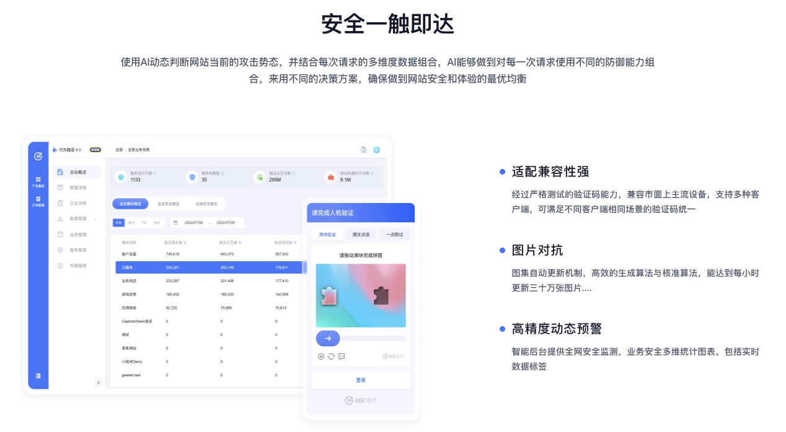
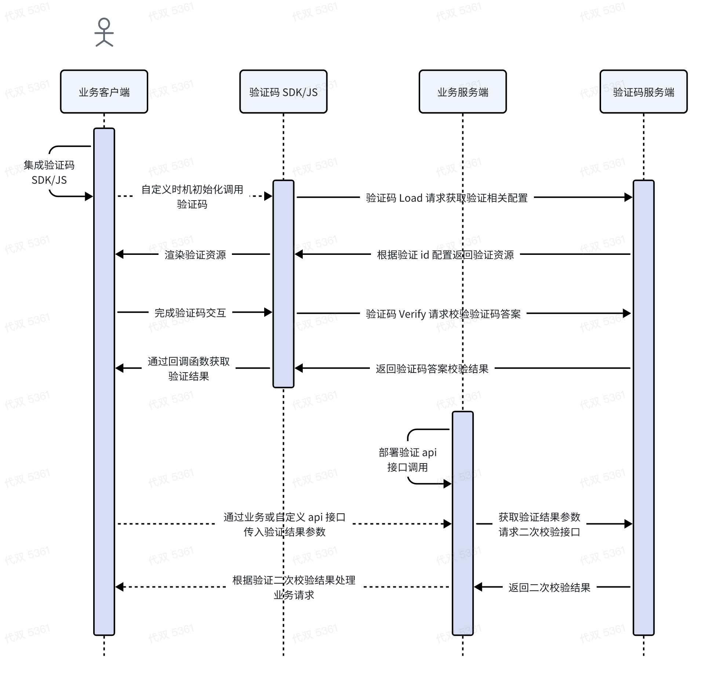
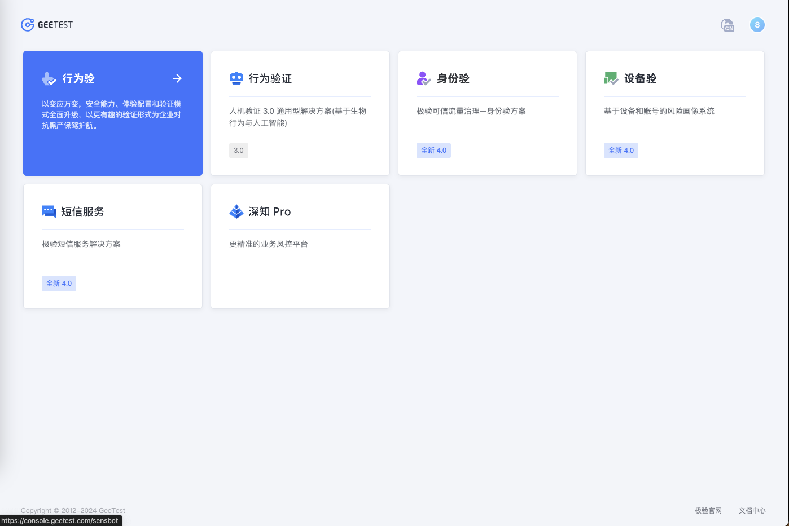
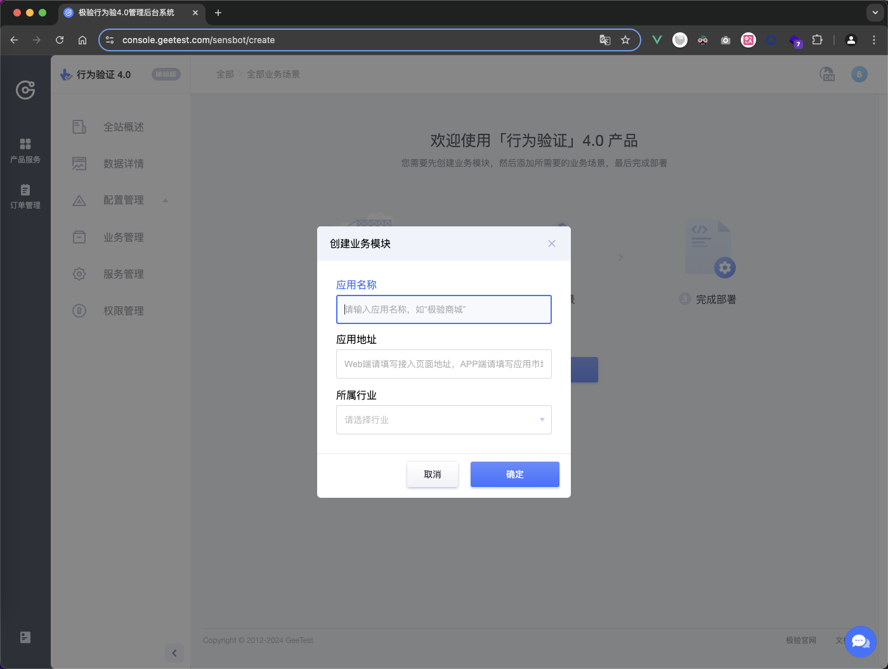
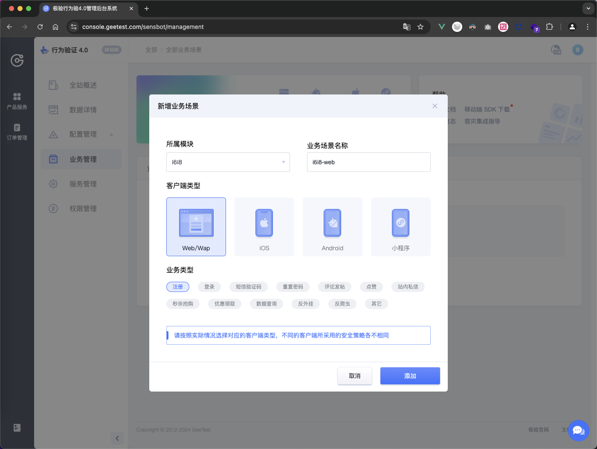
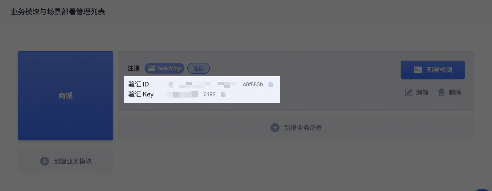

# 接入极验行为验证4.0滑动验证码

## 介绍

[行为验证4.0](https://docs.geetest.com/gt4/overview/flowchart)产品是极验于2022年6月正式推出的最新一代验证码产品，结合环境检测、行为特征、POW工作量证明、视觉模型热更等多项技术，在注册、登录、下单、防作弊等多种场景提供人机智能分流验证服务，为企业安全保驾护航。



## 使用场景
网站和APP，在所有可能被机器行为攻击的场景，例如但不限于注册、登录、短信接口、查询接口、营销活动、发帖评论等等，都可以部署使用「行为验证」，来抵御机器批量操作。

产品[体验地址](https://gt4.geetest.com/)


## 产品优势

- 防御更强大：得益于架构和逻辑优化重构，四代验证码有更多安全技术开发应用的空间，验证视觉模型更新更快，并新增POW工作量证明技术，最大程度提升黑产成本和遏制攻击频率。
- 服务更稳定：通过业务、数据库、运维等多维度设计容灾逻辑，从验证放行、监控预警、多集群灵活切换、多域名备用、服务抗DDOS等角度全面保障服务稳定性。
- 接入更精简：除移动端外，前端和服务端去SDK化，仅需通过JS和API完成集成，最快0.5天即可完成集成。
合规更安心：四代行为验环境检测及破解对抗相关规则回归验证问答校验本身，不依赖和不采集业务或C端隐私数据，满足隐私合规审查。
- 验证形式：验证形式高达9种
- 适配兼容性强：经过严格测试的验证码能力，兼容市面上主流设备，支持多种客户端，可满足不同客户端相同场景的验证码统一
- 语言：最高支持多达 78 种语言

## 支持平台
| web | iOS | Android | HarmonyOS | 小程序 |
|:---:|:---:|:-------:|:---------:|:-----:|
|  支持  |  支持 |  支持 |  支持 | 支持 |

### web支持框架
| H5 | Angular | React | Vue(2、3) | React-native | Flutter | Uniapp |
|:---:|:---:|:-------:|:---------:|:-----:|---:|---:|
|  支持  |  支持 |  支持 |  支持 | 支持 | 支持 | 支持 |

### 小程序支持平台
| 微信小程序 | 支付宝小程序 | 字节小程序 | 百度小程序 | QQ小程序 | 快手小程序|快应用|uniapp|taro|
|:--------:|:----------:|:---------:|:--------:|:-------:|:--------:|:---:|:-----:|:--:|
|  支持  |  支持 |  支持 |  支持 | 支持 | 支持 | 支持 | 支持 | 支持 |

## 验证码流程时序图



## 极验产品后台使用

### 1、获取账号

如您需体验行为验证 4.0 产品，请事先注册极验产品账号，[可点击此处](https://www.geetest.com/Register)提交账号申请

### 2、通过注册邮箱登录极验产品后台后，选择【[行为验](https://auth.geetest.com/product)】产品



### 3、进入【行为验】产品后台后，根据提示选择【创建业务模块】输入应用名称、应用地址、所属行业。



### 4、创建业务模块完成后，点击【新增业务场景】，输入场景名称、选择客户端类型、业务类型后生成部署所需的 `captcha_id` 和 `captcha_key`。



> 验证流程上不会校验不同场景和客户端是否共用一套 `id` 和 `key`，但为区分验证数据和配置不同的验证策略，建议不同的业务场景单独创建 `id` 和 `key` 部署



### 5、点击【部署检测】-【跳过指引】，即可进行后续场景的数据查看和验证形式配置等操作

## 服务端接入

当用户在前端界面通过验证码后，会产生一批与验证码相关的参数，用户的业务请求带上这些参数，后台业务接口再将这些参数上传到极验二次校验接口，确认该用户本次验证的有效性。

[服务端部署文档说明](https://docs.geetest.com/gt4/deploy/server)

### 1、获取 `captcha_id` 和 `captcha_key`

参考上述步骤登录极验产品后台-业务管理，获取到服务端部署所需的 `captcha_id`（验证 ID）和 `captcha_key`（验证 key），或联系您的项目对接人获取。

### 2、获取客户端验证参数并签名

在客户端完成验证后，可通过回调函数获取验证码相关参数，并通过业务自定义接口如注册登录等传入服务端，服务端拿到客户端验证参数后，需要使用客户端验证参数 `lot_number` 和 `captcha_key` 参考示例进行签名生成 `sign_token`。

### 3、上传验证参数提交二次校验

将客户端和服务端最终验证参数提交二次校验接口，进行二次校验，并根据二次校验返回结果处理最终的业务请求

> 参数请求格式请使用 application/x-www-form-urlencoded 格式，否则将返回报错-50005

### 4、处理容灾降级逻辑

注意处理二次校验接口异常情况，当请求极验二次验证接口异常或响应状态非200时对请求进行放行处理，避免因为接口请求超时或服务未响应而阻碍业务流程。

### 5、处理业务逻辑

根据极验二次校验接口返回的结果状态，进行后续的业务逻辑处理：仅当二次校验接口返回 `result` 为 `success` 时，才允许通过业务流程。

服务端预计开发周期：30分钟

服务端接入常见问题，[请参考此处](https://docs.geetest.com/gt4/faq/server)

### 6、接入示例

#### 二次校验接口

| 接口信息 | 说明 |
|:---:|:--:|
|  接口地址  |  [http://gcaptcha4.geetest.com/validate](http://gcaptcha4.geetest.com/validate) |
|  协议支持  |  https/http |
|  请求方法  |  GET/POST |
|  请求格式  |  application/x-www-form-urlencoded |
|  返回类型  |  json |

**请求参数**

| 参数名 | 类型 | 是否必填 | 说明 |
|:---:|:--:|:--:|:--:|
|  lot_number  |  string |  是 |  验证流水号 |
|  captcha_output  |  string |  是 |  验证输出信息 |
|  pass_token  |  string |  是 |  验证通过标识 |
|  gen_time  |  string |  是 |  验证通过时间戳 |
|  captcha_id  |  string |  是 |  验证 id |
|  sign_token	  |  string |  是 |  验证签名 |

**响应参数**

一般只需要处理校验成功和校验失败时的返回，异常返回一般只会出现在客户接入时没有以正确的方式进行请求。

**1.校验成功返回示例**

```json
{
    "status": "success", // 请求状态
    "result": "success", // 二次校验结果
    "reason": "", // 校验结果说明
    "captcha_args": { // 验证输出参数
        "used_type": "slide", 
        "user_ip": "127.0.0.1", 
        "lot_number": "4dc3cfc2cdff448cad8d13107198d473", 
        "scene": "反爬虫", 
        "referer": "http://127.0.0.1:8077/"
        // ...
    }
}
```
**2.校验失败返回示例**

```json
{
    "status": "success", // 请求状态
    "result": "fail", // 二次校验结果
    "reason": "pass_token expire", // 校验结果说明
    "captcha_args": { // 验证输出参数
        ...
    }
}
```

**3.请求异常返回示例**

```json
{
    "status": "error", // 请求状态
    "code": "-50005", // 错误码
    "msg": "illegal gen_time", // 错误信息
    "desc": { // 错误描述
        "type": "defined error"
    }
}
```

#### Node.js 接入代码示例
```javascript
// 使用 Node.js 框架 express 演示
const express = require('express'); // 导入 Express 模块
const cors = require('cors'); // 导入 CORS 模块，用于处理跨域请求
const axios = require('axios'); // 导入 Axios 模块，用于发起 HTTP 请求
const crypto = require('crypto');
const app = express(); // 创建 Express 应用实例

app.use(cors()); // 使用 CORS 中间件解决跨越请求

const port = 3000; // 设置应用监听的端口号

// geetest极验配置信息
const geetestConfig = {
  id: '7e111794121d87ca0959954f89580e1a', //公钥 public key
  key: '5dcbe6cb44549d3be1a48cbf18dd7bde',// 密钥 secret key
  server:'http://gcaptcha4.geetest.com/validate' // 服务地址server url
}

// 设置路由处理函数，用于验证
app.get('/login', async (req, res) => {

  console.log('login-req', req.query); // 打印请求查询参数

  // 收到前端传来的参数
  const { captcha_id,lot_number,captcha_output,pass_token,gen_time } = req.query

  // 如果没有该参数直接报错
  if(!captcha_id){
    throw new Error('请求参数有误')
  }

  // captcha_id 错误
  if(captcha_id !== geetestConfig.id){
    throw new Error('请求参数有误')
  }

  // 生成签名, 使用标准的hmac算法，使用用户当前完成验证的流水号lot_number作为原始消息message，使用客户验证私钥作为key
  // 采用sha256散列算法将message和key进行单向散列生成最终的 “sign_token” 签名
  const sign_token = crypto.createHmac("sha256", geetestConfig.key).update(lot_number, 'utf8').digest('hex'); 

  // 向极验发送二次校验接口验证，响应json数据如：{"result": "success", "reason": "", "captcha_args": {}}
  const response = await axios({
    method: "get",
    url:`${geetestConfig.server}`,
    params: {
      captcha_id,
      lot_number,
      captcha_output,
      pass_token,
      gen_time,
      sign_token
    },
  });

  // geetest服务响应异常
  if(response.status != 200){
    throw new Error('Geetest Response Error' + response.status)
  }
  // 验证失败
  if(response.data.result != 'success'){
    throw new Error('Geetest Validate Failed, Reason:' + response.data.reason)
  }

  // 验证成功返回结果
  res.send(response.data).json();
})

// 监听端口
app.listen(port, () => {
  console.log(`Example app listening on port ${port}`, `is open url http://127.0.0.1:${port}`)
})
```


#### 各语言示例demo

| 开发语言 | 地址 |
|:---:|:--:|
|  C#  |  [地址](https://github.com/GeeTeam/gt4_csharp_aspnetcoremvc_demo) |
|  Golang  |  [地址](https://github.com/GeeTeam/gt4_golang_demo) |
|  Java  |  [地址](https://github.com/GeeTeam/gt4-java-demo) |
|  Node  |  [地址](https://github.com/GeeTeam/gt4_node_express_demo) |
|  Php  |  [地址](https://github.com/GeeTeam/gt4-php-demo) |
|  Python  |  [地址](https://github.com/GeeTeam/gt4-python-demo) |
|  Ruby  |  [地址](https://github.com/GeeTeam/gt4-ruby-demo) |


## 客户端接入

### 1、获取 `captcha_id`

参考上述步骤登录极验产品后台-业务管理，获取到客户端部署所需的 `captcha_id`（验证 ID），或联系您的项目对接人获取。


### 2、客户端接入

#### Web 端接入：
如需开发 web 或 H5 场景接入，可参考客户端 [部署文档和](https://docs.geetest.com/gt4/deploy/client/web) [api 文档](https://docs.geetest.com/gt4/apirefer/api/web)完成引入 JS 后完成集成工作；

> Web 端 JS 支持 2 种引入方式：1.直接从极验域名线上引入加载； 2.将 JS 下载，上传到您服务器后从本地加载。从流程稳定性方面考虑，我们推荐您使用第 2 种加载方式

##### web 框架demo
| H5 | Angular | React | Vue(2、3) | React-native | Flutter | Uniapp |
|:---:|:---:|:-------:|:---------:|:-----:|---:|---:|
|  [demo](https://github.com/geetestweb/gt4-public-client-demo)  |  [demo](https://github.com/geetestweb/gt4-public-client-demo/tree/angular) |  [demo](https://github.com/geetestweb/gt4-public-client-demo/tree/react) |  [demo](https://github.com/geetestweb/gt4-public-client-demo/tree/vue3) | [demo](https://github.com/geetestweb/gt4-public-client-demo/tree/react-native) | [demo](https://github.com/GeeTeam/gt4_flutter_plugin) | [demo](https://github.com/geetestweb/gt4-public-client-demo/tree/uniapp) |


##### web 平台接入代码示例
```html
<!DOCTYPE html>
<html lang="en">
  <head>
    <meta charset="UTF-8" />
    <meta http-equiv="X-UA-Compatible" content="IE=edge" />
    <meta name="viewport" content="width=device-width, initial-scale=1.0" />
    <title>float模式</title>
    <style>
      body {
        margin: 50px 0;
        text-align: center;
        font-family: "PingFangSC-Regular", "Open Sans", Arial,
          "Hiragino Sans GB", "Microsoft YaHei", "STHeiti",
          "WenQuanYi Micro Hei", SimSun, sans-serif;
      }

      .inp {
        border: 1px solid #cccccc;
        border-radius: 2px;
        padding: 0 10px;
        width: 239px;
        height: 40px;
        font-size: 18px;
      }

      .btn {
        display: inline-block;
        box-sizing: border-box;
        border: 1px solid #cccccc;
        border-radius: 2px;
        width: 100px;
        height: 40px;
        line-height: 40px;
        font-size: 16px;
        color: #666;
        cursor: pointer;
        background: white linear-gradient(180deg, #ffffff 0%, #f3f3f3 100%);
      }

      .btn:hover {
        background: white linear-gradient(0deg, #ffffff 0%, #f3f3f3 100%);
      }

      #captcha {
        display: inline-block;
      }

      label {
        vertical-align: top;
        display: inline-block;
        width: 80px;
        text-align: right;
      }

      #wait {
        text-align: left;
        color: #666;
        margin: 0;
      }
    </style>
  </head>
  <body>
    <h2>滑动模式-float</h2>
    <form id="form">
      <div>
        <label for="username">用户名：</label>
        <input class="inp" id="username" type="text" value="用户名" />
      </div>
      <br />
      <div>
        <label for="password">密码：</label>
        <input class="inp" id="password" type="password" value="123456" />
      </div>
      <br />
      <div>
        <label>完成验证：</label>
        <div id="captcha"></div>
      </div>
      <br />
      <div id="btn" class="btn">提交</div>
    </form>
    <!-- 注意，验证码本身是不需要 jquery 库，此处使用 jquery 仅为了在 demo 中使用，减少代码量 -->
    <script src="https://apps.bdimg.com/libs/jquery/1.9.1/jquery.js"></script>
    <!-- 引入 gt.js，既可以使用其中提供的 initGeetest 初始化函数 -->
    <!-- 引入初始化函数(gt4.js下载地址: https://static.geetest.com/v4/gt4.js) -->
     <script src="https://static.geetest.com/static/js/gt.0.4.9.js"></script>
    <!-- <script src="libs/gt4.js"></script> -->
    <script>
      initGeetest4(
        {
          captchaId: "7e111794121d87ca0959954f89580e1a",
          product: "float",
        },
        function (captcha) {
          // captcha为验证码实例
          captcha.appendTo("#captcha"); // 调用appendTo将验证码插入到页的某一个元素中，这个元素用户可以自定义
          $("#btn").click(function () {
            var result = captcha.getValidate();
            if (!result) {
              return alert("请完成验证");
            }
            result.captcha_id = "7e111794121d87ca0959954f89580e1a";
            //your code
            $.ajax({
              url: "/login",
              type: "get",
              dataType: "json",
              data: result,
              success: function (data) {
                console.log("data", data);
                if (data.result === "success") {
                  setTimeout(function () {
                    alert("登录成功");
                  }, 1500);
                } else if (data.result === "fail") {
                  setTimeout(function () {
                    alert("登录失败，请完成验证");
                    captcha.reset();
                  }, 1500);
                }
              },
            });
          });
        }
      );
    </script>
  </body>
</html>

```


#### 移动端接入：
如需开发移动端场景，需先登录极验产品后台-业务管理-右上角“移动端 SDK 下载”，获取移动端 SDK 后，参考移动端 [部署文档](https://docs.geetest.com/gt4/deploy/client/android)和 [api 文档](https://docs.geetest.com/gt4/apirefer/api/android)本地依赖 SDK 后完成集成工作。

> 基于安全风控考虑，移动端 SDK 接入仅支持本地依赖，不支持远程依赖

#### 小程序接入：
如需开发小程序场景，微信小程序请先申请插件后联系我们审核，其他小程序无需审核可自行申请获取后参考 [部署文档](https://docs.geetest.com/gt4/deploy/client/miniprogram/wx)和 [api 文档](https://docs.geetest.com/gt4/apirefer/api/miniprogram/wx)集成接入

客户端预计开发周期：30 分钟
客户端接入常见问题，[请参考此处](https://docs.geetest.com/gt4/faq/other)

### 小程序demo
| 微信小程序 | 支付宝小程序 | 字节小程序 | 百度小程序 | QQ小程序 | 快手小程序|快应用|uniapp|taro|
|:--------:|:----------:|:---------:|:--------:|:-------:|:--------:|:---:|:-----:|:--:|
|  [demo](https://github.com/geetestweb/miniapp-v4-demo/tree/wechat)  |  [demo](https://github.com/geetestweb/miniapp-v4-demo/tree/ali) |  [demo](https://github.com/geetestweb/miniapp-v4-demo/tree/bytedance) |  [demo](https://github.com/geetestweb/miniapp-v4-demo/tree/baidu) | [demo](https://github.com/geetestweb/miniapp-v4-demo/tree/qq) | [demo](https://github.com/geetestweb/miniapp-v4-demo/tree/kuaishou) | [demo](https://github.com/geetestweb/miniapp-v4-demo/tree/quickapp) | [hbx](https://github.com/geetestweb/miniapp-v4-demo/tree/uniapp-hbuilder) [cli](https://github.com/geetestweb/miniapp-v4-demo/tree/uniapp-vite) | [demo](https://github.com/geetestweb/miniapp-v4-demo/tree/taro3x-react) |