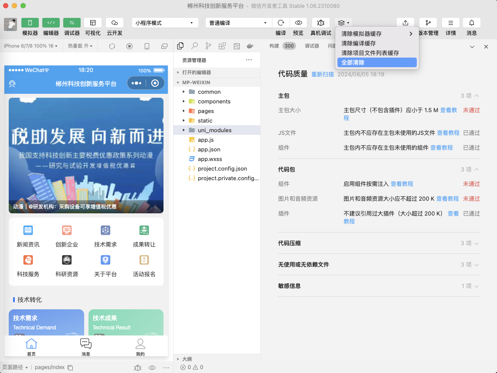
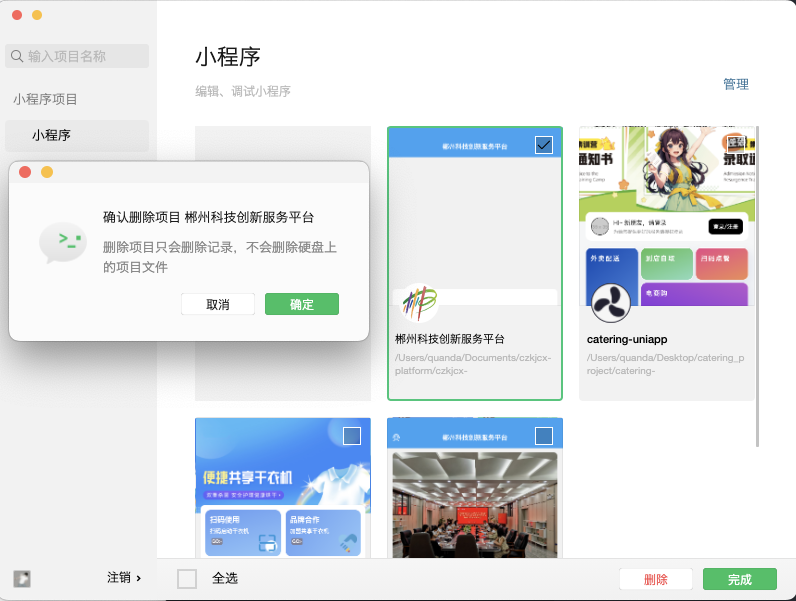

# 解决uniapp开发的小程序代码包大小超过限制

## 背景

在开发微信小程序的过程中，随着业务逻辑日渐庞大之后，突显了一些问题。

微信开发者工具很不稳定，我自己遇到很多坑，我把这些坑做了笔记，可以参考一下。

首先优化本身项目，优化的点比如：

如果优化后还是上传失败，或者同事电脑上传没问题自己电脑上传失败的话，那么可以尝试以下方法：

## 1.打开详情 -> 本地设置

将这些配置勾选上，如果之前勾选了，可以尝试取消勾选，再勾选上。

## 2.清除工具缓存

## 3.重新编译

## 4.二维码预览

## 5.真机调试

## 6.删除重新导入项目
在项目微信开发者工具中删除uniapp运行的项目

随后重新导入项目

## 7.在hbuilderx中删除生成的微信小程序项目并重新运行到重新运行到微信开发者工具

## 8.在 hbuilderx 中直接发行到微信

最后再微信开发者工具点击上传

