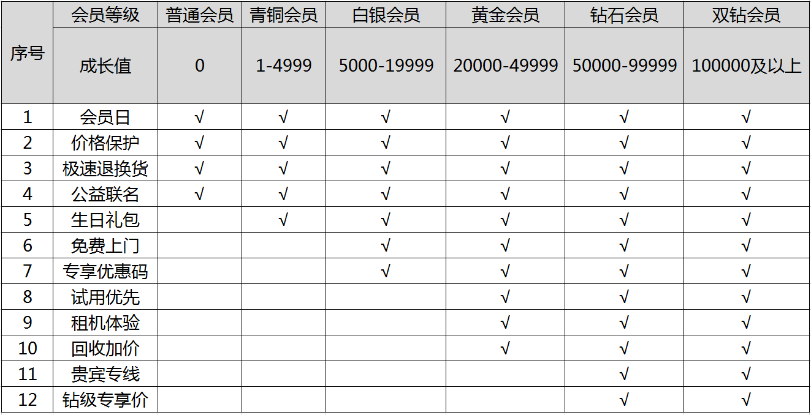

# 成长值介绍

## 一、成长值是什么？

成长值是会员在九机网购物后所获得的成长记录，用户通过累积成长值来提升九机网会员等级。

## 二、如何获得成长值？

会员在九机网购物，每消费1元将获得1个成长值，成长值持续累加且不清零。

## 二、成长值有什么用？

成长值决定会员等级，会员等级根据成长值的增长自动升级。

九机网共有6个会员等级，分别是：普通会员、青铜会员、白银会员、黄金会员、钻石会员、双钻会员，成长值越高会员等级越高，拥有的会员特权越丰富。具体特权分布如下图：

