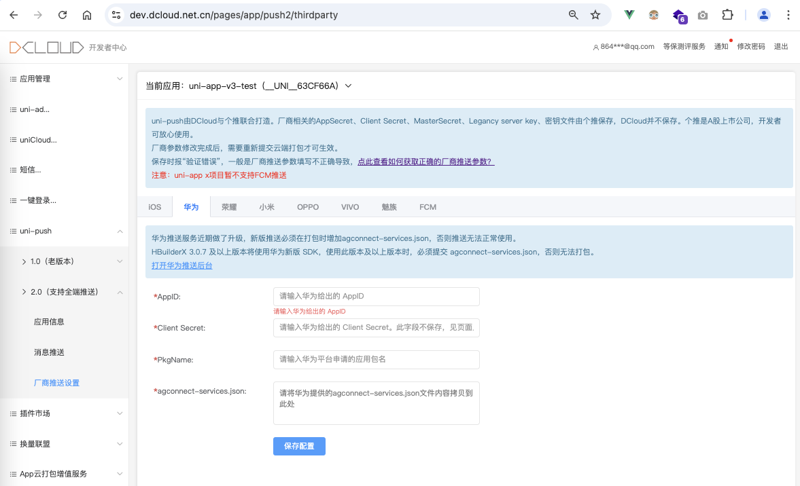

# uni-app和Node.js使用uni-push2.0实现通知栏消息推送功能

# 前言

uniapp 提供了 unipush 统一推送服务,但是每次要推送消息的时候都要登陆 Dcloud 开发者后台，有点不方便，运营需要在我们的后台系统就可以完成操作。


## 效果演示


## 消息下发流程


## 名词解释

| 名词     | 解释                                                                                                                                                                        |
| :------- | :-------------------------------------------------------------------------------------------------------------------------------------------------------------------------- |
| 通知消息 | 指定通知标题和内容后，由个推 SDK 自动处理在系统通知栏中展示通知栏消息，同时响铃或震动提醒用户(响铃和震动受手机系统的设置状态影响)。                                         |
| 透传消息 | 即自定义消息，消息体格式客户可以自己定义，如纯文本、json 串等。透传消息个推只传递数据，不做任何处理，客户端接收到透传消息后需要自己去做后续动作处理，如通知栏展示、弹框等。 |
| ClientId | 个推业务层中的对外用户标识，用于标识客户端身份，由第三方客户端获取并保存到第三方服务端，是个推 SDK 的唯一识别号，简称 CID、cid。                                            |
| 在线推送 | app 在前台打开运行时，通过个推渠道下发消息。                                                                                                                                |
| 离线推送 | app 在后台、锁屏、进程关闭时，通过厂商渠道下发消息。若未集成 android 多厂商、未配置 ios 推送证书，则该机型无法使用离线推送。                                                |

## 推送方式

### 离线推送

仅 APP 端支持，当应用被用户关闭，或者运行到后台时，手机厂商为了省电或释放内存，会终止 App 后台联网。

消息将通过不会离线的手机厂商通道，下发到手机系统推送服务模块；

此时客户端会自动创建通知栏消息，展示在系统消息中心（如图所示）但客户端监听不到消息内容；当用户点击通知栏消息后，会将 APP 唤醒此时 APP 才能监听到消息内容。

### 在线推送

当应用在线时，不会创建“通知栏消息”，此时客户端会立即监听到消息内容。

如果你希望当应用在线时，也通过“通知栏消息”来提醒用户；可以通过以下两种方式实现：

1.监听到消息内容后，根据业务需要自己判断是否要创建“通知栏消息”，需要就调用创建本地消息 API `uni.createPushMessage` 手动创建通知栏消息。

2.服务端执行推送时，传递参数 `force_notification:true`，客户端就会自动创建“通知栏消息”（此时你监听不到消息内容），当用户点击通知栏消息后，APP 才能监听到消息内容。

以上两种方案各有优劣，方案一更加灵活；比如：客服功能，客户端接收到聊天消息时，应用如果已经打开聊天对话页面，就直接将监听到的推送内容，渲染到页面。如果应用未打开聊天页，则调用 api 创建“通知栏消息”提醒用户；此时你还可以执行一些其他逻辑，比如将 tabBar 的消息中心加红点等。方案二比较简便，客户端无需额外编写代码，自动创建通知栏消息；但仅适用于不关心客户端行为就创建“通知栏消息”的场景，如广告营销内容的推送等。

## 推送消息类型

### 通知栏消息

UniPush 推送服务定义好的推送样式、后续动作的推送方式，客户端接收到后显示在系统通知栏，用户点击通知栏消息启动 APP（激活到前台）。

### 透传消息

即自定义消息，UniPush 推送服务只负责消息传递，不做任何处理，客户端在接收到透传消息后需要自己去处理消息的展示方式或后续动作


**UniPush 推送服务对透传消息的数据符合以下格式时做了特殊处理，即符合该格式的透传消息会自动显示到系统通知栏【需要确保 app 通知权限已打开】**


## 一、开通云服务空间

- uni-push2.0 需要开发者开通 uniCloud。不管您的业务服务器是否使用 uniCloud，但专业推送服务器在 uniCloud 上。


### 1、打开 [服务空间](https://unicloud.dcloud.net.cn/) 点击`新增服务空间`按钮


### 2、服务空间新购 页面填写信息，点击`立即购买`按钮


### 3、在确认订单信息页面，点击`确认开通`按钮


### 4、开通成功后会跳转到服务空间列表页面

- 在这页面可以看到我们刚才创建的服务空间
- 刚创建成功时需要等待10分钟左右，当状态为正常后便可正常使用了


## 二、创建Android证书

- 开通unipush需要填写`Android 应用签名` `SHA1` `MD5` `SHA256`，需要先创建证书，可以自定义证书，也可以使云端证书，这里我选择的是云端证书。
- 参考资料：[关于 Android 证书](https://ask.dcloud.net.cn/article/35985#server)

### 1、在`Android云端证书`中，点击`创建证书`

- 点击创建证书后会弹出提示框，点击`确定`


### 2、创建证书后 会显示 `证书详情`和`下载证书` 按钮


### 3、点击`证书详情`查看证书信息，如下图所示：

- 将证书详情里的 `SHA1` `MD5` `SHA256` 值复制出来备用


## 三、创建 Android 平台信息

### 1、在 Dcloud 控制台，选择侧边栏`我的应用`，选择应用会来到`应用基本信息`，点击`各平台信息`，点击`新增`按钮


### 2、在弹出的窗口中，填写`包名`，包名是默认生成的，开发者可以在`菜单栏`->`发行`->`原生App-云打包`中查看：


### 3、填写`Android 应用签名SHA1值`，将证书详情里的`SHA1`值复制过来。

### 4、填写 `Android 应用签名MD5`，将证书详情里的`MD5`值复制过来。

### 5、填写 `Android 应用签名SHA256`，将证书详情里的`SHA256`值复制过来。

### 6、填写完信息后，点击`提交`按钮


### 7、可以看见我们新增成功的信息，如下图所示：


## 四、创建 Ios 平台信息

- 参考资料：[iOS 证书申请](https://ask.dcloud.net.cn/article/152)

### 1、在 Dcloud 控制台，选择侧边栏`我的应用`，选择应用会来到`应用基本信息`，点击`各平台信息`，点击`新增`按钮


### 2、在弹出的窗口中，输入`iOS BundleId`


### 3、填写完信息后，点击`提交`按钮

- 可以看见我们新增成功的信息，如下图所示：


- 注：【由于没有配置厂商通道所以此时我们的 app 只能在线接收消息。但 ios 不用，既然提到就多说一点，配置 ios 推送服务必然要配置 ios 推送证书，其实在制作 iOS 推送证书的时候可以直接制作一份发布环境的 Push 证书，因为该证书发布和开发环境都能用，何必做两份呢。

- 苹果推送不同于安卓，他自有一套推送，配置好证书，在线离线都能接收】


## 五、开通 UniPush 推送服务

### 1、手机号验证

按照国家法律要求，所有提供云服务的公司在用户使用云服务时都需要验证手机号。

用户初次开通 uni-push 时，需要向个推同步手机号信息（DCloud 开发者无需再注册个推账户）。


### 2、进入Dcloud控制台，选择`uni-push`，选择`2.0(支持全端推送)`，点击`应用信息`

应用开通 UniPush 功能时，需要提交应用相关信息，如下图所示：


> 注意：UniPush 在申请开通时，需要确保输入的 Android 包名或 iOS Bundle ID 必须与打包时配置的一致，否则可能会导致无法收到推送消息。

- APPID:

  默认生成的，每个 uniapp 应用都会有一个 APPID，开发者可以在`manifest.json` 配置文件->`基础配置`中查看。

- 应用名称:

  默认是你创建项目时的名称，如果需要修改，可以在直接修改，或者`manifest.json` 配置文件->`基础配置`中修改。

- 选择平台:

  选择你需要的平台，我这边是选择了：Web/小程序 Android iOS 平台

- Android 包名:

  

- Android 应用签名:

  选择了`Android 包名`后会自动填写签名信息，无需手动填写。

- iOS BundleId:
  
  

- 关联服务空间：
  
  - 选择一个需要绑定的云服务空间，如果没有，会有一个去开通的按钮，点击去开通

  

- 填写完信息后，点击`开通应用`按钮，如下图所示：


- 开通完成后，后续仍可以在这里修改以上信息。


## 六、厂商推送设置

**若未完成开通离线厂商推送，只有在 app 在线时才能收到消息**

### 1、[Android 多厂商开通](https://uniapp.dcloud.net.cn/unipush_vendor_config.html)：

个推与主流安卓厂商合作融合了厂商推送 SDK，在后台配置 **“厂商推送设置”** 、**并云打包后**，可以同时使用 **“离线推送”**，能提高在安卓厂商设备上的消息到达率。

目前华为、荣耀、魅族、[oppo（测试环境）](https://open.oppomobile.com/new/developmentDoc/info?id=11257)不要求上架应用商店；vivo 、小米、[oppo（正式环境）](https://open.oppomobile.com/new/developmentDoc/info?id=11257)必须上架应用商店后才可使用离线厂商推送。

### 2、[iOS 推送证书生成](https://docs.getui.com/getui/mobile/ios/apns/)：

iOS 支持的推送通知功能，从苹果开发者官网导出证书并配置在后台的 **“厂商推送设置”** 后，可以同时使用 **“离线推送”**，能提高在 iOS 设备上的消息到达率。
iOS 使用推送无需上架 Appstore

**参数统一配置在下图所示位置，且云打包后 app 端才会生效：**

如需离线推送的话，需要到Dcloud控制台，选择`uni-push`，选择`2.0(支持全端推送)`，点击`厂商推送设置` 将需要推送的厂商配置好




## 七、前端 uniapp 实现

可查看 [客户端 api 介绍](https://uniapp.dcloud.net.cn/api/plugins/push.html)


### 1、创建并配置 uniCloud 云开发环境

#### 1.1、在项目根目录`鼠标右键`->选择`创建uniCloud云开发环境`->选择`阿里云`


- 这时会在控制台输出提示

```sh
[uni_modules] 20:54:42.211 [uni-app-v3-test][uni-id-common@1.0.18] 开始下载
[uni_modules] 20:54:42.601 [uni-app-v3-test][uni-id-common@1.0.18] 已下载到临时目录
[uni_modules] 20:54:43.228 [uni-app-v3-test][uni-id-common@1.0.18][uni-config-center@0.0.3] 开始下载
[uni_modules] 20:54:43.559 [uni-app-v3-test][uni-id-common@1.0.18][uni-config-center@0.0.3] 已下载到临时目录
[uni_modules] 20:54:43.562 [uni-app-v3-test] 插件依赖安装完成
```

#### 1.2、关联云服务空间

- 在`uniCloud`文件夹中，`鼠标右键`-点击`关联云服务空间或项目`


- 在弹出框中，选择你刚刚创建的云服务空间，点击`关联`按钮


- 关联成功后


#### 1.3、新建云函数

- 在`uniCloud/cloudfunctions`文件夹中，`鼠标右键`点击`新建云函数/云对象`


- 在弹出框中，输入`云函数名称`，选择`云函数类型`，点击`创建`按钮


#### 1.4、管理公共模块或扩展库依赖

- 在`uniCloud/cloudfunctions/test-uniPush2`文件夹中，`鼠标右键`点击`管理公共模块或扩展库依赖`


- 在弹出框中，选择`uni-cloud-push`统一推送服务，点击`确定`按钮


**注意**：扩展库依赖 3 张 opendb 表：`opendb-tempdata`,`opendb-device`,`uni-id-device`。公测版 uniCloud，执行扩展库会自动创建。如果你使用的是 uniCloud 正式版需要自己在 uniCloud 的 [web 控制台](https://unicloud.dcloud.net.cn/) 创建这 3 张表。

示例如下：


#### 1.5、编写推送云函数

- 在`uniCloud/cloudfunctions/test-uniPush2`文件夹中，找到`index.js`文件，编写云函数代码
- 云函数中调用uni-cloud-push扩展库的sendMessage方法，向客户端推送消息

```js
'use strict';

const uniPush = uniCloud.getPushManager({
	appId: "__UNI__63CF66A" // 你的应用appId  
})
exports.main = async (event) => {
	// event为客户端上传的参数
	const body = JSON.parse(event.body)
	// const body = event
	return await uniPush.sendMessage({
		"force_notification": true,// 填写true，客户端就会对在线消息自动创建“通知栏消息”，不填写则需要客户端自己处理。  
		"push_clientid": body.cids, // 必选 设备id，支持多个以数组的形式指定多个设备，如["cid-1","cid-2"]，数组长度不大于1000
		"title": body.title, //必填 通知栏显示的标题
		"content": body.content, //必填 通知栏显示的内容
		"payload": body.data, //可选 自定义数据
		"open_url": body.open_url, //可选 需要打开外部url就填写
		"request_id": body.request_id, //必填 请求唯一标识号，10-32位之间；如果request_id重复，会导致消息丢失
		// options更多参数介绍：https://doc.dcloud.net.cn/uniCloud/uni-cloud-push/options.html
		"options": {
			"HW": {
				// 1 表示华为测试消息，华为每个应用每日可发送该测试消息500条，target_user_type 参数请勿发布至线上。  
				"/message/android/target_user_type": 1,
				// "/message/android/category": "WORK"
			},
			"HO": {
				//值为int 类型。1 表示测试推送，不填默认为0。荣耀每个应用每日可发送该测试消息1000条。此测试参数请勿发布至线上。  
				"/android/targetUserType": 1
			},
			"VV": {
				//值为int 类型。0 表示正式推送；1 表示测试推送，不填默认为0。此 pushMode 参数请勿发布至线上。  
				"/pushMode": 1
			},
			"XM": {
				//新小米消息分类下，私信公信id都必须要传，否则请求小米厂商接口会被拦截  
				"/extra.channel_id": "填写小米平台申请的渠道id"
			}
		}
	})
};
```

#### 1.6、上传并运行推送云函数

- 在`uniCloud/cloudfunctions/test-uniPush2`文件夹中，`鼠标右键`点击`上传并运行`


### 2、App、Web、微信小程序端配置

#### 2.1、App模块配置

在 uniApp 项目 `manifest.json` 配置文件，选择`App模块配置`，向下找到`Push(消息推送)`，勾选后，点击 `uniPush2.0` 下面的配置链接，即可进入 Uni Push 配置页面。如下图所示：

离线推送这边我是测试而已所以只选了华为、小米、OPPO、VIVO、百度、魅族、荣誉等，其它平台可以自行选择。


#### 2.2、Web配置


#### 2.3、微信小程序配置


- 其他小程序启用方式参考微信小程序，这里不一一列举

**小程序中使用uni-push2.0的白名单配置**

uni-push在web和小程序端就是个websocket；各家小程序平台，均要求在小程序管理后台配置小程序应用的联网服务器域名，否则无法联网。

根据下表，在小程序管理后台设置socket合法域名。下表的域名均为个推自有域名，并非DCloud所属域名。

|域名|端口|
|----|----|
|wshzn.gepush.com|5223|
|wshzn.getui.net|5223|


在`manifest.jso`n中配置完之后，需要重新编译项目，即：点击如图重新运行按钮


### 3、App.vue代码实现

#### 3.1、检查是否开启了通知权限

微信小程序和App端需要进行权限检查，因为微信小程序和App端，默认没有开启通知权限，需要用户手动去开启。

我这边的代码只是做了app的权限检查，微信小程序的权限检查，可以参考官网

```javascript
// 检查app是否开启了通知权限 安卓苹果通用
function checkNotificationAuthorized() {
	const notificationAuthorized = uni.getAppAuthorizeSetting().notificationAuthorized
	if (notificationAuthorized !== 'authorized') {
		uni.showModal({
			title: '通知权限',
			content: '您还没有开启通知权限，无法接受到消息通知，请前往设置！',
			confirmText: '去设置',
			showCancel: false,
			success:(res) => {
				if (res.confirm) uni.openAppAuthorizeSetting()
			}
		});
	}
}
```

#### 3.2、客户端获取 cid
假如我要给“张三”打电话，那就需要知道对方的电话标识，即电话号码是多少。 同理，要给某个客户端推送消息，也需要知道该设备的客户端推送标识。

```js
// uni-app客户端获取push客户端标记，代码可以实现在App.vue中  
uni.getPushClientId({  
    success: (res) => {  
        let push_clientid = res.cid  
        console.log('客户端推送标识cid:',push_clientid)  
    },  
    fail(err) {  
        console.log(err)  
    }  
})
```

#### 3.3、监听消息推送
```js
uni.onPushMessage((res) => {
  // 监听通知栏消息的点击  
  if (type == "click") {
    console.log('"click"-从系统推送服务点击消息启动应用事件；', res);
  }
  // 监听在线推送消息，若云函数设置了 "force_notification":true，则不会触发此 receive。  
  if (type == "receive") {
    console.log('"receive"-应用从推送服务器接收到推送消息事件', res);
  }
});
```

#### 3.4、完整代码
```javascript
<script>
	export default {
		onLaunch: () => {
			// 1 判断手机权限 , 如果没有权限就去设置
			//#ifdef APP-PLUS
			checkNotificationAuthorized();
			//#endif

			// 2 获取客户端推送标识信息 cid , 必须要获取到cid后才能接收推送信息
			uni.getPushClientId({
				success: (res) => {
					// 将获取到的cid存起来，方便其它页面从缓存中获取
					uni.setStorageSync('cid',res.cid)
					console.log('客户端推送标识:', res.cid)
				}
			})

			// 3 启动监听推送消息事件
			uni.onPushMessage(res => {
				const { type, data } = res
				if (type == 'click') {
					console.log('"click"-从系统推送服务点击消息启动应用事件；', res);
					if (!data?.payload?.url) {
						uni.reLaunch({
							url: '/pages/index/index'
						});
					} else {
						setTimeout(() => {
							uni.navigateTo({
								url: data.payload.url
							});
						}, 1000);
					}
				}
				if (type == 'receive') {
					console.log('"receive"-应用从推送服务器接收到推送消息事件', res);
				}
			});
		}
	}

	// 检查app是否开启了通知权限 安卓苹果通用
	function checkNotificationAuthorized() {
		const notificationAuthorized = uni.getAppAuthorizeSetting().notificationAuthorized
		if (notificationAuthorized !== 'authorized') {
			uni.showModal({
				title: '通知权限',
				content: '您还没有开启通知权限，无法接受到消息通知，请前往设置！',
				confirmText: '去设置',
				showCancel: false,
				success:(res) => {
					if (res.confirm) uni.openAppAuthorizeSetting()
				}
			});
		}
	}
</script>
```

### 4、打包自定义基座

- 点击菜单栏的【发行】-【原生APP-云打包】然后再弹出的窗口中勾选【制作自定义调试基座】- 点击【打包】


- 打包成功后，点击菜单栏的【运行】-【运行到手机或模拟器】-【运行到 Android App 基座】然后在弹出的窗口中勾选【使用自定义基座运行】-【运行】


### 5、APP端真机运行注意点

- 如果启用了离线推送，必须：经过发行原生app云打包后，客户端才能监听到推送消息。标准HBuilder运行基座无法使用。
- 离线推送时，Android手机厂商通道推送[需设置消息渠道id](https://doc.dcloud.net.cn/uniCloud/uni-cloud-push/api.html#channel)，否则会被限制频次和静默推送(静音且需下拉系统通知栏才可见)
- 如果Android应用进入后台后（App未销毁），点击通知消息无法拉起App，请检查设备是否有禁止后台弹出界面，路径>>设置-应用管理-测试应用-权限管理-后台弹出界面，(一般是小米、oppo、 vivo设备)。


## 八、后端 Node.js 实现

### 1、云函数 URL 化 

#### 1.1、在[服务空间](https://unicloud.dcloud.net.cn/)列表中，点击服务空间名称，进入服务空间详情页


#### 1.2、点击侧边栏 `云函数/云对象`->`函数/对象列表`，进入云函数/云对象列表页，在列表中点击 `详情`按钮


#### 1.3、设置URL的PATH部分


### 2、Node.js端代码实现
```js
const express = require('express'); // 导入 Express 模块
const cors = require('cors'); // 导入 CORS 模块，用于处理跨域请求
const axios = require('axios'); // 导入 Axios 模块，用于发起 HTTP 请求

const app = express(); // 创建 Express 应用实例
app.use(cors()); // 使用 CORS 中间件解决跨越请求
app.use(express.json()) // 解析 json 格式请求体
app.use(express.urlencoded({ extended: true })) // 解析传统表单请求体

// 发送消息
app.post('/api/sendMessage', async (req, res) => {
  
  // 1、校验必填参数
  if (!req.body?.cids || !req.body?.title || !req.body?.content) {
    throw new Error('必填参数不能为空！')
  }
  
  // 2、调用 unicloud云函数URL 推送消息
  const body = req.body
  const response = await axios({
    method: 'post',
    url: 'https://fc-mp-4eb888f5-d8bc-42b0-9526-947a0508f266.next.bspapp.com/sendMessage',// 云函数URL
    data: {
      cids: body.cids,
      title: body.title,
      content: body.content,
      request_id:Date.now() + Math.random().toString(32).substr(2, 9),
      data:body.data
    }
  });

  if(response.data?.errCode !== 0 && response.data?.errMsg !== 'success'){
    throw new Error(JSON.stringify(response.data))
  }
  // 3、在这步你可以将消息存入数据库中等其他操作，这里我直接返回了
  res.status(200).send(response.data.data)
})

// curl测试命令:
// curl -d '{"cids": ["da09f206811cf60253dda4e704dff1e3"], "title": "Node.js消息推送标题", "content": "测试Node.js消息推送内容"}' -H 'Content-Type: application/json' http://127.0.0.1:3000/api/sendMessage

// 启动服务
const PORT = process.env.PORT || 3000;
app.listen(PORT, () => {
  console.log(`Server running on http://127.0.0.1:${PORT}`);
});
```

## 九、测试 消息推送功能

### 1、将app真机运行到手机后，在控制台可以看见输出的cid


### 2、在项目的pages/index/index.vue中编写测试代码

#### 2.1、页面效果如下：


#### 2.2、代码如下：

```html
<template>
	<view class="container">
		<view class="form">
			<view class="form-item">
				<view class="form-item-title">
					<text>标题</text>
				</view>
				<view class="form-item-input">
					<input v-model="form.title" type="text" placeholder="请输入标题" />
				</view>
			</view>
			<view class="form-item">
				<view class="form-item-title">
					<text>内容</text>
				</view>
				<view class="form-item-input">
					<input v-model="form.content" type="text" placeholder="请输入内容" />
				</view>
			</view>
		</view>
		<button class="button" hover-class="button-hover" :disabled="isBtnDisabled || loading" @click="handleSubmit">
			发送消息
		</button>
	</view>
</template>

<script setup lang="ts">
	import { ref, reactive, computed } from 'vue'
	import { onLoad } from '@dcloudio/uni-app'

	const loading = ref(false)
	const form = reactive({
		cids: uni.getStorageSync('cid'),// 获取在App.vue中存的cid
		title: '你关注的“你的Maya”发布了新文章',
		content: 'uni-app实现uni-push2.0通知栏消息推送功能'
	})

	const isBtnDisabled = computed(() => form.title && form.content ? false : true)

	/**
	 * 发送消息接口
	 */
	function sendMessage(data) {
		return new Promise((resolve, reject) => {
			uni.request({
				method: 'POST',
				url: 'http://192.168.43.245:3000/api/sendMessage', //替换你的接口地址
				data,
				success(res) {
					resolve(res.data)
				},
				fail(err) {
					reject(err)
				}
			})
		})
	}

	/**
	 * 提交
	 */
	function handleSubmit() {
		loading.value = true
		uni.showLoading({
			title: `消息发送中...`,
			mask: true
		})
		sendMessage(form).then(() => {
			setTimeout(() => {
				uni.showToast({
					title: `消息发送成功`,
					icon: 'success'
				})
			}, 500)
		}).finally(() => {
			loading.value = false
			uni.hideLoading()
		})
	}
</script>

<style lang="scss">
	.container {
		padding: 12px;
		min-height: calc(100vh - var(--window-top) - var(--window-bottom));
		box-sizing: border-box;
		background-color: #f5f6f7;
	}

	.form {
		// margin: 12px;
		padding: 5px 12px;
		border-radius: 12px;
		background-color: white;

		.form-item {
			display: flex;
			align-items: center;
			padding: 12px 0px;
			font-size: 14px;
			border-bottom: 1px solid #f5f6f7;

			&:last-child {
				border-bottom: none;
			}

			.form-item-title {
				flex-shrink: 0;
				min-width: 80px;
				color: #333;
			}

			.form-item-input {
				color: #aba1a1;
				flex: 1;

				input {
					font-size: 14px;
				}

			}
		}
	}

	.button {
		margin-top: 15px;
		padding: 10px;
		line-height: unset;
		font-size: 14px;
		text-align: center;
		border-radius: 8px;
		box-sizing: border-box;
		letter-spacing: 2px;
		// border: 1px solid #666;
		color: white;
		border: 1px solid black;
		background-color: black;
	}

	.delbtn {
		background-color: transparent;
		color: #333;
	}

	.button-hover {
		border: 1px solid #333;
		background-color: #333;
	}

	.button[disabled] {
		border: 1px solid black;
		border-radius: 8px !important;
		border: 1px solid #ebe7e7 !important;
		background-color: #ebe7e7 !important;

		&::after {
			border: 0px solid transparent !important;
		}
	}
</style>
```

#### 2.3 效果演示

- 点击发送消息按钮，看到消息推送成功后，在手机上通知栏可以看到推送的消息


## 快速接入和常见问题

[uni-push 2.0 快速接入指南](https://ask.dcloud.net.cn/article/40283)

[uni-push2.0 常见问题](https://ask.dcloud.net.cn/article/40291)
