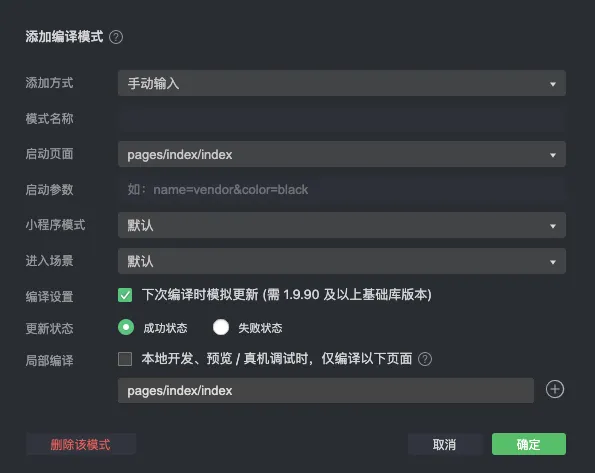
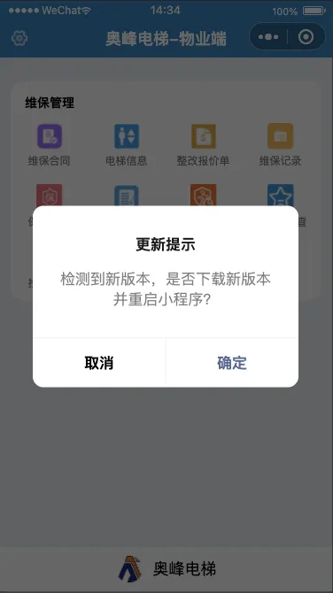

# uni-app开发的小程序版本更新提示

> 在uni-app开发过程中，应用的版本更新是一个常见的需求。当开发者发布了新版本的小程序后，希望用户在下一次打开旧版小程序时能够收到更新提示，引导用户更新到最新版本。本篇技术博客将介绍如何在uni-app中实现小程序版本更新提示的功能。

开发者将小程序文案更新后，发版后，页面、功能发现没有修改，必须在我的小程序删除后，重新进入才更新看到我们发版的功能，这样很影响用户体验

## 小程序更新机制

开发者在管理后台发布新版本的小程序之后，微信客户端会有若干个时机去检查本地缓存的小程序有没有新版本，并进行小程序的代码包更新。但如果用户本地有小程序的历史版本，此时打开的可能还是旧版本。

## 平台差异说明

| App | H5 | 微信小程序 | 支付宝小程序 | 百度小程序 | 抖音小程序 | 飞书小程序 | QQ小程序 | 快手小程序 | 京东小程序 |
|:---:|:--:|:----------:|:------------:|:----------:|:----------:|:----------:|:--------:|:----------:|:----------:|
|  x  |  x |      √     |       √      |      √     |      √     |      √     |     √    |      √     |      √     |

## updateManager 对象的方法列表：

| 方法 | 参数 | 说明 |
|:---:|:--:|:----------:|
|  onCheckForUpdate  |  callback(callback) |      当向小程序后台请求完新版本信息，会进行回调     | 
|  onUpdateReady  |  callback |      新的版本已经下载好，会进行回调     | 
|  onUpdateFailed  |  callback |      当新版本下载失败，会进行回调     | 
|  applyUpdate  |  callback |      当新版本下载完成，调用该方法会强制当前小程序应用上新版本并重启     | 


## onCheckForUpdate(callback) 回调结果说明：

| 属性 | 类型 | 说明 |
|:---:|:--:|:----------:|
|  hasUpdate  |  Boolean | 是否有新的版本 | 

## 准备工作

在开始之前，确保你已经有了以下准备：

- uniapp项目: 一个已经部署并上线的UniApp小程序项目。

## 客户端检查更新代码示例

在uni-app小程序的App.vue或main.js文件中，我们可以在App.vue中的onShow生命周期钩子中检查更新：

```javascript
<script>
export default {
	onShow() {
		// #ifdef MP
		this.checkForUpdate()
		// #endif
	},
	methods:{
		// 检测是否更新
		checkForUpdate(){
			const _this = this
			// 检查小程序是否有新版本发布
			const updateManager = uni.getUpdateManager();
				// 请求完新版本信息的回调
			updateManager.onCheckForUpdate((res) => {
				console.log('onCheckForUpdate-res',res);
				//检测到新版本，需要更新，给出提示
				if (res && res.hasUpdate) {
					uni.showModal({
						title: '更新提示',
						content: '检测到新版本，是否下载新版本并重启小程序？',
						success(res) {
							if (res.confirm) {
								//用户确定下载更新小程序，小程序下载及更新静默进行
								_this.downLoadAndUpdate(updateManager)
							}else{
								// 若用户点击了取消按钮，二次弹窗，强制更新，如果用户选择取消后不需要进行任何操作，则以下内容可忽略
								uni.showModal({
									title: '温馨提示~',
									content: '本次版本更新涉及到新的功能添加，旧版本无法正常访问的哦~',
									confirmText: "确定更新",
									cancelText:"取消更新",
									success(res) {
										if (res.confirm) {
											//下载新版本，并重新应用
											_this.downLoadAndUpdate(updateManager)
										}
									}
								});
							}
						}
					});
				}
			});
		},
		// 下载小程序新版本并重启应用
		downLoadAndUpdate(updateManager){
			const _this = this
			uni.showLoading({ title: '小程序更新中' });
			
			// //静默下载更新小程序新版本
			updateManager.onUpdateReady((res) => {
				console.log('onUpdateReady-res',res);
				uni.hideLoading();
				//新的版本已经下载好，调用 applyUpdate 应用新版本并重启
				updateManager.applyUpdate()
			});
			
			// 更新失败
			updateManager.onUpdateFailed((res) => {
				console.log('onUpdateFailed-res',res);
				// 新的版本下载失败
				uni.hideLoading();
				uni.showModal({
					title: '已经有新版本了哟~',
					content: '新版本已经上线啦~，请您删除当前小程序，重新搜索打开哟~',
					showCancel: false
				});
			});
		}
	}
};
</script>
```

由于小程序开发版/体验版没有“版本”的概念，所以无法在开发版/体验版上测试版本更新情况，可以在开发工具上，添加编译模式，勾选最下方的“下次编译时模拟更新”，但是要注意，这种模式仅供一次编译，下次编译需重新勾选“下次编译时模拟更新”



## 结语

通过以上步骤，你可以在uni-app小程序中实现版本更新提示的功能。这不仅有助于提升用户体验，还能确保用户总是使用最新的功能和改进。记得在发布新版本时更新小程序版本号，以便及时通知用户。希望本篇博客能够帮助你在uni-app项目中顺利实现版本更新提示。



好了今天的内容分享到这，下次再见 👋