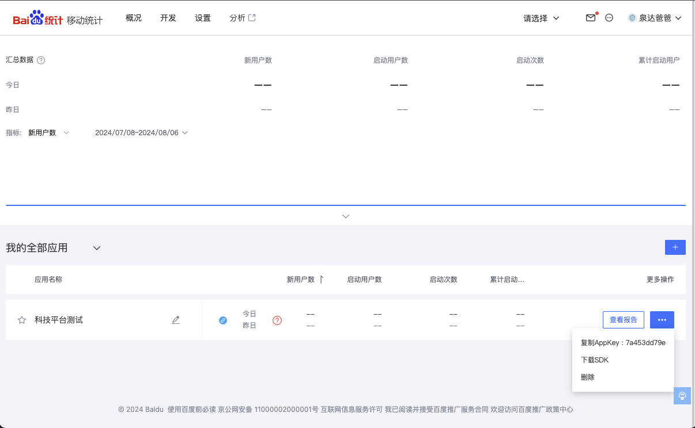
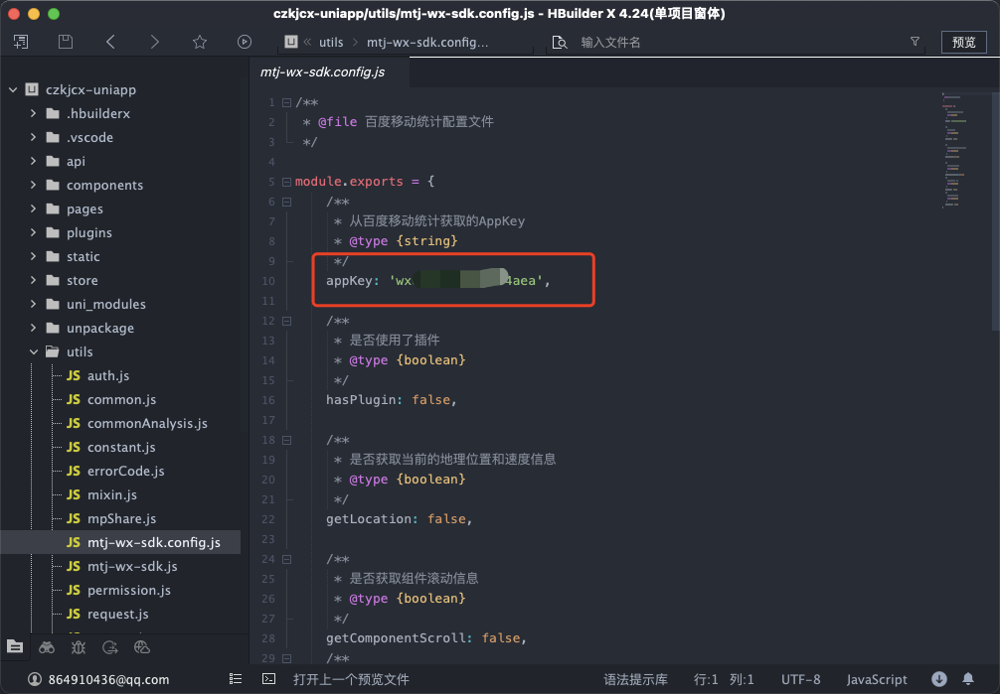

# uniapp开发的微信小程序接入百度移动统计

## 一、简介

微信小程序统计是一款基于微信小程序的数据统计分析工具，极简接入后，将开始为您采集访问您小程序的全部访问及用户行为数据，从而为您提供多样化、实时的报表数据。

微信小程序数据分析功能为开发者提供了用户分析、使用分析、场景分析、留存分析、转化分析、分享传播六大模块分析功能，帮助开发者了解小程序整体运营状况，分析小程序的用户来源、用户构成、用户增长趋势、用户留存与转化、用户小程序使用行为习惯等一些列问题。以实现数据驱动商业运营与产品迭代的目标。

## 二、快速接入SDK

### 2.1 适用范围

百度移动统计的微信小程序SDK适用于微信小程序全部版本。

### 2.2 集成准备

官方接入配置说明：[技术人员接入指南](https://mtj.baidu.com/static/userguide/book/chapter1/tguide.html)

####  1、注册账户并登录[百度移动统计官网](https://mtj.baidu.com/);
#### 2、创建应用时选择小程序-微信小程序平台并获取AppKey；

<div align="center">
  
</div>

#### 3、如果已创建的应用，请从"设置->应用信息"中查看AppKey;



#### 4、下载微信小[程序统计SDK](https://mtj.baidu.com/web/sdk/index)。

### 2.3 配置SDK

#### 1、在百度统计平台 的 「小程序SDK」 里下载「微信小程序统计SDK」，把解压缩得到的 `mtj-wx-sdk.js` 和 `mtj-wx-sdk.config.js` 拷贝到 uniapp小程序项目 的 `src/utils` 文件夹中。

<div align="center">
  
</div>
<br />

<!--  -->

#### 2、编辑 `mtj-wx-sdk.config.js`，填写 `appKey` 字段:

```js
appKey: '您小程序的AppKey',
```


#### 3、编辑 uniapp小程序项目根目录下 的 `main.js`，在文件最顶部加入：
```js
import './utils/mtj-wx-sdk.js';
```


#### 4、登录[微信公众平台](https://mp.weixin.qq.com/)，进入小程序的 `设置` -> `开发设置` -> `服务器域名`，把`https://hmma.baidu.com`加入 `request`合法域名


#### 5、检查sdk是否接入成功

打开控制台可以看到向百度统计发送了埋点数据


## 三、测试

在完成SDK的基础配置操作后，可通过“在线调试”功能，测试集成效果。详细操作可参考[在线调试功能介绍](https://mtj.baidu.com/static/userguide/book/chapter3/test.html)


## 第四步：查看报表数据
SDK嵌入成功后15分钟左右，数据即可在报表中呈现，您可登录mtj.baidu.com，选择新创建的APP，想看详细的各项数据指标。

