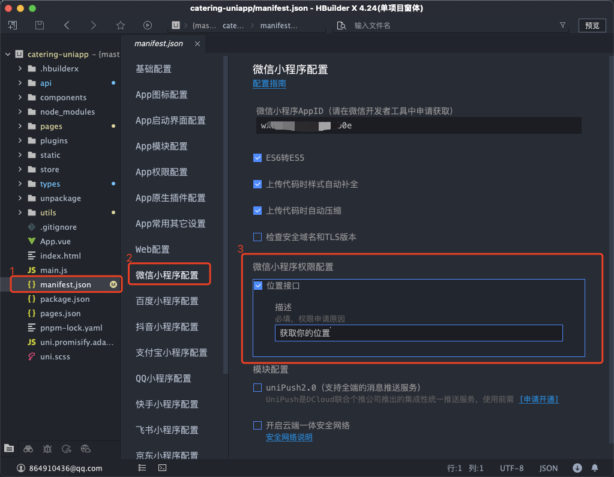
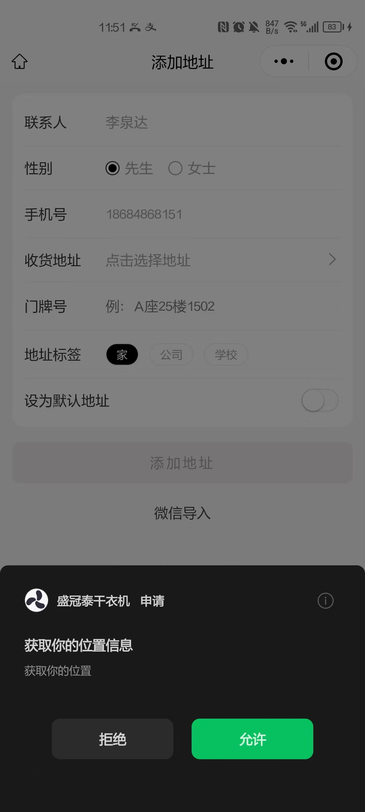

# uniapp开发的微信小程序提示errMsg:getLocation:fail:require permission desc

uniapp开发微信小程序 最近新版本上线出现无法定位的问题,提示无权限:
```json
errMsg:getLocation:fail:require permission desc
```

## 错误出现：
```js
uni.getLocation({
	success(res) {
		console.log('getLocation-res', res);
	},
	fail(fail) {
		console.log('getLocation-fail', fail); 
    // getLocation-fail {
    //   "errno": 103, 
    //   "errMsg": "getLocation:fail fail:require permission desc"
    // }
	}
})
```


## 解决办法如下：

在在微信7.0.0版本之下需要在配置页面配置权限，在7.0.0版本之上不需要配置权限。

1 打开根目录下的 `manifest.json`

2 在 `manifest.json` 选择 `微信小程序配置`

3 在 `微信小程序配置` 中 找到 `微信小程序权限配置` 将描述填上



## 查看效果

> 配置完成后，重新编译项目即可

