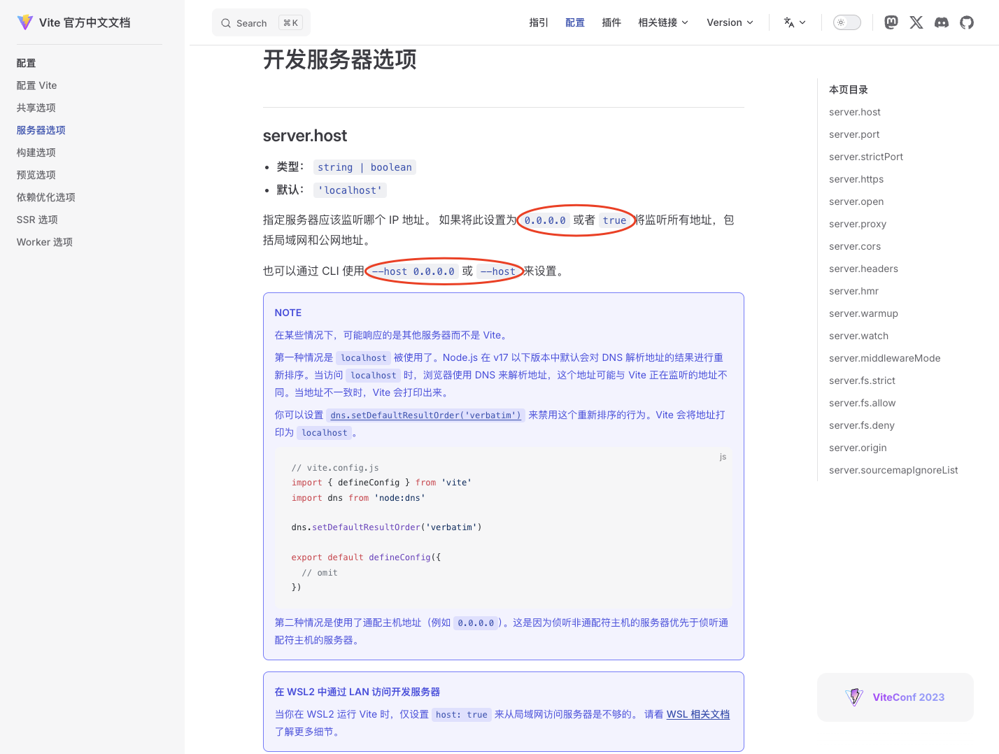
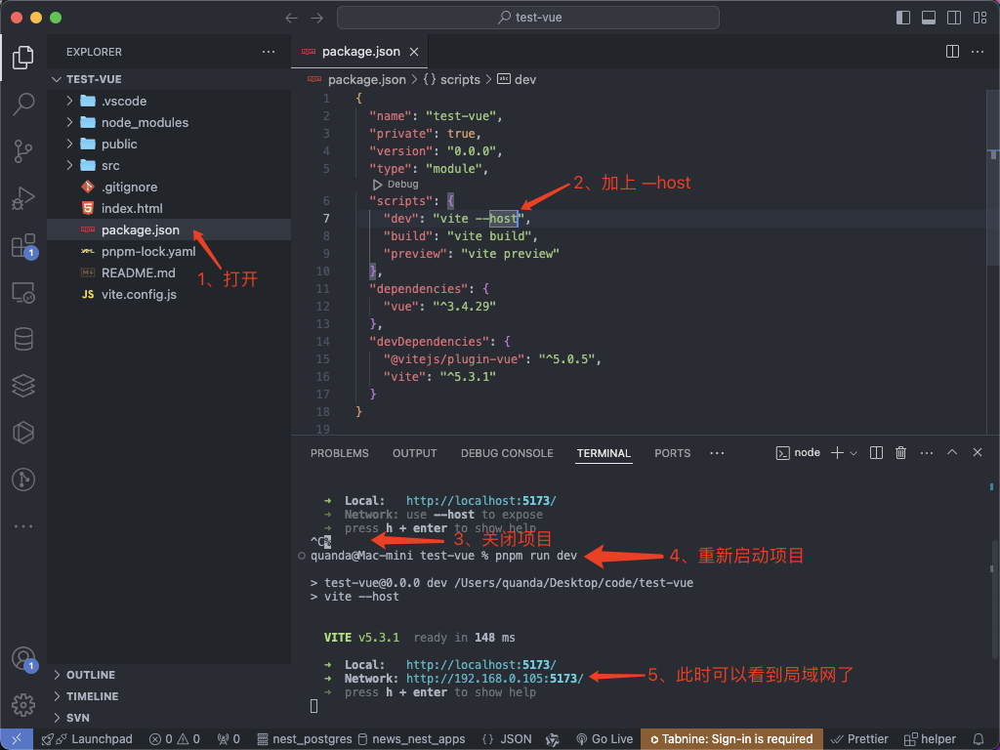
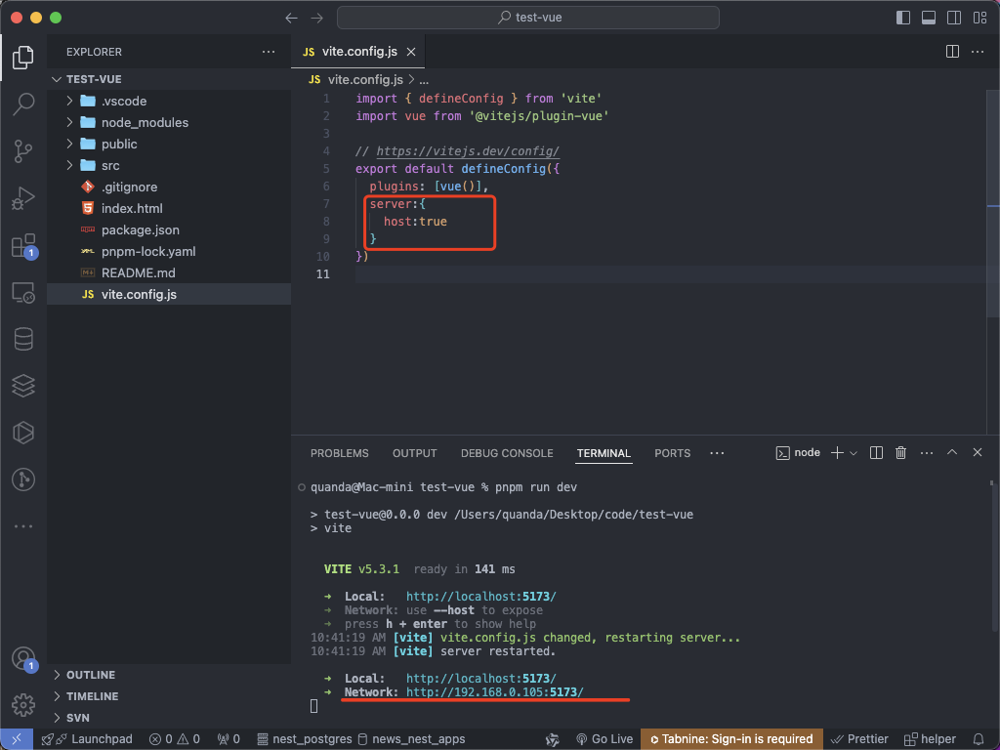

# Vite启动后提示Network: use --host to expose

hello 大家好，我是你的 Maya ！

今天教解决 Vite 启动 Vue3 项目后提示 `Network: use --host to expose` 提示。

## 前言

Vue2 升级到 Vue3 也有几年的时间了，官方也告知了 Vue2 将于 2023年12月31日 停止维护。

相信很多朋友的公司搭建新项目时都会使用 Vue3了，当然使用 Vue3 的话肯定会有很多朋友使用 Vite 这个优秀的构建工具来构建 Vue3 的项目，当然 我们公司也不例外。


## 问题抛出

最近我们公司因为接了好几个项目，忙不过来，所以我们招聘了两个前端小伙伴，其中有个小伙伴启动 Vue3 项目时遇到了 `Network: use --host to expose`, 这个提示的意思是会导致在同一个局域网内的其他人无法访问到小伙伴的本地的项目，这样我就没法看小伙伴做出来的效果了，每次都要跑到他的电脑前才能看到效果，为了不跑来跑去（自己也懒），所以我今天出一个教程来告诉前端小伙伴如何解决这个问题。

## 搭建并运行演示项目

### 1、搭建项目

我们用 Vite 来搭建 Vue3 项目

```bash
# 1、输入命令
quanda@Mac-mini code % pnpm create vite 
.../Library/pnpm/store/v3/tmp/dlx-40791  | Progress: resolved 1, reused 0, downl.../Library/pnpm/store/v3/tmp/dlx-40791  |   +1 +
.../Library/pnpm/store/v3/tmp/dlx-40791  | Progress: resolved 1, reused 0, downl.../Library/pnpm/store/v3/tmp/dlx-40791  | Progress: resolved 1, reused 0, downl.../Library/pnpm/store/v3/tmp/dlx-40791  | Progress: resolved 1, reused 0, downloaded 1, added 1, done
# 2、输入项目名称
✔ Project name: … test-vue
# 键盘上下键选择 Vue 作为项目模版
✔ Select a framework: › Vue
# 3、键盘上下键选择 JavaScript 作为开发语言
✔ Select a variant: › JavaScript
# 项目搭建在这个路径下
Scaffolding project in /Users/quanda/Desktop/code/test-vue...
# 搭建成功提示
Done. Now run:
  
  cd test-vue
  pnpm install
  pnpm run dev
```

### 2、进入搭建好的项目

```bash
quanda@Mac-mini code % cd test-vue 
```

### 3、安装项目所需依赖

```bash
quanda@Mac-mini test-vue % pnpm install

Packages: +32
++++++++++++++++++++++++++++++++
Progress: resolved 69, reused 22, downloaded 10, added 32, done

dependencies:
+ vue 3.4.30

devDependencies:
+ @vitejs/plugin-vue 5.0.5
+ vite 5.3.1

The dependency was already listed in devDependencies.
If you want to make it a prod dependency, then move it manually.

Done in 2.4s
```
### 4、运行项目
```bash
quanda@Mac-mini test-vue % pnpm run dev

> test-vue@0.0.0 dev /Users/quanda/Desktop/code/test-vue
> vite


  VITE v5.3.1  ready in 510 ms

  ➜  Local:   http://localhost:5173/
  ➜  Network: use --host to expose
  ➜  press h + enter to show help

```

上面可以看到 `ready in 510 ms` 启动项目只花了 510毫秒，秒启动 这也是很多前端小伙伴选择 Vite 来做构建工具的原因之一。

## 问题出现

Vite 启动后提示：`Network:use --host to expose`

## 解决方法

到 Vite 官网，在导航找到 配置，再点击左侧的 开发服务器选项 [点我快速到达](https://cn.vitejs.dev/config/server-options.html)



### 解决方法一

打开项目根目录下的 `package.json` 找到 `scripts` 下的 `dev` 在后边加一个命令 `--host` ，然后重新启动项目
此时就看到我们这个局域网的地址了



### 解决方法二

这张方法也是我更推荐的方法，使用第二种方法时记得把 方法一步骤还原回去后重启项目。

打开项目根目录下的`vite.config.js`，在`plugins`下面新增以下代码

```js
server: {
  host: true
}
```
新增以上代码后保存代码就可以看到控制台 `Network` 上的局域网就有地址了



可以看到第二种方式也是没问题的。

好了今天的内容分享到这，下次再见 👋