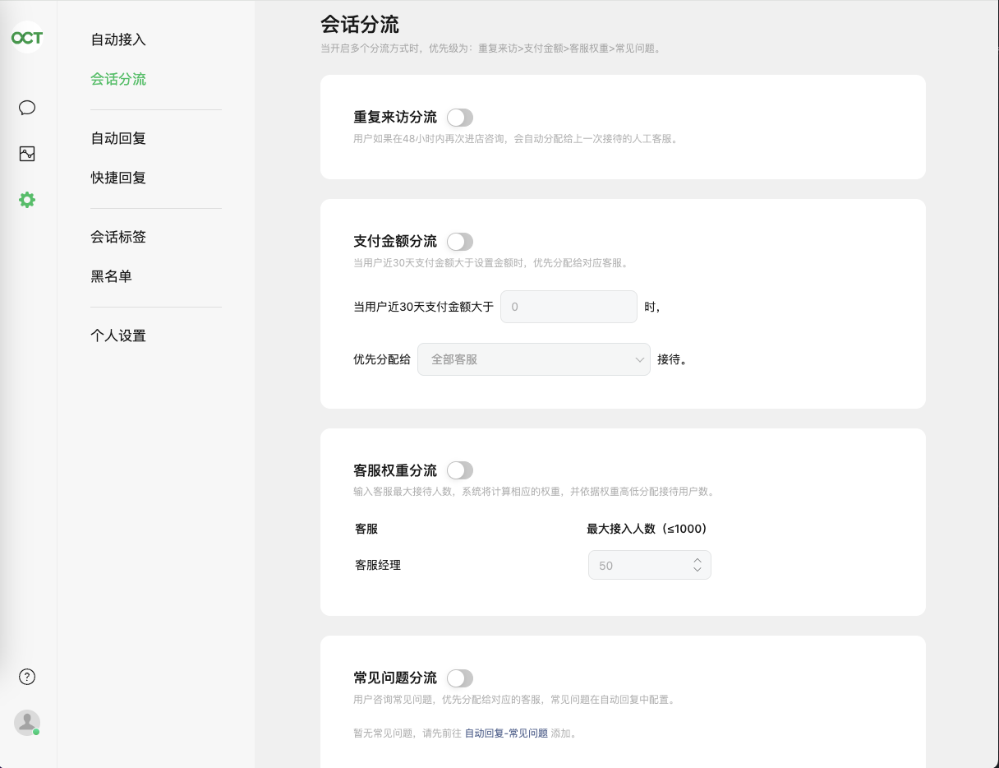

# 微信小程序接入客服功能


## 前言

- 用户可使用小程序客服消息功能，与小程序的客服人员进行沟通。
- 客服功能主要用于在小程序内 用户与客服直接沟通用，本篇介绍客服功能的基础开发以及进阶功能的使用，另外介绍多种客服的对接方式。

更多介绍请查看[客服消息使用指南](https://developers.weixin.qq.com/miniprogram/introduction/custom.html)

**客服视角：**


**用户视角：**


## 功能开通
- 登录[小程序官方后台](https://mp.weixin.qq.com/)；
- 开通小程序客服功能；
- 添加绑定客服账号，即谁来当客服；
目前小程序支持绑定不多于100个客服人员。


## 开发

- 在页面使用客服消息
  需要将 `button` 组件 `open-type` 的值设置为 `contact`，当用户点击后就会进入客服会话，如果用户在会话中点击了小程序消息，则会返回到小程序，开发者可以通过 `bindcontact` 事件回调获取到用户所点消息的页面路径 `path` 和对应的参数 `query`，开发者需根据路径自行跳转。此外，开发者可以通过设置 `session-from` 将会话来源透传到客服。

**示例代码**

```html
<button open-type="contact" bindcontact="handleContact" session-from="sessionFrom"></button>

<script setup>
  function handleContact(e) {
    // 小程序消息页面的路径 String
    console.log(e.detail.path)
    // 小程序消息指定的查询参数 Object
    console.log(e.detail.query)
  }
</script>
```

**发送卡片示例代码**
```html
<button open-type="contact" show-message-card="true">
  联系客服
</button>
```


**发送卡片标题示例代码**
```html
<button open-type="contact" :send-message-title="标题" show-message-card="true">
  联系客服
</button>
```


## 客服工具使用
小程序也可以直接使用[网页端微信小程序客服](https://mpkf.weixin.qq.com/)或者移动端「客服小助手」小程序进行客服消息回复。

客服小助手小程序码

若小程序没有启用消息推送，则用户发送的消息将会被转发至网页端微信小程序客服和移动端「客服小助手」，客服人员可在网页端微信小程序客服和移动端「客服小助手」中接入并回复用户。

**注意：**
- 如小程序的客服消息权限集已授权给第三方平台，则所有的客服消息将推送到第三方平台的服务器，不再推送到开发者的服务器或推送到网页版客服工具。
- “用户通过客服消息按钮进入会话”事件将不会转发至网页端客服工具。
- 客服不能一直发消息给用户的，有限制，如果发出了5条信息用户还有没回复，就不能继续发信息了。
- 客服不能主动向用户发起沟通，只有用户才能发起沟通！


### 移动端「客服小助手」小程序使用说明

**登录并接入**
已被绑定的小程序客服人员可微信搜索「客服小助手」或扫码登录「客服小助手」小程序，并选择对应的小程序账号，登录后即可看到与小程序对话的用户，可选择接入对话。

**切换客服状态**
点击在线状态，可以选择客服在线状态、客服离线状态： 选择客服在线状态后，即使退出客服小程序，仍可在“服务通知”中接收到用户咨询的消息提醒； 选择客服离线状态后，将无法收到客服消息与消息提醒。


**接收与发送消息**
打开「客服小助手」小程序后，进入“待接入列表”可选择用户会话进行接入； 已经接入的会话，客服人员可以在48小时内和用户进行对话，目前支持发送文本、图片、小程序卡片类型的消息。


### 网页端微信小程序客服工具使用说明

**登录并接入**

已被绑定的小程序客服人员可扫码登录[网页端微信小程序客服](https://mpkf.weixin.qq.com/)，并选择对应的小程序账号，登录后即可看到与小程序对话的用户，可选择接入对话。


**切换客服状态**

点击在线状态，可以选择在线状态、离线状态


**接收消息**

手动接入：客服人员上线后，可在“待接入”列表中，手动接入待回复的用户会话。
自动接入：当待接入的用户会话太多时，可以在设置-接入与回复中，开启自动接入。


**发送消息**

已经接入的会话，客服人员可以在48小时内和用户进行对话，目前支持发送文本、图片、小程序卡片类型的消息。


**会话分流**

客服人员可设置会话分流，即每个客服人员可同时接待的会话数量。


**设置** 

其他设置 自动回复、快捷回复、会话标签、等等自行了解


## 其他对接方式

小程序自带的客服功能，只有基本的功能，如果想要更强的功能，可以考虑下面两种方式的客服对接，下面两种都有免费试用，对接也很简单，用小程序授权就行。

- 芝麻小客服
- 网易七鱼客服